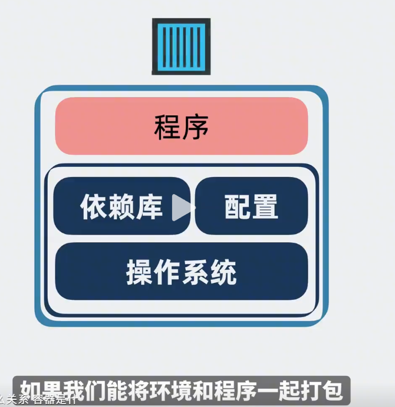
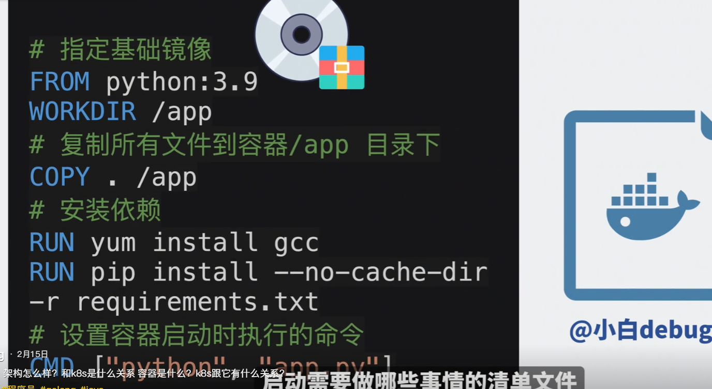
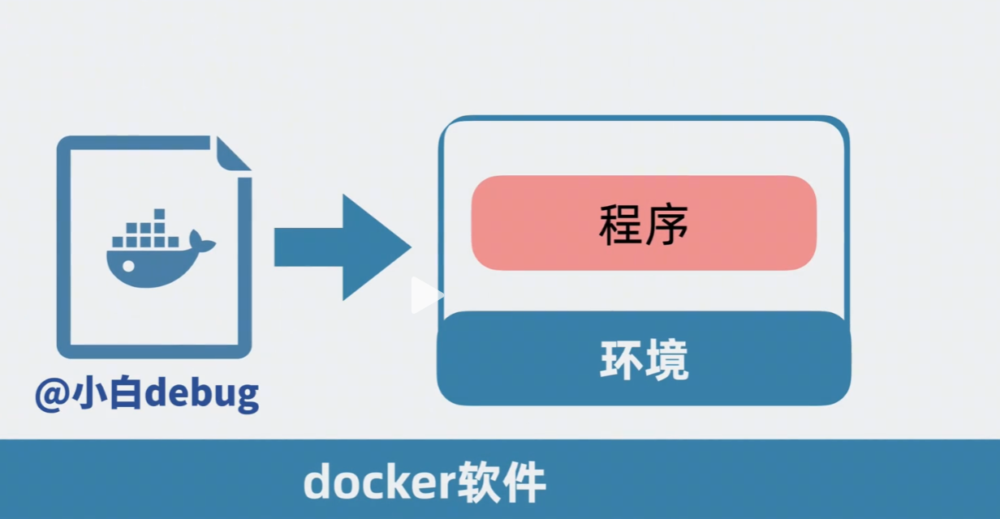
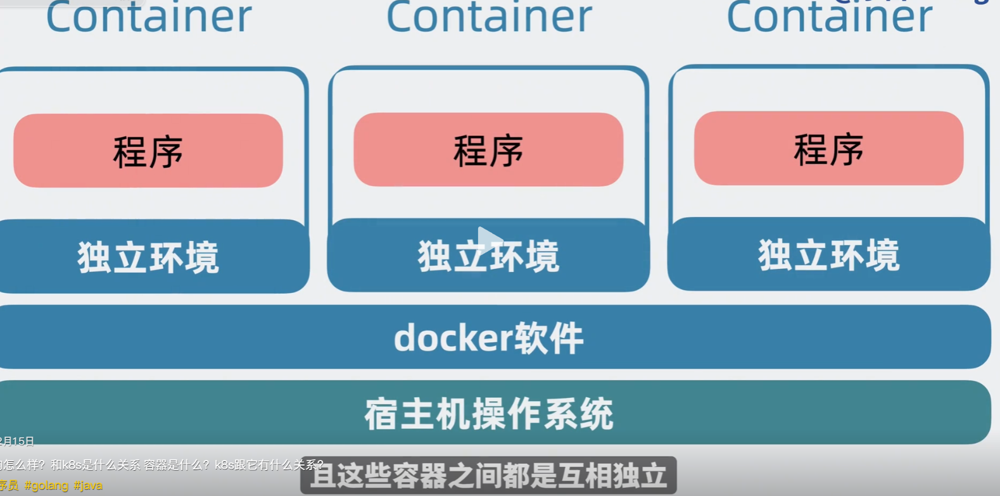
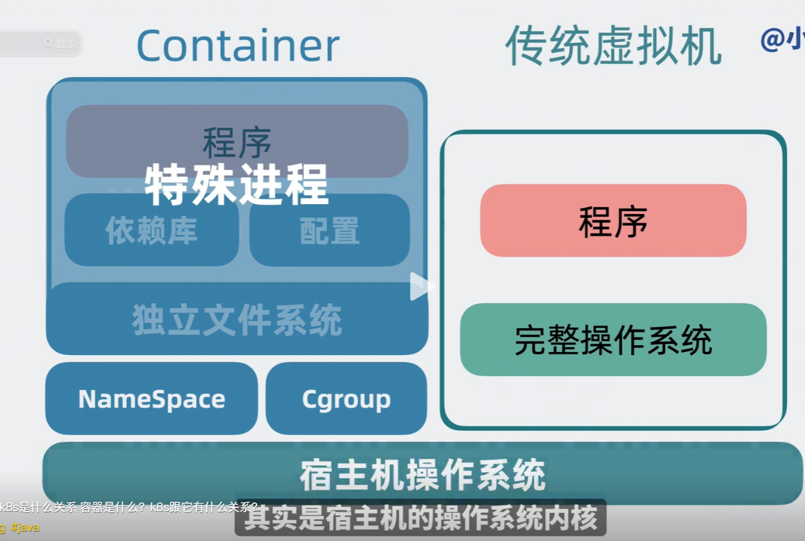
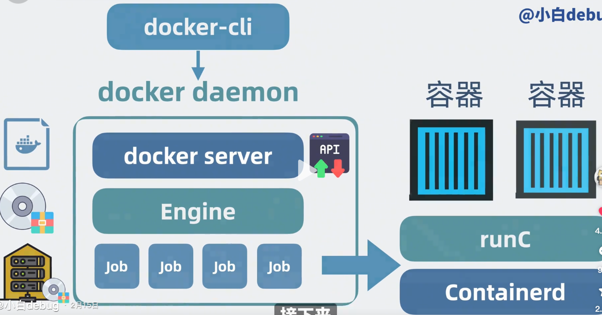
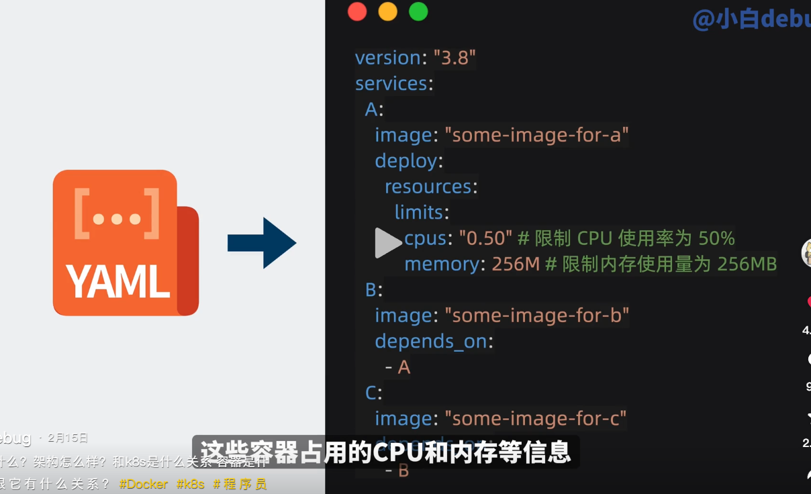

中间层： docker 容器

docker 容器与 k8s 

docker 干的事情就是



将环境和程序一起打包成一个压缩文件；

## 基础镜像

操作系统各有不同，将操作系统的用户空间部分，将所选系统的 文件系统与依赖库打包。

base image 基础镜像


## **dockerfile**

列清楚，从操作系统-》容器启动， 需要做哪些事情。



## 容器镜像

执行docker build 构建容器

环境+ 程序 =  容器镜像



## registry 是什么

Docker registry功能： 把容器镜像上传到类似于 github 之类的服务器上的一种功能。

docker push 将文档推送到仓库

docker pulll 将文件拉入仓库

## 容器

docker pull 拉取文件

docker run 启动容器文件

container: 独立的环境+



一个操作系统可以跑多个容器，且容器与容器之间相互独立。


## docker 与虚拟机的关系

虚拟机是装了独立的操作系统的；

但是container 容器使用的宿主机操作系统




### docker的架构与运行原理




## Docker Compose

这些容器的启动，会有先后顺序，例如： 先数据库 -》 身份验证服务 -》 web服务

通过 yaml 文件

写清楚 容器执行顺序，占用内存与 cpu 数量

运行

```
docker-compose up
```

解析yaml 文件，将容器按顺序部署

## Docker swarm

docker  针对的是单个容器的部署， docker compose 是多个容器组成的一整套服务操作。

## Docker swarm与k8s

竞品

k8s 就是： 以API 编程的方式管理安排各个容器的引擎；
