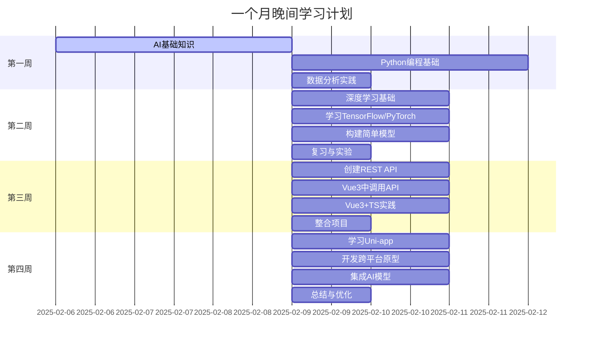

## 使用 RAG 对 gpt 的数据进行一个扩充

参考：https://zhuanlan.zhihu.com/p/668082024

通过调用 ai 的接口，gpt3.5-turbo , 通过你给的提示词，进行推理，把词换成一节一节的，然后喂进去；
但是反转出错，可以把字符隔断 传入，这样就可以识别；
通过基础的某个训练，获取更多的链接关联词库，以达到精准回答的目的；

1. 一些问题，我们可以通过使用 LLM 做分隔符进行步骤推理，
   一些问题，我们通过多个步骤的思维链 =》 来获得思维导出的结果；
2. Use the following format:
   Step 1:{delimiter} <step 1 reasoning>
   Step 2:{delimiter} <step 2 reasoning>
   Step 3:{delimiter} <step 3 reasoning>
   Step 4:{delimiter} <step 4 reasoning>
   Response to user:{delimiter} <response to customer>
   使用的这种模式进行问题推导

### 链接提示

### 检查输出

对于用户输入的提示信息，机器会对你说的事情的真伪进行校验；检出输出有没有潜在危害内容；

### 对问题评估：

1. 把所有的答案链整合；
2. 把答案进行初步的评估。 有单一正确答案的时候，评估 LLM 的回答；
3. 评估没有一个正确答案的情况；

陈瑜初步的一些理解：

基本就是一些 api 的调用，模型选择，限制输入参数；
对输入的答案进行结构分析，
先分析输入数据是否有害，再甄别是否正确，然后检索答案链条；
通过基础的某个训练，获取更多的链接关联词库，以达到精准回答的目的；
答案根据 LLM 分步骤，获取结果；
一步一步喂养进去得出结果；

观看视频之后的理解：

Moderations 审核 api 是为了限制 ai，限制一些暴力 、 性 、政治等话题；
avoid prompt injections 避免一些提示注入；或者用户通过一些语言指令绕过限制；
让模型去分类，看是否与之前的设定相冲突，

关于提示链；
在提出一个问题的时候，先去思考，先给出一系列的思维链条；再根据给出的链条去一个一个解答；
解答的方式是：
步骤 1，步骤 2，步骤 3。。。 然后总结一个最终的结论，这就是原因链条。

更深入的 chaining Prompts （这一块，有点点看不懂啊）这一块等下重点学习；
动态添加语言模型，动态的去加入模型元素；

check outputs 检查输出；

ai 学习规划

为了更全面地学习和掌握 AI 大模型开发相关的知识，尤其是结合您的技术栈（Vue3、TypeScript、Uni-app），这里有一些额外的学习资源推荐：

### AI 与机器学习

1. **书籍**

   - 《深度学习》由 Ian Goodfellow 等人撰写。
   - 《Python 机器学习》由 Sebastian Raschka 撰写。
2. **在线课程**

   - [Coursera](https://www.coursera.org/)上的“Deep Learning Specialization”系列课程。
   - [Udacity](https://www.udacity.com/course/intro-to-machine-learning--ud120)的机器学习入门课程。

### Python 编程

- [Real Python](https://realpython.com/)提供丰富的 Python 教程，包括数据科学相关的内容。
- [Automate the Boring Stuff with Python](https://automatetheboringstuff.com/)是一本非常适合初学者的实用指南。

### 深度学习框架

- [TensorFlow 官网](https://www.tensorflow.org/)
- [PyTorch 官网](https://pytorch.org/)

### Web 开发与 Vue.js

- Vue.js 官方文档提供了非常详细的指南和 API 参考：[Vue.js Docs](https://v3.cn.vuejs.org/)
- 对于 TypeScript 的支持，可以查看[Vue + TypeScript 指南](https://vuejs.org/v2/guide/typescript.html)
- Uni-app 社区和论坛是获取最新信息和支持的好地方：[DCloud-Uni-app](https://nativesupport.dcloud.net.cn/)

### 实践项目

- 尝试在[Kaggle](https://www.kaggle.com/)上参加一些实际的数据分析和机器学习竞赛，以提高实践能力。
- GitHub 上也有很多开源项目可以供您学习和贡献，通过参与这些项目来提升自己的技能。

利用这些资源，您可以根据自己的进度和兴趣选择合适的学习材料。记得理论学习和实践相结合，不断尝试将所学应用到实际项目中去，这样才能更好地理解和掌握相关知识。

为了帮助您更详细地规划一个月的学习计划，我们将学习周期分为四周，并为每周设定具体的学习目标和资源。以下是一个更加详细的月度学习计划，结合您的技术栈（Vue3、TypeScript、Uni-app）以及 AI 大模型开发的相关需求。

### 学习计划

#### 第 1 周：AI 基础知识与 Python 编程

- **目标**：
  - 理解 AI 和机器学习的基本概念。
  - 掌握 Python 基础及其在数据处理中的应用。
- **每日任务**（每晚 3 小时）：
  - 第 1 天：了解 AI/ML 基本概念（视频教程或文章阅读）
  - 第 2-3 天：学习 Python 基础（变量、循环、函数等）
  - 第 4-5 天：学习 Pandas 和 NumPy 库的基础操作
  - 第 6-7 天：完成一个小项目，如数据分析案例
- **资源**：
  - Coursera 上的“Machine Learning” by Andrew Ng
  - Codecademy 的 Python 课程

#### 第 2 周：深度学习基础与框架入门

- **目标**：
  - 学习深度学习的基本原理。
  - 开始使用 TensorFlow 或 PyTorch 进行简单的模型训练。
- **每日任务**：
  - 第 8-9 天：学习神经网络的基本概念
  - 第 10-11 天：开始学习 TensorFlow 或 PyTorch 的基础
  - 第 12-13 天：构建并训练一个简单的神经网络模型
  - 第 14 天：复习本周内容并尝试调整模型参数
- **资源**：
  - TensorFlow 官网教程
  - PyTorch 官网教程

#### 第 3 周：Web 集成与 Vue.js 实践

- **目标**：
  - 学习如何通过 API 将训练好的模型部署并与 Web 应用集成。
  - 在 Vue3 中实现前端展示和交互。
- **每日任务**：
  - 第 15-16 天：学习 Flask 或 Express.js 来创建 REST API
  - 第 17-18 天：在 Vue3 中调用 API 并展示结果
  - 第 19-20 天：探索如何在 Vue3 中使用 TypeScript 增强代码质量
  - 第 21 天：项目实践，整合本周所学知识
- **资源**：
  - Vue.js 官方文档
  - Flask REST API 教程

#### 第 4 周：跨平台开发与综合实践

- **目标**：
  - 使用 Uni-app 开发跨平台的应用程序。
  - 综合前几周的知识点，完成一个小型 AI 驱动的跨平台应用。
- **每日任务**：
  - 第 22-23 天：学习 Uni-app 基础及其实战应用
  - 第 24-25 天：设计并开发一个简单的跨平台应用原型
  - 第 26-27 天：将之前训练的模型集成到 Uni-app 应用中
  - 第 28 天：总结反思，优化应用性能
- **资源**：
  - Uni-app 官方文档

### Mermaid 甘特图表示这份计划：

此计划旨在为您提供一个清晰的学习路径，并帮助您有效地利用晚上时间深入学习相关技能。希望这对您有所帮助！
