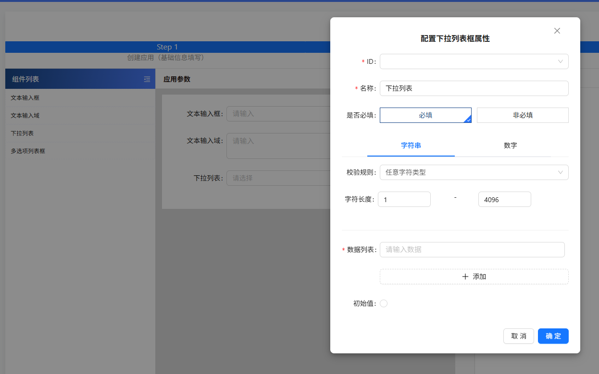

低代码平台

## 低代码的json schemma 如何设计的，拖拽功能怎么做的， undo 已经 redo 怎么做的？

展示



### 初始的 json schema 结构， 组件初始列表

```
{
  typeId: 'input', // 拖拽判断 是那种类型的组件
  config: { // 传给后端的配置信息
    appDefinitionId: '', // 判断他属于的是哪一个父类
    charLength: '~',    // 字符长度校验规则
    isRequired: true,   // 是否必填项
    id: '',   // 每一项自己的ID
    paramId: '', // 绑定的脚本参数
    paramName: '', // 名称
    valueType: '',  //  "string" | number 用于区分 Tab 的值
    renderType: '', // 渲染的是哪一种组件 input | input_textarea |
    validationRuleId: '',// 多种校验规则的ID any_char  exclude_chinese
    optionData: 'list',
    dataList: [''],  // 多选项的值
    },
    placeholder: '默认输入值'
}
```

表单设计

### 拖拽功能的实现？ 拖拽排序的实现？

使用：vuedraggable 组件

实现原理：

* 拖拽区（组件列表）和目标区（表单设计区）都绑定同一个或不同的数组（如drawingList）。
* 拖拽时，库会自动处理数组的插入、移动、删除，数组变化即为表单结构变化。
* 拖拽结束后，drawingList（即 JSON Schema）自动更新，UI自动响应。

拖拽区： 原始列表数据  List

目标区： 表单设计存储的list  drawingList

拖拽时的插入、移动、删除 是如何实现的？

### 低代码DSL 设计时需要考虑哪些问题？

1. 符合支持当下的业务场景
2. 可读性与易用性
   * 结构清晰，命名规范
   * 便于理解
3. 数据-》 视图的更新， 校验规则的配置

## 如何优化JSON Tree的解析和渲染性能？ 使用了哪些算法（比如需要修改某一个节点的顶端 key 值


### 出现的问题

#### .组用与数据隔离

* 弹窗、表单项等组件频繁复用时，如何避免响应式数据污染、状态错乱？
* 如何保证每个组件实例的数据独立、互不干扰？

方案： 每次打开/props变化时，重置内部响应式数据

```
const props = defineProps({ formData: Object, open: Boolean });
const formState = reactive({ ...props.formData });

watch(
  () => props.open,
  (val) => {
    if (val) {
      // 用最新的props重置所有字段，深拷贝防止引用污染
      Object.assign(formState, deepClone(props.formData));
    }
  },
  { immediate: true }
);
```

避免直接赋值响应式对象引用

* 不要直接formState = props.formData，这样会丢失响应式，且会污染原始数据。
* 不要只在onMounted/constructor里赋值，要用watch/useEffect监听props或打开事件。

#### 拖拽与可视化编辑的性能与一致性

* 拖拽排序、嵌套拖拽时，如何保证数据结构和UI的一致性？
*
* 采用“数据驱动UI”原则，所有拖拽操作均直接作用于Schema（如数组/树结构），UI自动响应数据变化，保证了数据结构与UI的一致性。通过只在拖拽结束时批量更新数据、采用虚拟渲染和深拷贝等手段，有效避免了性能瓶颈和响应式副作用，支持大规模表单/页面的高效可视化编辑和嵌套拖拽。
* 拖拽操作的本质是对数据结构（如JSON Schema/数组树）的增删改，UI只是数据的“投影”。

#### 拖拽过程中如何高效地同步Schema、避免性能瓶颈？

只在必要时更新数据结构，避免频繁重渲染。

虚拟渲染/懒加载，大数据量时只渲染可见部分。

批量操作/防抖，合并多次拖拽操作，减少无效更新。

#### 事件系统与跨组件通信

* 如何设计灵活的事件系统，支持组件间、页面间、平台与业务代码间的通信？
* 如何避免事件监听器泄漏、重复绑定等问题？

  原先使用的事件总线，后面发现数据信息难以追踪维护，修改方案为 pinia 传值。

#### 可视化与代码生成的双向同步

* 如何实现“所见即所得”与代码/配置的双向同步？
* 如何支持导入导出、Schema与代码的互转？
