## 一、内容介绍 

### 1、课程概述

本阶段围绕 vue2（版本号2.6.X）vue3 vuex vue-router 进行源码分析

vue 的底层原理在项目开发中可以帮助我们更好的理解 vue 的运行机制，从而优化开发，提升项目运行效率，在面试中也是冲击高薪的重点考察知识点，通过 vue 底层原理的学习我们可以了解 vue 的初始化流程，响应式原理，虚拟dom的编译过程，异步更新机制，学习面向对象，工厂模式，代理模式，观察者模式等设计模式，提升开发品味。

学习完本阶段内容，人人都是尤大～

### 2、学习路线

- 响应式系统
  - 学习`Vue`中如何实现数据的响应式系统，从而达到数据驱动视图。
- vue中选项方法
  - 学习watch选项 $watch方法 computed选项 $set方法 $nextTick $mount方法的封装
- template 编译过程
  - 学习`Vue`内部是怎么把`template`模板编译成虚拟`DOM`,从而渲染出真实`DOM`
- 虚拟 dom 生成与更新
  - 学习什么是虚拟 DOM，以及`Vue`中的`DOM-Diff`原理


## 二、Vue2 学习路线图

下面这张流程图中表示了vue的关键部分的执行过程，和核心函数。我们可以根据这样一个过程来自己实现一个vue框架。

###### 

通过梳理Vue初始化的过程，我们发现实现一个类似于Vue的框架主要需要实现这几部分 响应式系统框架、虚拟dom编译渲染机制 MVVM更新机制，接下来我们先从最基本的响应式系统开始，自己动手写一个Vue的简单框架

【思考】Vue在初始化的过程中主要经历的哪些步骤

【回答】

1、初始化Vue构造函数，挂载属性 方法

2、模板编译成render函数

3、通过Watcher收集依赖

4、diff更新dom

5、渲染dom


【补充】vue是一个标准的MVVM框架么？

Vue 并不完全是一个MVVM框架MVVM只能数据驱动视图，视图更改数据，而不能通过其他方式操作数据。在vue中我们也可以自己手动修改数据，所以vue并不是一个完全意义上的MVVM框架。


## 三、Vue2 响应式原理

从这一小节开始我们带着大家实现一个Vue框架

我们先来看看面试宝典中的关于Vue响应式的八股文 （P143-4）

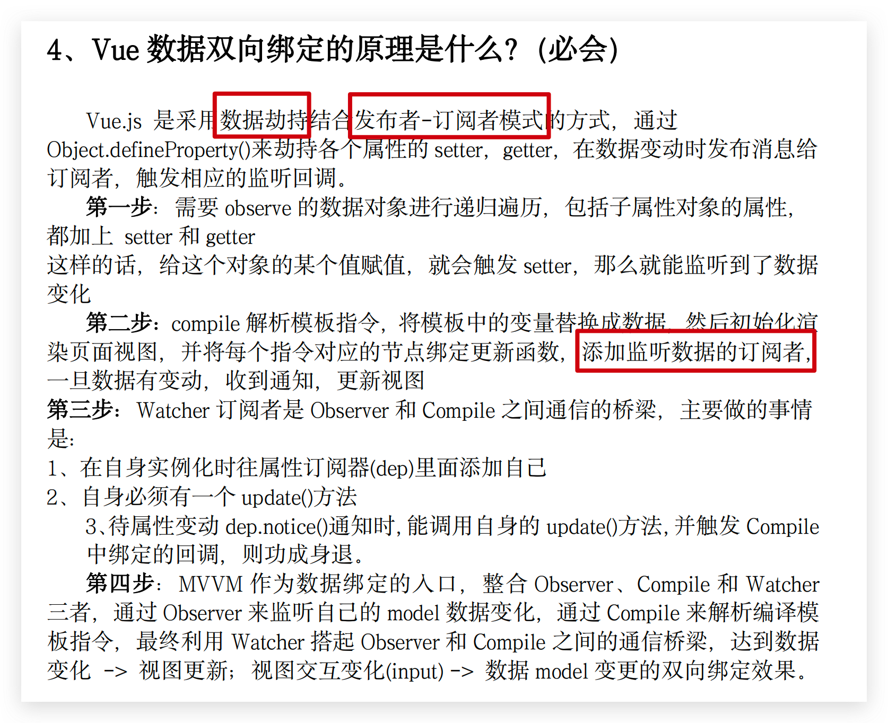

相信绝大多数的同学看到这个八股文都会感觉头大。学完今天的内容，我们都会对怎么回答vue的响应式原理有了自己的理解。

下面我们一起来揭秘vue的响应式原理到底是怎么实现的！

### 1、章节概述

我们首先实现学习路线中第一条分支，从状态初始化到数据响应式的过程


所谓数据响应式就是**能够使数据变化可以被检测并对这种变化做出响应的机制**。MVVM框架中要解决的一个核心问题是连接数据层和视图层，通过**数据驱动**应用，数据变化，视图更新，要做到这点的就需要对数据做响应式处理，这样一旦数据发生变化就可以立即做出更新处理。


Vue 的响应式原理依赖于[Object.defineProperty](https://developer.mozilla.org/en-US/docs/Web/JavaScript/Reference/Global_Objects/Object/defineProperty)，Vue通过设定对象属性的 setter/getter 方法来监听数据的变化，通过getter进行依赖收集，而每个setter方法就是一个观察者，在数据变更的时候通知订阅者更新视图。

所以在vue中的数据响应式原理主要是给data绑定一个观察着 observe 让数据变成可观察的，我们首先来看源码然后自己尝试手写一个observe

### 2、环境准备

在这一小节中我们开始自己实现一个Vue框架，通过Vue源码我们了解到Vue使用的rollup构建工具进行打包

**/package.json**


这里我们也使用Rollup实现项目打包，我们之前有学习过脚手架工具webpack，Rollup和webpack的区别在于项目类代码中有大量的代码拆分，构建项目类型的应用显然webpack更为合适，如果想要构建js类库将多个模块打包成一个大的文件rollpu更加合适，同时rollup中提供的tree-shake可以帮助我们自动删除冗余代码

| **Webpack**                              | **Rollup**                                                   |
| ---------------------------------------- | ------------------------------------------------------------ |
| vue-cli, create-react-app 各类应用脚手架 | react，vue，three.js，[D3](https://so.csdn.net/so/search?q=D3&spm=1001.2101.3001.7020)，moment |

#### 1、源码工程的初始化

##### 1、新建项目文件夹，在文件夹下初始化工程

~~~~shell
npm init -y
~~~~


获得package.json


##### 2、安装Rollup打包依赖

~~~~shell
// 1，安装 rollup：用于 Vue 源码的打包构建
npm install rollup

// 2，使用 babel：需要安装核心模块 @babel/core；
npm install @babel/core

// 3，rollup 与 babel 关联
npm install rollup-plugin-babel

// 4，浏览器兼容：将 ES6 语法转译为 ES5
npm install @babel/preset-env


// ==> 合并写法：一次性安装开发环境所需的全部依赖
npm install rollup @babel/core rollup-plugin-babel @babel/preset-env -D
~~~~

##### 3、创建Vue.js文件

创建打包入口：src/index.js

~~~~js
// src/index.js Vue 构造函数
function Vue(){}

// 导出 Vue 函数，提供外部使用
export default Vue;
~~~~

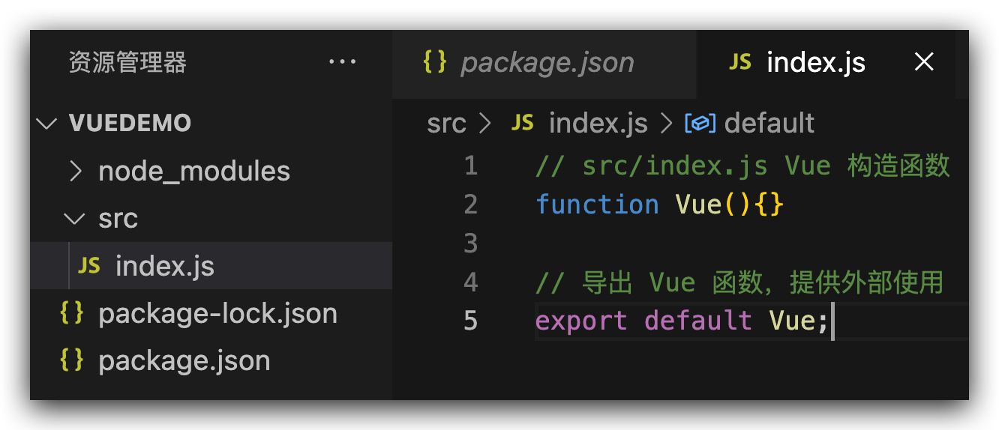

##### 4、创建 Rollup 配置文件

rollup 默认配置文件：项目根目录下`rollup.config.js`文件

创建 rollup.config.js，完成 rollup、[babel](https://so.csdn.net/so/search?q=babel&spm=1001.2101.3001.7020) 相关配置：

```js
// src/rollup.config.js
import babel from 'rollup-plugin-babel'

// 导出 rollup 配置对象
export default {
  // 打包入口
  input: './src/index.js',   
  // 打包出口：可定义为数组，输出多种构件
  output: {                
    // 打包输出文件
    file: 'dist/vue.js',   
    // 打包格式（可选项）：iife（立即执行函数）、esm（ES6 模块）、cjs（Node 规范）、umd（支持 		amd + cjs）
    format: 'umd',         
    // 使用 umd 打包需要指定导出的模块名，Vue 模块将会绑定到 window 上；
    name: 'Vue',          
    // 开启 sourcemap 源码映射，打包时会生成 .map 文件；作用：浏览器调试ES5代码时，可定位到			ES6源代码所在行；
    sourcemap: true,      
  },
  // 使用 Rollup 插件转译代码
  plugins: [
    babel({
      // 忽略 node_modules 目录下所有文件（**：所有文件夹下的所有文件）
      exclude: 'node_modules/**'
    })
  ]
}
```

##### 5、创建 rollup 构建脚本

执行 Rollup 打包构建 Vue，创建 rollup-script 构建脚本：

~~~~json
// package.json
{
.........
  // ollup 命令：默认会去找 node_module/bin/rollup；
	// - -c：config 选项，使用配置文件，默认找 rollup.config.js；
	// - -w：watch 选项，监听文件变化；当文件发生变化时重新打包；
  "scripts": {
    "dev": "rollup -c -w"
  },
.........
}
~~~~

dev 脚本解释：

- rollup 命令：默认会去找 node_module/bin/rollup；
- -c：config 选项，使用配置文件，默认找 rollup.config.js；
- -w：watch 选项，监听文件变化；当文件发生变化时重新打包；

##### 6、打包构建 Vue

执行构建脚本 npm run dev


将 `src/index.js` 输出至 `dist/vue.js` 其中，`vue.js.map` 为 sourcemap 源码映射文件


##### 7、创建 Html 引入 Vue

创建 `dist/index.html` 引入 `dist/vue.js`，打印输出 Vue：

~~~~html	
<!DOCTYPE html>
<html lang="en">
<head>
  <meta charset="UTF-8">
  <meta http-equiv="X-UA-Compatible" content="IE=edge">
  <meta name="viewport" content="width=device-width, initial-scale=1.0">
  <title>Document</title>
</head>
<body>
  <!-- 引入 vue.js，将会绑定到 window-->
  <script src="./vue.js"></script>
  <script>
    console.log(Vue) 
  </script>
</body>
</html>
~~~~

在浏览器中打开`index.html`，查看控制台输出，此时一个`Vue`的构建环境就搭建完成了


### 3、Vue函数的封装

【目标】封装一个 Vue 函数并且在 index.html 中引入

【前置知识】

在js中函数和class都可以new，如下：有啥区别呢 ？


class **类是用于创建对象的模板。**

我们使用 class 关键字来创建一个类，类体在一对大括号 **{}** 中，我们可以在大括号 **{}** 中定义类成员的位置，如方法或构造函数。

每个类中包含了一个特殊的方法 **constructor()**，它是类的构造函数，这种方法用于创建和初始化一个由 **class** 创建的对象。

创建一个类的语法格式如下：

~~~~js
class ClassName {  constructor() { ... } }
~~~~

在js中除了class函数也可以new，函数本身就是对象，在js中每定义一个函数都会同时生成一个以这个函数体为构造函数的对象，不信你试试

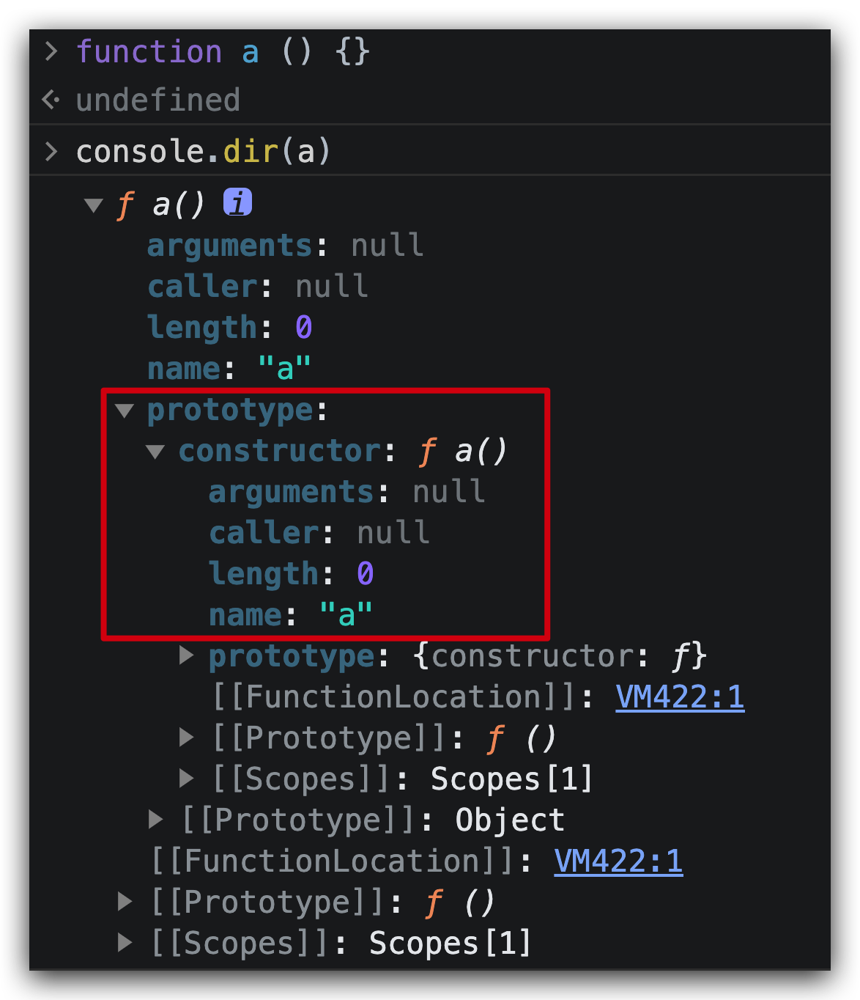

可以通过对象来new出一个新的对象。定义 function Vue(options){} 时， 实际上生成了一个Function类型（预定义类型）的对象，对象名叫Vue，对象的构造函数就是这个函数的体。如下

我们在初始化`Vue`项目的时候使用到`new`关键字，这里的vue是使用函数定义的。目的是提升vue的灵活性。

~~~~js
function Vue (options) {
  this.name = options.name;
  this.data = options.data;
}
~~~~


【思考】为什么vue使用函数定义而其他的watcher observer使用class定义？

【回答】核心目的：提升Vue的灵活性：

1、class的所有方法都是不可枚举的，而function声明的函数是可以枚举的。用户可以根据需要定制重写（重载）vue提供的成员方法

2、function 既能当常规函数来用，又能当做函数的属性来用，又能当类来用。相对class更加灵活。

3、对于内部定义的不希望修改的方法，通过class来定义，另外class声明的函数会有变量提升。

下面我们实例化一个Vue

~~~~js
let vm = new Vue({
  name: 'vue',
  data: {}
});
~~~~

此时在 vm 实例上就具有了 name 和 data 属性

接下来我们在`src/index.js`中定义这个类并导出。在构造函数中获取传入的`options`并挂载到`vue`实例上。

~~~~js
// src/index.js

function Vue (options) {
  console.log('Vue构造器执行')
  const vm = this;
  vm.$options = options        
}
~~~~

并且在 **dist/index.html**中实例化一个Vue对象。

~~~~html
<!-- 引入 vue.js，将会绑定到 window-->
<script src="./vue.js"></script>
<script>
	var vm = new Vue({
    data: {
      a: {
        b: {
          c: 1
        }
      },
      arr: [1, 2, 3, 4],
      message: "hello world!"
    }
  });
</script>
~~~~


此时我们访问`Vue`对象中data里面定义的数据不能直接访问，必须通过`vue.data.xxx`访问，实际在`Vue`项目中`data`里面定义的数据是可以直击访问的，所以我们需要给`data`中的数据添加一个代理实现数据的直接访问。


### 4、核心函数 Object.defineProperty 的介绍和简单响应式的实现

【目标】能够了解Object.defineProperty的用法，并且实现一个简单的响应式

为了实现vue中的数据代理，我们需要首先了解一下vue中的响应式核心方法Object.defineProperty

Object.defineProperty 在 vue2 中起到了非常重要的作用，通过Object.defineProperty实现了数据的代理，数据响应式原理，以及vue中的一些重要成员方法。下面我们学习Object.defineProperty的基本概念和用法。

语法：**[Object.defineProperty(obj, prop, descriptor)](https://developer.mozilla.org/zh-CN/docs/Web/JavaScript/Reference/Global_Objects/Object/defineProperty)**
其中：**obj**要在其上定义属性的对象。**prop**要定义或修改的属性的名称。**descriptor**将被定义或修改的属性描述符。

参数：    1、obj : 第一个参数就是要在哪个对象身上添加或者修改属性

​				2、prop : 第二个参数就是添加或修改的属性名

​				3、desc ： 配置项，一般是一个对象 

~~~~js
desc 的详细配置
writable：	是否可重写
value：  	当前值 
enumerable： 	是否可以遍历
configurable： 	是否可再次修改配置项
get：    	 读取时内部调用的函数
set：        写入时内部调用的函数

当数据调用的时候触发get 方法，当数据修改的时候触发set方法
~~~~


【思考】什么是响应式？

【回答】对外界的变化做出反应

【思考】数据响应式的核心思想是什么？

【回答】将数据变成可观察的


下面我们来实现一个简单的数据响应式过程，在 dist 下新建一个 **defineproperty.html **

~~~~html
<!DOCTYPE html>
<html lang="en">
<body>
  <input type="text">
</body>
<script>
  let data = {
    value: 'hello world'
  }

  document.querySelector('input').addEventListener('input', (e) => {
    console.dir(e.target.value)
    data.value =  e.target.value
  })
  
  document.querySelector('input').value = data.value
  // 这里的val的作用是行程闭包，拓展函数体内部变量的作用域
  function defineReactive (obj, key, val, cb) {
    Object.defineProperty(obj, key, {
      get() {
        console.log('数据被获取了');
        return val
      },
      set(value) {
        val = value
        // document.querySelector('input').value = value
        console.log(value,'输入框输入的值');
        cb(value)
      }
    })
  };
  function callBack (val) {
    document.querySelector('input').value = val
  }
  
  defineReactive(data, 'value', data['value'], callBack)
</script>
</html>
~~~~


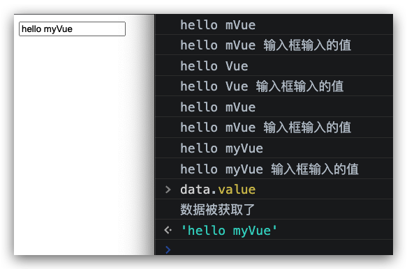

【思考】数据获取的时候触发的哪个方法，数据修改的时候触发的哪个方法？

【回答】获取触发get 修改触发set


【思考】上面这段代码实现了什么呢？

【回答】实现了数据的双向绑定，数据改变视图改变，视图改变数据也改变


【思考】定义defineReactive函数的时候，里面第三个参数val的作用？

【回答】在函数体内部形成闭包结构，防止死循环用开来拓展函数内部变量的作用域


### 5、通过data代理，实现数据的访问

【目标】实现data的代理可以直接通过vm实例获取data中定义的数据

【思考】在 vue 中的数据是存放在 data 中为什么可以通过 vm.XXX 直接访问数据呢？

【回答】通过数据代理实现数据的访问


此时我们想获取数据 a 需要通过 Vue.$options.data.a ，但是在 vue 中只需要 this.a 就可以获取到 a 的值，这是怎么实现的呢？

在 Vue 中，可以在外部直接通过vm实例进行数据访问和操作：

~~~~js
let vm = new Vue({
  data() {
    return { 
    	a: {
        b: {
          c: 1
        }
      },
      arr: [1, 2, 3, 4],
      message: "hello world!"
    }
  }
});
console.log(vm.message)
console.log(vm.arr.push(4))
~~~~

当前代码中，外部通过vue实例只能拿到 `vue.$options`，想要拿到`data`需要 `vue.$options.data`，要想实现`vue.message`和`vue.$options.data.message`等效，就需要想办法将`vue`实例操作“代理”到`$options.data`上；这样，就实现了 Vue 的数据代理我们来观察一下vue的实例，在实例上有一个_data属性 还有我们定义的变量。

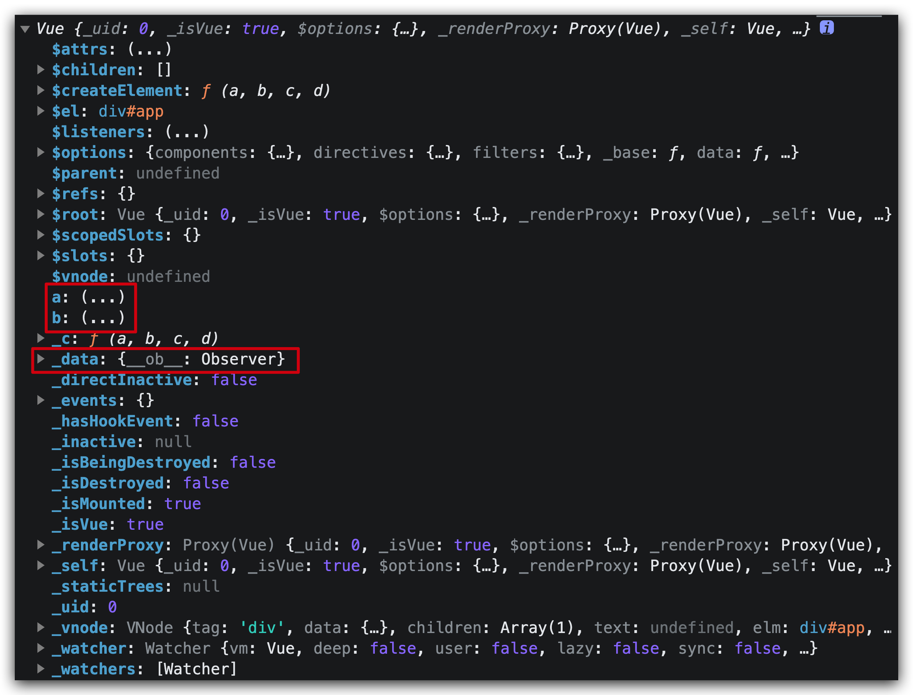


首先，先做一次代理，将`data`挂载到 vue._data下（因为Object.defineProperty的第一个参数必须为一的对象，我们，第一层代理更加方便我们在实现属性的追加），这样 vue 实例就能够在外部通过`vue._data.message`获取到`data.message`；

之后，再做一次代理，将 vue 实例操作 vue.message 代理到 vue._data 上，这样，外部就可以直接通过vue.message 获取到 data.message；_

Vue 状态初始化阶段，通过 observe() 实现数据响应式之后，通过 Object.defineProperty 对 _data 中的数据操作进行劫持；将 vue.xxx 在 vue 实例上的取值操作，代理到 vue._data.xxx 上，这样可以简化书写。

下面我们开始实现数据的代理

`data`挂载到 vue._data下

~~~~js
function Vue (options) {

  console.log('Vue构造函数执行')
  const vm = this
  vm.$options = options
  vm._data = typeof(options.data) === 'function' ? options.data() : options.data
}	
~~~~

将vue实例操作vue.message代理到vue._data上

~~~~js
// 数据代理 实现非侵入的数据修改
_proxy(data) {
    const that = this
    Object.keys(data).forEach(key => {
      Object.defineProperty(this, key, {
        get () {
          return this._data[key] // 会触发后面的真实响应
        },
        set (val) {
          this._data[key] = val // 这个也会触发吗？？？
        }
      })
    })
  }
~~~~

然后在Vue的构造器中使用proxy方法代理数据

~~~~js
function Vue (options) {
    console.log('Vue构造函数执行')
    const vm = this
    vm.$options = options
    vm._data = typeof(options.data) === 'function' ? options.data() : options.data
    this._proxy(vm._data)
}
~~~~

此时我们再访问vue对象中的数据，就不需要.data了，观察打印结果：当从vue实例取值时，就会被代理到vm._data取值；


【总结】vue中实现数据直接访问的实现步骤

1、将 data 暴露在 vue._ _data 实例属性上
2、利用 Object.defineProperty 将 vue.xxx 操作代理到 vue._ _data 上


### 6、单层对象的响应式

【目标】实现vue的单层对象的响应式

vue 内部实现双向绑定过程：**简单来说就是初始化 data 的时候会调用 observe 方法给 data 里的属性重写 get 方法和 set 方法，到渲染真实 dom 的时候，渲染 watcher 会去【 访问 】页面上使用的属性变量，给属性的 Dep 都加上渲染函数，每次修改数据时通知渲染 watcher 更新视图**下面我们来实现一个最简单的响应式机制

我们先写在 index.js 中然后再做模块拆分

**src/index.js**

~~~~js
// 遍历数据将data中每一个对象变成可观察的observe
function observe(value, cb) {
  Object.keys(value).forEach((key) => defineReactive(value, key, value[key] , cb))
}

/**
* obj： 要监听的对象
* key： 要监听对象中的属性
* val： 在函数体内部形成闭包，作为中间变量实现数据的返回
* cb： 回调函数
**/
function defineReactive (obj, key, val, cb) {
  Object.defineProperty(obj, key, {
      get: ()=>{
          /*....依赖收集等....*/
          console.log('获取数据')
          return val
      },
      set:newVal=> {
          val = newVal;
          console.log('修改数据')
          cb ? cb() : null;/*订阅者收到消息的回调*/
      }
  })
}
~~~~

~~~~js
function Vue (options) {
  console.log('Vue构造器执行')
  this._data = options.data;
  const vm = this;
  vm.$options = options
  // 调用observe传入data
  observe(this._data)
  _proxy.call(this, options.data)
}
~~~~

此时我们查看控制台输出，发现每一个数据都变成可观察的了

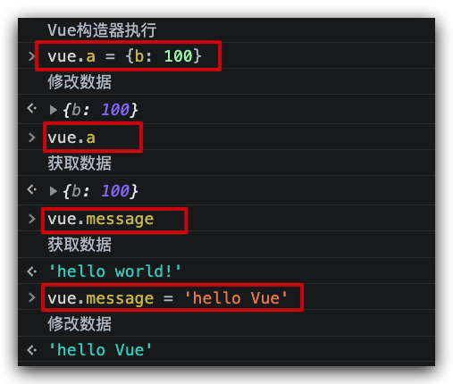

但是当我们修改a.b的值的时候发现数据的修改并没有被观察到


【优化】我们可以将proxy方法和observe方法单独抽离出来封装成一个函数 initData，这样可以提升代码的品味。

~~~~js
function initData() {
  const vm = this
  observe(this._data)
  _proxy.call(vm, vm._data)
}
~~~~

最后在Vue中调用

~~~~js
function Vue(options) {
  const vm = this
  this.$options = options
  // options.data 可能是对象也可能是函数
  vm._data = typeof (options.data) === 'function' ? options.data() : options.data
  initData.call(vm)
}
~~~~


如果我们想对对象中每个属性都添加getter和setter，因为对象的嵌套层级不确定，因此就需要想到递归。这一部分我们会在最后一节中来学习


【思考】为什么在数据代理我们操作的是原数据，但是在响应式使用的是闭包变量val呢？

【回答】因为代理本质上是通过更简单的方式操作原始数据，使用原始数据相当于直接操作的原数据，但是响应式并不是要操作原始数据，而是将数据变成可观察的即可。


### 7、Observer类的定义

数据响应式是Vue中比较核心的功能，很多模块都是依赖数据响应式实现的，所以并不希望用户修改，此时我们可以将数据响应式定义为一个类

【目标】定义Observer类并在data数据中添加响应式标识


新建一个 observer/index.js 文件此时我们可以封装一个 Observer 类，将上面的方法复制到构造函数中，然后将 observe 方法导出，并在src/index.js 中导入

~~~~js
// 遍历数据将data中每一个对象变成可观察的observe
export function observe(value, cb) {
  Object.keys(value).forEach((key) => defineReactive(value, key, value[key] , cb))
}

/**
* obj： 要监听的对象
* key： 要监听对象中的属性
* val： 在函数体内部形成闭包，作为中间变量实现数据的返回
* cb： 回调函数
**/
function defineReactive (obj, key, val, cb) {
  Object.defineProperty(obj, key, {
      get: ()=>{
          /*....依赖收集等....*/
          console.log('获取数据')
          return val
      },
      set:newVal=> {
          val = newVal;
          console.log('修改数据')
          cb ? cb() : null;/*订阅者收到消息的回调*/
      }
  })
}
~~~~

~~~~js
import {observe} from './observer/index.js'
~~~~

重写 observe 方法，在 observe 方法中我们调用定义的 Observer 类，然后再 Observer 类中实现数据的响应式

~~~~js
// observer/index.js
export function observe(value, cb) {
  let ob = new Observer(value)
  return ob
}
~~~~

定义 observer 类，在 walk 中调用 defineReactive。

~~~~js
// src/observer/index.js
export class Observer {
  // 这里的value刚开始时，实际上就是data
  constructor (value) {
    this.walk(value)
  }
  // walk走你，这个方法用来遍历value给每个key下面都加上一个getter setter属性变成可观察的
  walk (value) {
    Object.keys(value).forEach(
      (key)=> defineReactive(value, key, value[key])
    )
  }
}
~~~~

此时我们有了两个方法一个类：

defineReactive 方法实现数据的响应式

observe方法 实例化一个 observer类，并且将实例化之后的对象返回

Observer类  调用walk方法，walk方法中循环遍历属性的key作为参数传入到defineReactive，再通过define Reactive方法给对象中的属性绑定get和set方法

他们的调用关系如下


此时修改a的值，试一试！

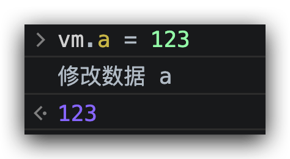

触发defineReactive中的set，数据变成了响应式的。


### 8、watcher的实现 & dep类依赖收集

【目标】这一小节我们会手动实现一个watcher！

先来看看Vue中watche选项和$watch方法在vue中的使用方式

~~~~js
// 选项式调用
watch: {
  a() {
    console.log('watch a1')
  }
}
~~~~

~~~~js
// 方法式调用
vm.$watch('message', () => {
  console.log('watch message')
})
~~~~

实现效果


【思考】Vue中的watch监听器是怎么实现的呢？

【回答】当用户修改数据的时候，需要知道数据改变，并且通知依赖这个数据的视图重新渲染或者计算，最典型的场景就是dom的更新和watcher监听器。所以我们需要对数据的调用关系进行收集，等数据变更的时候去找到他的调用关系，触发更新。

【结论】

- 在getter中收集依赖（因为在getter中可以知道哪些地方使用到这个数据）

- 在setter中触发依赖（因为在setter中可以知道数据修改）


【思考】什么是依赖？

【回答】需要使用数据的地方（不仅仅局限在Dom）


【思考】watcher中应该接收几个参数？

【回答】目前watcher中应该接受三个参数，第一个是vue实例，第二个是监听的属性，第三个是属性更新之后的回调。

【思考】如果想要实现一个$watch方法和watch选项需要几步操作？

1、结合watch和$watch的使用方式，将watch选项和$watch方法在Vue实例上定义

2、在添加响应式过程中，即Observer中的get方法实现依赖收集

3、定义Watcher类作为收集的依赖

3、将watcher依赖添加到一个容器中，定义一个Dep类存储watcher

4、数据更新在set中触发，在Observer中的set方法中进行依赖的触发


我们首先在vue实例上添加 $watch 方法和 watch 选项

~~~~js
// /src/index.js
function Vue(options) {
  
  ...
  // watch 选项的实现
  const watch = this.$options.watch
  if (watch) {
    let keys = Object.keys(watch)
    for(let i = 0; i < keys.length; i++) {
      // 实现watch 并执行回调
    }
  }
}
~~~~

~~~~js
// $watch方法的实现
Vue.prototype.$watch = function () {
  // 实现watch 并执行回调
}
~~~~

当watch方法调用的时候，实际上相当于将数据添加观察者，观察者观察到数据改变之后触发传入的回调函数。那么观察者是如何添加的呢？

给数据添加 getter 和 setter 都是在 observer 类中完成的，所以依赖的收集也需要在 observer 中进行，因此在Observer类的构造器中向数据里面通过dep类实例化dep对象，添加到数据中。这里的`__ob__`可以暂时将它理解为一个盒子。后面会详细讲到

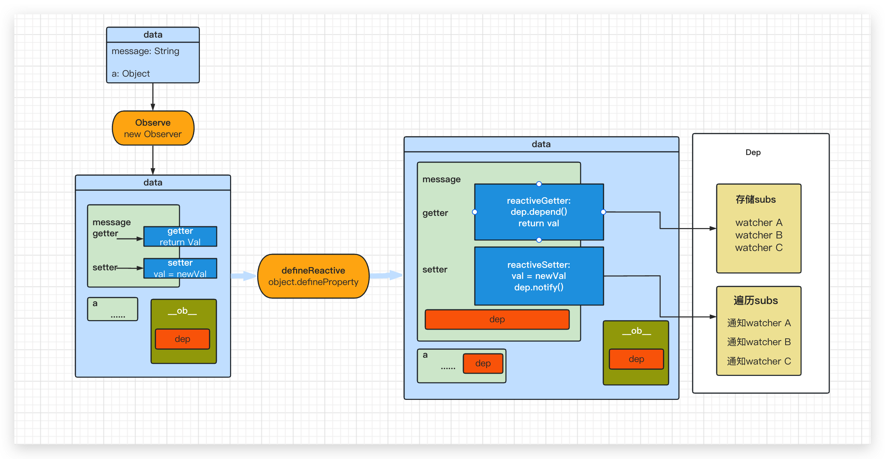

在defineReactive函数中也使用了dep类，赋值给局部变量dep，在get方法中使用闭包结构保存属性相关信息，用于依赖的收集depend，在set中触发依赖notify，在Dep类，实现订阅(addSub)和通知(notify)。首先我们新建一个dep.js，然后再类中添加这三个方法。

~~~~js
// src/observer/dep.js
export default class Dep {
  constructor() {
    this.subs = [];
    console.log('dep类的构造器')
  }
  addSub() {
    console.log('添加依赖')
  }
  depend() {
    console.log('收集依赖')
  }
  notify() {
    this.subs.forEach(item => item)
    console.log('通知依赖')
  }
}
~~~~

然后我们分别在 observer 类中和 defineReactive 中实例化

src/observer/index.js

~~~~js
import Dep from "./dep.js";

export class Observer {
  constructor (value) {
    this.dep = new Dep(); // <=========
		//...省略
  }
}
~~~~

~~~~js
/**
 * 给对象Obj，定义属性key，值为value
 *  使用Object.defineProperty重新定义data对象中的属性
 *  由于Object.defineProperty性能低，所以vue2的性能瓶颈也在这里
 * @param {*} obj 需要定义属性的对象
 * @param {*} key 给对象定义的属性名
 * @param {*} value 给对象定义的属性值
 */
function defineReactive(obj, key, value) {
  // childOb 是数据组进行观测后返回的结果，内部 new Observe 只处理数组或对象类型
  const dep = new Dep() // <====
  Object.defineProperty(obj, key, {
    // get方法构成闭包：取obj属性时需返回原值value，
    // value会查找上层作用域的value，所以defineReactive函数不能被释放销毁
    get() {
      console.log('访问', key, '属性');
      // 在get方法中收集依赖
      dep.depend(); // <======
      return value;
    },
    // 确保新对象为响应式数据：如果新设置的值为对象，需要再次进行劫持
    set(newValue) {
      console.log("修改了被观测属性 key = " + key + ", newValue = " + JSON.stringify(newValue))
      if (newValue === value) return
      value = newValue;
      // 在set方法中通知依赖更新，并且传入新值
      dep.notify(newValue);
    }
  })
}
~~~~

此时当我们访问数据的时候，会在控制台中打印依赖收集


当我们修改数据的时候会在控制台中打印通知依赖


另外dep类中的subs存储的是watcher，所以这部分我们将watcher类定义一下

首先watcher（这里叫做依赖）它可以将目标对象，目标对象中的属性和用于渲染的回调函数三者关联起来，所以Watcher类的结构如下

~~~~js
// src/observer/watcher.js
class Watcher{ 
  // vm，因为实现了数据代理，所以相当于data；expr，即访问路径，如'count.total';cb: 依赖回调
  constructor(vm, exp, cb){ 
    this.vm = vm;
    this.exp = exp;
    this.cb = cb;
  }
  update(){
    //todo: 调用依赖回调cb 
  }
}
~~~~

那么watcher怎么和dep关联起来呢？

这里用一个旋转餐厅的例子来解释：用户点了餐相当于调用了数据，此时餐品被放在传送带target上，用户会一致关注传送带上是否有餐，如果有则将菜品拿下来放在桌子（subs）上，此时就完成了依赖的收集。

`Watcher` 把自己设置到全局的一个指定位置(target)，然后读取数据。因为读取了数据，所以会触发这个数据的`getter` 。在`getter` 中就能得到当前正在读取数据的`Watcher`，并把这个存储了`Watcher`的`target`收集到`Dep` 中。然后将`target`清空用于下一次存储。

下面我们来解决读取数据问题，这里我们只需要定义一个get方法即可，调用成员方法get来访问所依赖的属性，从而引发该属性的getter执行。

~~~~js
import Dep from "./dep.js";

export default class Watcher {
  constructor(vm, exp, cb) {
    this.exp = exp;
    this.cb = cb;
    this.vm = vm;
    this.value = this.get();
  }
  get () {
    Dep.target = this;
    const obj = this.vm._data
    var value;
    value = obj[this.exp]
    Dep.target = null;
    return value;
  }
  update () {
    // 这个位置可以实现新老数据的回传和判断数据是否发生修改
    this.cb && this.cb();
  }
}
~~~~

然后定义dep中的depend方法，这个方法是用来收集依赖的，当前数据的依赖被封存放在一个全局的 target 中，当获取到依赖之后给 target 赋值，当依赖存入完成之后 target 设置为 null，可以将 target 理解成一个搬运工。

src/observer/dep.js

~~~~js
let uid = 0

export default class Dep {
  constructor () {
    console.log('dep类的构造器')
    this.id = uid++
    this.subs = []
  }

  addSub (sub) {
    this.subs.push(sub)
    console.log('subs', this.subs)
  }

  depend () {
    console.log(Dep.target)
    if (Dep.target) {
      console.log('添加订阅者')
      this.addSub(Dep.target)
    }
  }

  notify(newValue) {
    console.log('dep通知更新', this.subs)
    for (let i = 0, l = this.subs.length; i < l; i++) {
      console.log('通知更新的watcher', this.subs)
      this.subs[i].update(newValue)
    }
  }
}
~~~~

此时已经可以实现notify调用每一个watcher中的update触发更新了


最后我们把watch选项和$watch方法完善一下，并且添加上监听，快来试试！

~~~~js
// /src/index.vue
import { observe } from './observer/index.js'
import  Watcher  from './observer/watcher.js';

function Vue (options) {
  console.log('Vue构造器执行')
  this._data = options.data;
  const vm = this;
  vm.$options = options
  // 响应式处理部分代码
  observe(this._data)
  _proxy.call(this, options.data)
  // watch 选项的实现
  const watch = this.$options.watch
  if (watch) {
    let keys = Object.keys(watch)
    for(let i = 0; i < keys.length; i++) {
      // 实现watch 并执行回调
      new Watcher(vm, keys[i], watch[keys[i]])
    }
  }
}
// $watch方法的实现
Vue.prototype.$watch = function (key, cb) {
  // 实现watch 并执行回调
  const vm = this
  new Watcher(vm, key, cb)
}
~~~~

~~~~js
// 在index.html中调用
watch: {
  a() {
    console.log('watch a1')
  }
}

vm.$watch('message', () => {
  console.log('watch message')
})
~~~~


此时subs中就出现了我们想要调用的watcher了


【优化】我们可以将watch选项和$watch方法单独抽离出来封装成一个函数 initWatch，这样可以提升代码的品味。

~~~~js
function initWatch() {
  const vm = this
  const watch = this.$options.watch
  if (watch) {
    let keys = Object.keys(watch)
    for (let i = 0; i < keys.length; i++) {
      // 实现watch 并执行回调
      new Watcher(vm, keys[i], watch[keys[i]])
    }
  }

  Vue.prototype.$watch = function (key, cb) {
    // 实现watch 并执行回调
    new Watcher(vm, key, cb)
  }
}
~~~~

在Vue中调用

~~~~js
function Vue(options) {
  const vm = this
  this.$options = options
  // options.data 可能是对象也可能是函数
  vm._data = typeof (options.data) === 'function' ? options.data() : options.data
  initData.call(vm)
  initWatch.call(vm)
}
~~~~

【总结】

代码在访问依赖属性之前先把Dep.target设置成当前的watcher实例本身，所以defineReactive的getter中就会认为当前正处于依赖收集阶段，所以就会继续调用dep.depend方法，从而将该watcher实例加入到该属性的dep实例所维护的subs数组中。

完了后上面的代码会继续走，在watcher中的get方法调用末尾将Dep.target设置成null，从而结束依赖收集阶段。

也就是说，只有Watcher中的get方法会触发getter中的dep.depend，即只有在`new Watcher(vm, key,...) `会引发依赖收集。


### 9、计算属性 computed 的实现

Vue中一个比较常用的属性就是计算属性，我们来回顾一下计算属性的写法

~~~~js
cumputed: {
	sum() {
		return this.num1 + this.num2
	}
}
~~~~

计算属性的特点：

1、他的值是一个函数运行的返回值

2、函数中所有用到的属性发生改变都会引起计算属性的改变


通过第二点特点，计算属性本质上还是一个watcher，但是又有一些区别，目前我们定义的watcher只能监听一个属性的变化，但是computed 中可以对多个属性进行监听，所以我们需要对现有的watcher进行改造！

我们可以让 watcher 的第二个参数接收一个函数，然后运行这个函数获取返回值，运行过程中所有的数据获取都会触发该数据的getter，此时target中的watcher是计算属性的watcher，这样我们就在 computed 中所有依赖数据的dep里，收集到这个conputed的watcher

计算属性是独立于data的，但是计算属性中的属性又可以作为数据去调用，所以需要单独的初始化

简写的计算属性只能取值，不能赋值，在Vue源码中试一试！

  


下面我们来实现computed

1、将watcher的第二个参数进行拓展，支持传入函数

2、将传入函数的计算结果挂载到watcher上

3、定义计算属性方法initComputed，并将计算属性添加到Vue实例上

4、在获取计算属性值的时候通过调用watcher中的get拿到算好的新值。

 让watcher的第二个参数变成函数

~~~~js
export class Watcher {
  constructor(vm, exp, cb) {
    this.exp = exp;
    this.cb = cb;
    this.vm = vm;
    this.value = this.get();
  }
  get() {
    Dep.target = this;
    console.log(Dep.target, 'Dep.target')
    // 判断第二个参数是不是函数
    if (typeof this.exp === 'function') {
      // 这里需要使用数据运算所以传入改变this指针到vm实例
      this.value = this.exp.call(this.vm)
    }
    else {
      this.value = this.vm[this.exp]
    }
    Dep.target = null;
  }
  update(newValue) {
    // 这个位置可以实现新老数据的回传和判断数据是否发生修改
    this.cb && this.cb(newValue);
  }
}
~~~~

定义计算属性

~~~~js
function initComputed(vm) {
  let computed = vm.$options.computed
  if (computed) {
    let keys = Object.keys(computed)
    for (let i = 0; i < keys.length; i++) {
      const watcher = new Watcher(vm, computed[keys[i]], () => {
      })
      Object.defineProperty(vm, keys[i], {
        enumerable: true,
        configurable: true,
        get() {
          watcher.get()
          return watcher.value
        },
        set() {
          console.log('computed不能赋值')
        }
      })
    }
  }
}
~~~~

在Vue中调用

~~~~js
function Vue(options) {
  const vm = this
  this.$options = options
  // options.data 可能是对象也可能是函数
  vm._data = typeof (options.data) === 'function' ? options.data() : options.data
  initData.call(vm)

  initComputed(vm)

  initWatch.call(vm)
}
~~~~

我们来试一试！

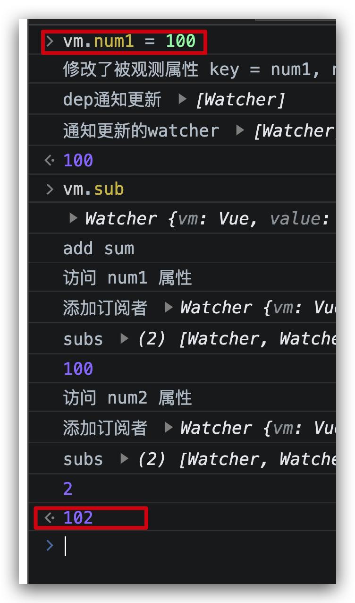

我们将num1的值改成100，此时计算出来的结果为102

除此之外计算属性有两个特性：

1、lazy:  如果计算属性没有被使用，即使依赖的数据发生改变也不会重新计算

2、dirty: 计算属性计算完成之后如果依赖没有发生变化，会缓存上一次的结果不会重复计算


我们可以给watcher上添加一个lazy属性，当lazy属性为true时，它是一个特殊的watcher，此时watcher更新的时候不直接update，而是给watcher加上一个状态 dirty：true，此时watcher是一个肮脏的状态

下一次我们去调用这个watcher去执行的时候，检查watcher是不是一个肮脏的状态，如果是一个脏的状态，在进行get求值，并且将计算结果存储在watcher.value中，如果dirty === false 是干净的，说明没有变更，直接返回watcher.value即可

~~~~js
function initComputed(vm) {
  let computed = vm.$options.computed
  if (computed) {
    let keys = Object.keys(computed)
    for (let i = 0; i < keys.length; i++) {
      // 实例化watcher的时候传入lazy 当前是一个惰性watcher
      const watcher = new Watcher(vm, computed[keys[i]], () => {
      }, {
        lazy: true
      })
      Object.defineProperty(vm, keys[i], {
        enumerable: true,
        configurable: true,
        get() {
          // 在computed获取数据的时候我们判断watcher是不是脏的
          // 1、如果是脏的说明需要更新，重新调用get方法
          // 然后将watcher.dirty改为false 恢复watcher的干净状态
          if (watcher.dirty) {
            watcher.get()
            watcher.dirty = false
          }
          // 2、如果不是脏的，直接返回上一次的计算结果
          return watcher.value
        },
        set() {
          console.warn('computed不能赋值')
        }
      })
    }
  }
}
~~~~

~~~~js
// /src/observe/watcher.js
export class Watcher {
  // 接收第四个参数
  constructor(vm, exp, cb, options = {}) {
    this.exp = exp;
    this.cb = cb;
    this.vm = vm;
    // 如果不传默认为false
    this.dirty = this.lazy = !!options.lazy
    // 如果lazy为false，则立即执行get
    // 如果lazy为true，则暂时不执行get
    if (!this.lazy) {
      this.value = this.get();
    }
  }
  get() {
    Dep.target = this;
    console.log(Dep.target, 'Dep.target')
    // 判断第二个参数是不是函数
    if (typeof this.exp === 'function') {
      this.value = this.exp.call(this.vm)
    }
    else {
      this.value = this.vm[this.exp]
    }
    Dep.target = null;
  }
  update(newValue) {
    // 在dep的notify方法中会调用watcher中的update
    // 此时如果是惰性watcher则不执行回调
    // 但是此时有依赖变更，所以我们将watcher上的dirty属性变为true
    if (this.lazy) {
      this.dirty = true
    }
    // 如果是正常watcher直接执行回调
    else {
      // 这个位置可以实现新老数据的回传和判断数据是否发生修改
      this.cb && this.cb(newValue);
    }
  }
}
~~~~


### 10、深层对象的响应式 

【目标】这一小节我们完善一下vue中的深层嵌套对象的监听！

此时我们的src/index.js observe可以修改一下，单独封装在observe.js文件中，并且新增类型判断 

需要添加的响应式属性是对象的时候，再进行递归，保证接下来的递归的安全性

~~~~js
// observer/index.js
export function observe(value, cb) {
  if (typeof value != 'object') return 
  let ob = new Observer(value)
  return ob
}
~~~~

此处的调用顺序应该是这样

~~~~java
let obj = {
  a: 1,
  b: {
    c: 2
  }
}
执行observe(obj)
├── new Observer(obj),并执行this.walk()遍历obj的属性，执行defineReactive()
    ├── defineReactive(obj, a)
        ├── 执行observe(obj.a) 发现obj.a不是对象，直接返回
        ├── 执行defineReactive(obj, a) 的剩余代码
    ├── defineReactive(obj, b) 
	    	├── 执行observe(obj.b) 发现obj.b是对象
	        	├── 执行 new Observer(obj.b)，遍历obj.b的属性，执行defineReactive()
          			├── 执行defineReactive(obj.b, c)
          					├── 执行observe(obj.b.c) 发现obj.b.c不是对象，直接返回
          					├── 执行defineReactive(obj.b, c)的剩余代码
  							├── 执行defineReactive(obj, b)的剩余代码
代码执行结束
~~~~

所以递归的调用顺序为


完善Observer/index.js的 defineReactive方法 实现递归，同时对修改的数据也是一个对象的情况进行处理

这里实际上需要对两部分进行响应式处理

1、现有对象下的对象属性需要通过递归实现响应式

2、在现有对象下修改的对象属性，如果是一个对象需要进行响应式

~~~~js
/**
 * 给对象Obj，定义属性key，值为value
 *  使用Object.defineProperty重新定义data对象中的属性
 *  由于Object.defineProperty性能低，所以vue2的性能瓶颈也在这里
 * @param {*} obj 需要定义属性的对象
 * @param {*} key 给对象定义的属性名
 * @param {*} value 给对象定义的属性值
 */
function defineReactive(obj, key, value) {
  // childOb 是数据组进行观测后返回的结果，内部 new Observe 只处理数组或对象类型
  // 递归实现深层观测
  const dep = new Dep() 
  // 1、现有对象下的对象属性需要通过递归实现响应式
  observe(value); // <====
  Object.defineProperty(obj, key, {
    // 可以被枚举
    enumerable: true,
    // 可以被配置
    configurable: true,
    // get方法构成闭包：取obj属性时需返回原值value，
    // value会查找上层作用域的value，所以defineReactive函数不能被释放销毁
    get() {
      console.log('访问', key, '属性');
      dep.depend();
      return value;
    },
    // 确保新对象为响应式数据：如果新设置的值为对象，需要再次进行劫持
    set(newValue) {
      console.log("修改了被观测属性 key = " + key + ", newValue = " + JSON.stringify(newValue))
      if (newValue === value) return
			// 2、在现有对象下新增的对象属性需要进行响应式
      observe(newValue); // <==========
      value = newValue;
      dep.notify(newValue);
    }
  })
}
~~~~

然后我们在控制台输出一个 vm.a ，试一试！


此时a属性下的b，c下都有get和set方法了，说明当前这个对象下的子对象也都变成响应式的了。

【优化】判断当前变量是否是一个对象是一个通用的工具方法，封装他！

~~~~js
// src/utils.js
/**
 * 判断是否是对象：类型是object，且不能为 null
 * @param {*} val 
 * @returns 
 */
export function isObject(val) {
  return typeof val == 'object' && val !== null
}

~~~~

在observe中使用他！

~~~~js
// src/observer/index.js
export function observe(value, cb) {
  if (!isObject(value)) return
  let ob = new Observer(value)
  return ob
}
~~~~

在浏览器中修改a.b的值，试一试！


【总结】observer的流程

1、通过 data = observe(data)处理后的 data 就实现了数据的响应式（目前只有劫持）

2、observe 方法最终返回一个 Observer 类

3、Observer 类初始化时，通过 walk 遍历属性

4、对每一个属性进行 defineReactive（Object.defineProperty）就实现对象属性的单层数据劫持

5、在 defineReactive 中，如果属性值为对象类型就继续调用 observe 对当前的对象属性进行观测（即递归步骤 3~5），这样就实现了对象属性的深层数据劫持

6、当现有数据被修改成一个对象，还需要对修改的数据进行监听，所以在set方法中对newVal进行observe


### 11、$set的实现原理介绍

vue 中提供一个 $set 方法，通过$set向响应式对象中添加一个属性，并确保这个新属性同样是响应式的，且触发视图更新。它必须用于向响应式对象上添加新属性。

例如通过$set给a对象添加一个 f 属性值为 456，并且对 a 属性进行监听，在源码中试一试！

~~~~js
vm.$set(vm.a, 'f', '456')
~~~~

此时在控制台可以看到a属性发生改变，这里触发的是watcher的回调方法


如果直接在 a 上添加属性，添加的属性是非响应式的，是不会触发监听的。

下面我们来将 Vue 源码中的 vm.a 打印出来看看 a 中有哪些属性，对比一下我们实现的vue有什么区别？


可以很清楚的发现在官方的数据中将observer类作为一个【不可遍历的】属性添加到了对象之中！

那么这个属性中有哪些内容呢？我们展开～

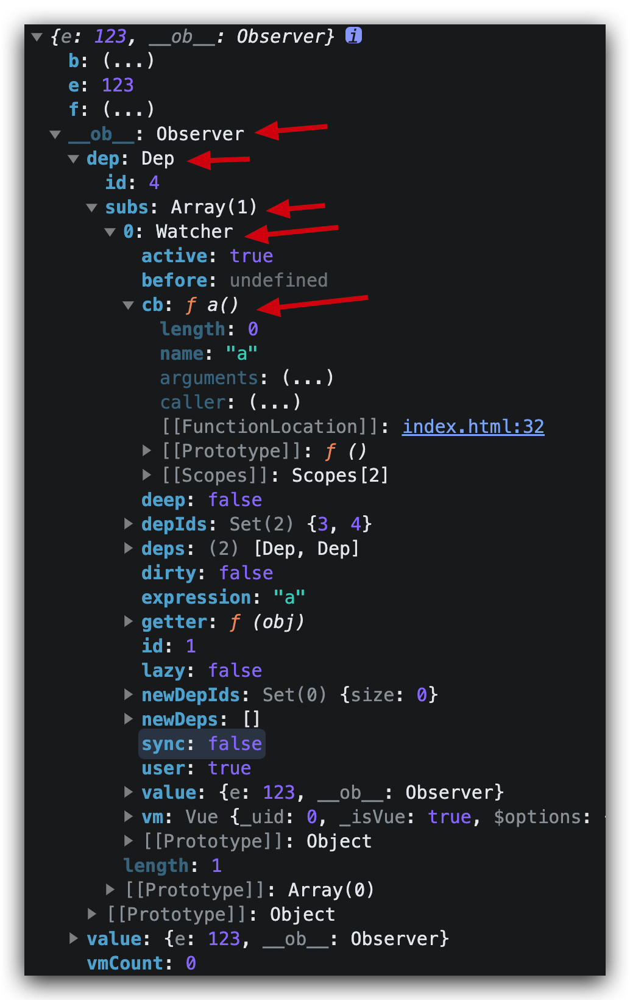

看到这里我们可以发现：这里触发的就是a对象下`__ob__`属性中watcher的回调！

【思考】 $set方法是怎么实现的呢？

1、在数据上添加一个不可枚举__ __ob__ __属性，用这个属性来存放一个observer的对象

2、在vue实例上定义成员方法$set

3、因为新增数据是非响应式的，所以在$set中将新增的属性变成响应式的

4、因为改变了原有对象，需要手动触发对象中的Dep.notify


【思考】 `__ob__`的作用是什么？

【回答】

此时需要判断当前数据是否是响应式的，并且需要调用【这个数据中的observer中的dep下的watch里面的回调】

所以需要将【这个数据中的observer中的dep下的watch里面的回调】在数据中以一个不可枚举的属性来存储

这个属性起一个比较奇怪的名字叫 `__ob__`


【思考】为什么`__ob__`是不可枚举属性呢？直接通过.运算符添加不行么？

【回答】因为`__ob__`属性本身是一个Observer对象，我们上一小节处理了对象的深层响应式

这里会对对象进行递归，如果`__ob__`是可枚举的，就会参与递归运算，造成递归的死循环，所以他是不可枚举的！


下面我们来添加`__ob__`

1、因为`__ob__`是一个不可枚举的属性，并且存入的是observer实例，所以在Onserver类中通过Object.defineProperty将`__ob__`属性添加到数据上，值为当前的实例，this

2、在定义observe方法的时候查看是否有`__ob__`属性，如果有就不需要重复new Observer


在Observer/index.js构造器中添加`__ob__`

~~~~js
class Observer {
  constructor(value) {
    // value：为数组或对象添加自定义属性__ob__ = this，
    // this：为当前 Observer 类的实例，实例上就有dep实例和里面的方法
    // value.__ob__ = this;	// 可被遍历枚举，会造成死循环
    // 定义__ob__ 属性为不可被枚举，防止对象在进入walk都继续defineProperty，造成死循环
    Object.defineProperty(value, '__ob__', {
      value: this,
      enumerable: false  // 不可被枚举
    });
    
    // 如果value是对象，就循环对象，将对象中的属性使用Object.defineProperty重新定义一遍
    this.walk(value); // 上来就走一步，这个方法的核心就是在循环对象
  }

  /**
   * 遍历对象
   *  循环data对象（不需要循环data原型上的方法），使用 Object.keys()
   * @param {*} data 
   */
  walk(data) {
    Object.keys(data).forEach(key => {
      // 使用Object.defineProperty重新定义data对象中的属性
      defineReactive(data, key, data[key]);
    });
  }
}
~~~~

然后我们在控制台输出一个 app.a 此时数据中，可以发现一个 ______ob__ ，用来判断当前变量是否是可观察的

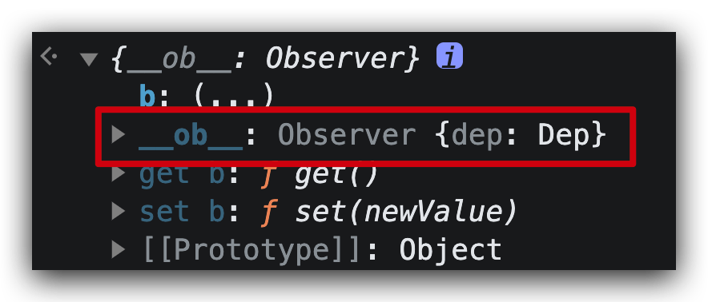

在observer/index.js的observe 方法中判断对象上是否存在 __ __ob__ __，如果有就不添加新的，如果没有实例化一个observer 添加到 value 对象上。

~~~~js
// src/observer/index.js
// 遍历数据将data中每一个对象变成可观察的observe
export function observe(value, cb) {
  // 类型判断，如果value不是对象就什么都不做
  if (!isObject(value)) return 
  let ob
  if (typeof value.__ob__ !== 'undefined') {
    ob = value.__ob__
  }
  else {
    ob = new Observer(value)
  }
  return ob
}
~~~~

此时我们通过observer类为vue中的简单数据添加了一个`__ob__`属性。


接下来我们完成后面的步骤：在vue原型上定义一个$set方法吧～

~~~~js
Vue.prototype.$set = function (obj, key, value) {
  console.log(obj, key, value, '$set执行')
  // 让新增数据也变成响应式的
  defineReactive(obj, key, value)
  // a对象追加属性手动触发a下的面的watcher中的回调
  obj.__ob__.dep.notify()
}
~~~~

试一试！


### 12、数组的监听

【目标】这一小节我们来实现数组的响应式！

在vue中的响应式系统，对于数组做了额外的处理，目的是为了提升性能。单纯通过数组索引来对数组进行响应式也会出现各种问题。所以在vue中通过对数组的7个方法进行重写（拓展）实现了数组固定方法的响应式机制。

【思考】数组改变本质上就是数组下标的改变，那么object.defineProperty方法可以监听数据下标的改变么？

【回答】可以实现，但是由于数组长度的不确定性，vue 并没有对数组下标进行object.defineProperty数据劫持

我们一起来看下面的这段代码

~~~~js
let arr = [1, 2, 3, 4, 5]
  arr.forEach((item, index) => {
    Object.defineProperty(arr, index, {
      get() {
        console.log(item, 'get')
      },
      set(val) {
        console.log(item, 'set')
      }
    })
  })
~~~~

再控制台查看输出：


【注意】通过这样一个简单的例子我们需要明确一个概念，object.defineProperty实际上是可以对数组下标的修改就行劫持的，但是Vue处于性能考虑，并没有使用这一特性。

接下来我们在data中定义一个数组 然后向数组中push一个数据，然后我们看控制台的输出

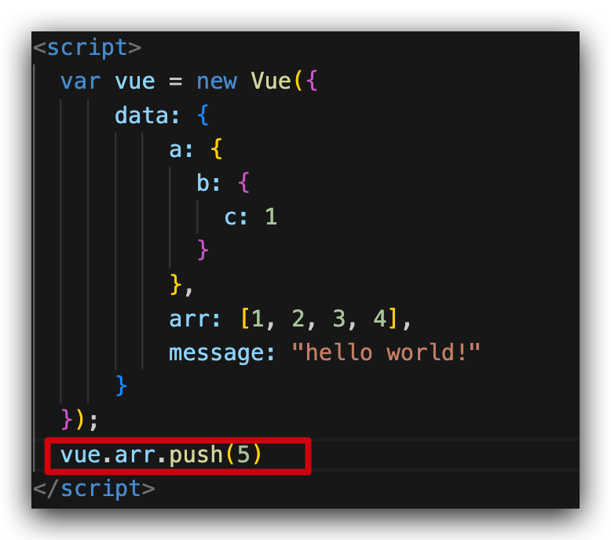


此时虽然操作了数组 arr 但是并没有监听到数组的改变，只劫持到数组的调用。对于数组这种比较特殊的数据类型的响应式设计，vue对于常见的数组方法push, pop, unshift, shift, splice, reverse, sort，进行了重新封装。

那么怎么对数组的方法进行重新封装呢？我们试一试下面的代码。

~~~~js
let arr = [1,2,3]
arr.push(4)
Array.prototype.myPush = function(val){
  console.log('调用拓展的Array方法myPush，劫持到arr被修改了')
  this.push(val)
}

arr.myPush(4)
~~~~


在上面这个例子中，我们针对数组的原生`push`方法定义个一个新的`myPush`方法，这个`myPush`方法内部调用了原生`push`方法，这样就保证了新的``myPush``方法跟原生`push`方法具有相同的功能，并且我们还可以在新的``myPush``方法内部干一些别的事情，比如通知变化。Vue内部就是这么实现的。

【前置知识】
1、Object.setPrototypeOf() 修改对象原型
Object.setPrototypeOf() 方法设置一个指定的对象的原型 ( 即, 内部[[Prototype]]属性）到另一个对象或null

~~~~js
Object.setPrototypeOf(obj, prototype)
~~~~

obj 要设置其原型的对象
prototype 该对象的新原型(一个对象 或 null)

2、Object.create() 创建一个新对象
Object.create()方法创建一个新对象，使用现有的对象来提供新创建的对象的__proto__

~~~~js
Object.create(proto，[propertiesObject])
~~~~

proto 新创建对象的原型对象。
propertiesObject 可选。需要传入一个对象，该对象的属性类型参照Object.defineProperties()的第二个参数。如果该参数被指定且不为 undefined，该传入对象的自有可枚举属性(即其自身定义的属性，而不是其原型链上的枚举属性)将为新创建的对象添加指定的属性值和对应的属性描述符。

返回一个新对象，带着指定的原型对象和属性。


有了以上的前置知识，下面我们对observer 类进行拓展，判断value是否是一个数组，判断数组的方法可以封装在src/utils.js中

~~~~js
// src/utils.js
/**
 * 判断是否是数组
 * @param {*} val 
 * @returns 
 */
export function isArray(val) {
  return Array.isArray(val)
}
~~~~

然后我们对数据类型进行判断，如果数组中的元素是对象需要对对象进行递归响应式的绑定

~~~~js
// observer/index.js
class Observer {
  constructor(value) {
    console.log('observer构造器执行', value);
    // value：为数组或对象添加自定义属性__ob__ = this，
    // this：为当前 Observer 类的实例，实例上就有 observeArray 方法；
    // value.__ob__ = this;	// 可被遍历枚举，会造成死循环
    // 定义__ob__ 属性为不可被枚举，防止对象在进入walk都继续defineProperty，造成死循环
    Object.defineProperty(value, '__ob__', {
      value: this,
      enumerable: false  // 不可被枚举
    });
    

    this.value = value
    if (isArray(value)) {
      // 代理原型...
      // 对数组中元素为对象的情况进行响应式
      this.observeArray(value)
    } else {
      // 如果value是对象，就循环对象，将对象中的属性使用Object.defineProperty重新定义一遍
      this.walk(value); // 上来就走一步，这个方法的核心就是在循环对象
    }
  }

  /**
   * 遍历对象
   *  循环data对象（不需要循环data原型上的方法），使用 Object.keys()
   * @param {*} data 
   */
  walk(data) {
    Object.keys(data).forEach(key => {
      // 使用Object.defineProperty重新定义data对象中的属性
      defineReactive(data, key, data[key]);
    });
  }
  /**
   * 遍历数组，对数组中的对象进行递归观测
   *  1）[[]] 数组套数组
   *  2）[{}] 数组套对象
   * @param {*} data 
   */
  observeArray(data) {
    // observe方法内，如果是对象类型，继续 new Observer 进行递归处理
    data.forEach(item => observe(item))
  }
}
~~~~


此时数组中的对象元素已经具有响应式，那么我们怎么重写Array对象中的方法呢？

这里使用了一种看起来很厉害的设计模式AOP


【拓展】什么是AOP切片编程

通过预编译或者动态代理实现在不修改源代码的情况下给程序动态统一添加某种特定功能的一种技术


采用原型代理，当我们调用`arr.push()`时，实际上是调用了`Array.prototype.push`，我们想对`push`方法进行特殊处理，除了重写该方法，还有一种手段，就是设置一个代理原型。

我们在数组实例和`Array.prototype`之间增加了一层代理来实现派发更新(依赖收集部分后面单独讲)，数组调用代理原型的方法来派发更新，代理原型再调用真实原型的方法实现原有的功能。

定义*/Observer/array.js* 

~~~~js
const arrayPrototype = Array.prototype // 缓存真实原型

// 需要处理的方法
const reactiveMethods = [
  'push',
  'pop',
  'unshift',
  'shift',
  'splice',
  'reverse',
  'sort'
]

// 增加代理原型 arrayMethods.__proto__ === arrayProrotype
// 然后将arrayMethods继承自数组原型
// 这里是面向切片编程思想（AOP）--不破坏封装的前提下，动态的扩展功能
export const arrayMethods = Object.create(arrayPrototype)

// 定义响应式方法
reactiveMethods.forEach((method) => {
  const originalMethod = arrayPrototype[method]
  // 在代理原型上定义重写后的响应式方法
  Object.defineProperty(arrayMethods, method, {
    value: function reactiveMethod(...args) {
      const result = originalMethod.apply(this, args) // 执行默认原型的方法
      // ...派发更新...
      console.log('监听数组方法')
      
      return result
    },
    enumerable: false,
    writable: true,
    configurable: true
  })
})
~~~~

在上面的代码中，首先创建了继承自`Array`原型的空对象arrayMethods，接着在`arrayMethods`上使用`object.defineProperty`方法将那些可以改变数组自身的7个方法遍历逐个进行封装。最后，当我们使用`push`方法的时候，其实用的是`arrayMethods`，而`arrayMethods.push`就是封装的新函数`reactiveMethod`，也就后说，实标上执行的是函数`reactiveMethod`，而`reactiveMethod`函数内部执行了`originalMethod`函数，这个`originalMethod`函数就是`Array.prototype`上对应的原生方法。 那么，接下来我们就可以在`reactiveMethod`函数中做一些其他的事，比如说监听数组方法派发更新。

在observer中使用

~~~~js
import { arrayMethods } from "./array.js";

// 对 value 是数组和对象的情况分开处理
if (isArray(value)) {
  // 将新定义的数组方法 替换到data上的__proto__上
  value.__proto__ = arrayMethods;
  console.log(value)
  this.observeArray(value);	// 数组的深层观测处理
} else {
  // 如果value是对象，就循环对象，将对象中的属性使用Object.defineProperty重新定义一遍
  this.walk(value); // 上来就走一步，这个方法的核心就是在循环对象
}
~~~~

这样，对象`obj: { arr: [...] }`就会变为`obj: { arr: [..., __ob__: {} ], __ob__: {} }`


并且此时在代码中执行arr.push() 由于 触发了push方法此时 监听数组方法会输出


此时数组新增的元素是在绑定ob之后发生的 新增的内容并没有被监听到


所以需要重新调用__ __ob__ __下的observe对数组新增元素进行监听

1、需要知道数组新增了哪些元素

2、将这些新增的元素变成响应式

3、添加依赖收集

~~~~js
// 定义响应式方法
reactiveMethods.forEach((method) => {
  const originalMethod = arrayPrototype[method]
  // 在代理原型上定义重写后的响应式方法
  Object.defineProperty(arrayMethods, method, {
    value: function reactiveMethod(...args) {
      const result = originalMethod.apply(this, args) // 执行默认原型的方法
      // ...派发更新...
      console.log('监听数组方法')
       // this代表的就是数据本身 比如数据是{a:[1,2,3]} 那么我们使用a.push(4)  this就是a  ob就是a.__ob__ 这个属性就是上段代码增加的 代表的是该数据已经被响应式观察过了指向Observer实例
      const ob = this.__ob__; // <========

      // 这里的标志就是代表数组有新增操作
      let inserted;
      switch (method) {
        case "push":
        case "unshift":
          inserted = args;
          break;
        case "splice":
          inserted = args.slice(2);
        default:
          break;
      }
      // 如果有新增的元素 inserted是一个数组 调用Observer实例的observeArray对数组每一项进行观测
      if (inserted) ob.observeArray(inserted); // <========
      // 在这里检测到数组改变了之后从而触发视图更新的操作 
      ob.dep.notify()
      return result
    },
    enumerable: false,
    writable: true,
    configurable: true  
  })
})

~~~~

此时新增的对象也变成了响应式的

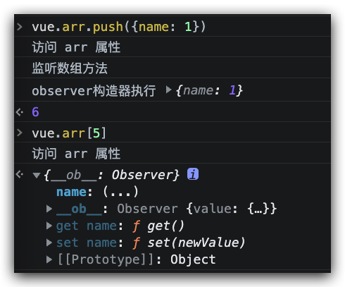

至此我们通过实现重写数组原有的7个方法实现数组方法的监听

那么 如果对象中有数组我们又该如何处理呢？

我们需要对外层对象和内层数组分别进行依赖收集（略）

~~~~js
function defineReactive(obj, key, value) {
  // childOb 是数据组进行观测后返回的结果，内部 new Observe 只处理数组或对象类型
  let childOb = observe(value);// 递归实现深层观测
  let dep = new Dep();  // 为每个属性添加一个 dep
  Object.defineProperty(obj, key, {
    // get方法构成闭包：取obj属性时需返回原值value，
    // value会查找上层作用域的value，所以defineReactive函数不能被释放销毁
    get() {
      // 对象属性的依赖收集
      dep.depend();
      // 数组或对象本身的依赖收集
      if(childOb){  // 如果 childOb 有值，说明数据是数组或对象类型
        // observe 方法中，会通过 new Observe 为数组或对象本身添加 dep 属性
        childOb.dep.depend();    // 让数组和对象本身的 dep 记住当前 watcher
        if(Array.isArray(value)){// 如果当前数据是数组类型
          // 可能数组中继续嵌套数组，需递归处理
          dependArray(value)
        }  
      }
      return value;
    },
    set(newValue) { // 确保新对象为响应式数据：如果新设置的值为对象，需要再次进行劫持
      console.log("修改了被观测属性 key = " + key + ", newValue = " + JSON.stringify(newValue))
      if (newValue === value) return
      observe(newValue);  // observe方法：如果是对象，会 new Observer 深层观测
      value = newValue;
      dep.notify(); // 通知当前 dep 中收集的所有 watcher 依次执行视图更新
    }
  })
}

/**
 * 使数组中的引用类型都进行依赖收集
 * @param {*} value 需要做递归依赖收集的数组
 */
function dependArray(value) {
  // 数组中如果有对象:[{}]或[[]]，也要做依赖收集（后续会为对象新增属性）
  for(let i = 0; i < value.length; i++){
    let current = value[i];
    // current 上如果有__ob__，说明是对象，就让 dep 收集依赖（只有对象上才有 __ob__）
    current.__ob__ && current.__ob__.dep.depend();
    // 如果内部还是数组，继续递归处理
    if(Array.isArray(current)){
      dependArray(current)
    }
  }
}
~~~~


【总结】


