## 一、章节概述

今天的主题是通过 Template 获取 ast 语法树，这一天主要是实现vue的dom不同数据结构之间的转换。

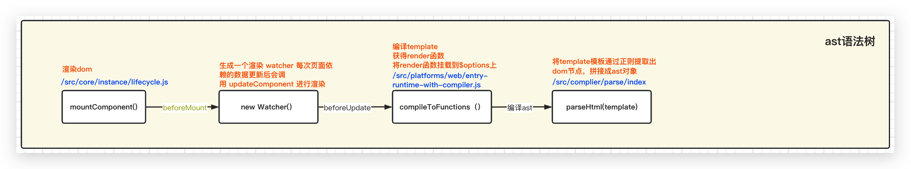

## 二、Vue虚拟dom更新机制(源码解析)

### 1、如何将数据渲染到页面上

【目标】了解vue中dom渲染的大致流程

在Vue初始化的时候主要完成了两件事，一个是数据状态响应式的初始化，另一个是dom渲染并且将数据渲染到页面上，我们已经实现了数据的处理，接下来我们继续完成dom的处理

这一部分中我们会了解到

- vue的差值表达式的渲染和指令的使用
- vue的新旧节点的比对
- vue的就地复用实现和dom节点更新

为了实现这些特性，Vue中创造了模板template（类似于react的Jsx），vue中支持template和jsx，在vue2中使用jsx性能会更高，但是在vue3中由于对模板编译做了一些优化使用jsx反而性能会低一点

那么Vue是怎么将template转化成html的呢？首先Vue对template进行模板解析，将template转换为js代码

在转化过程中使用ast语法树对html结构进行描述，通过ast树形结构将代码重构成js语法也就是虚拟dom后面对于dom的操作只操作js即可，vue模板编译环节首先将template编译成render函数，通过render函数返回旧的dom，更新时再次通过render函数生成新的dom，使用diff进行对比，根据对比的结果更新真实dom

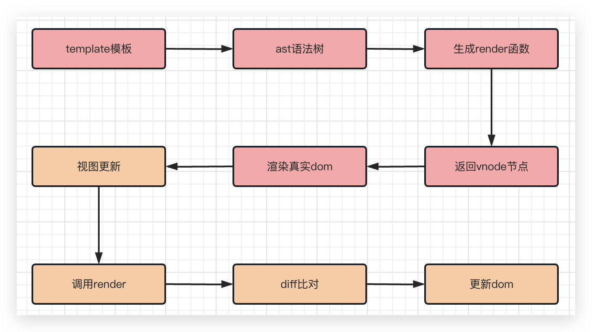

【思考】为什么Vue中要提供如此复杂的dom系统处理dom更新？

【回答】

ast 语法树 是模板通过正则规则匹配截取时候的产物，更具有普适性 比如多平台开发跨端开发中ast结构可以根据不同平台生成不同平台的dom结构

render 函数 是将ast语法树的结构通过栈进行解析后拼接出的产物，他是整个dom系统中最为特殊的部分，因为它是一个函数其他的内容都是结构化的数据。render函数的作用是【调用】， 将节点与数据、属性、方法、样式、指令、事件、双向绑定等关联起来，通过with（this）进行了取值，每一次数据更新的时候驱动视图的修改都会重新调用render获取新的虚拟dom

vnode 节点是render函数调用之后的产物，他是最接近真实节点的dom结构，但是在vue中做了简化为后面的大布丁提供了良好的数据基础，这里需要额外注意的是vnode中的数据已经通过render转换成真实的值了。

diff 对比是将新旧dom进行比较更新的方法，里面定义多种不同的对比方式，根据更新类型的不同可以实现高效的对比更新。

在vue中各个部分各司其职，缺一不可，目前来看复杂的转换逻辑的背后是对可拓展性和性能的妥协。


## 三、模板解析的处理

【目标】回顾模板渲染的流程图，这一步我们生成ast语法树结构


### 1、$mount 的声明获取模板内容

【目标】这一小节我们需要定义$mount方法作为整个dom系统的入口

在`$mount`中，需要拿到`el`挂载点所指向的真实`dom`元素，并使用新内容将它替换掉：

~~~~js
// src/index.js
function Vue(options) {
  console.log('Vue构造器执行')
  this._data = options.data;
  const vm = this;
  vm.$options = options
  console.log('observe方法执行')
  observe(this._data, options.render)
  _proxy.call(this, options.data)
  if (options.el) {
    // 将数据挂在到页面上（此时,数据已经被劫持）
    this.$mount(options.el)
  }
}
// 支持 new Vue({el}) 和 new Vue().$mount 两种情况
Vue.prototype.$mount = function (el) {
  const vm = this;
  el = document.querySelector(el); // 获取真实的元素
  vm.$el = el; // vm.$el：当前页面上的真实元素
}
~~~~

那么，如何拿到`el`挂载点指向的真实`dom`元素？
在`dom`操作中，获取内容有两个方法：`outerHTML`、`innerHTML`由于希望能够使用新内容替换掉老内容，所以，需要使用`outerHTML`来拿到全部内容；下面结合Vue中不同模板的优先级特性，大致逻辑如下：

~~~~js
// 支持 new Vue({el}) 和 new Vue().$mount 两种情况
Vue.prototype.$mount = function (el) {
    console.log("#### 进入 $mount，el = " + el + "####")
    const vm = this;
    const opts = vm.$options;
    el = document.querySelector(el); // 获取真实的元素
    vm.$el = el; // vm.$el 表示当前页面上的真实元素
    console.log("获取真实的元素，el = " + el)
  
  	let template = opts.template;
    if (!template) {
			template = el.outerHTML;
    }    	
}
~~~~

现在我们已经能够获取到页面中的模板字符串 并且挂载到vue实例上，接下来需要进行模板解析

### 2、 模板编译入口方法compileToFunction的定义

【目标】定义`compileToFunction` 入口，以及`compileToFunction`方法中的两个核心方法 parser 和 generate


在前面分析`vue`数据渲染流程中提到：`template` 模板 -> `ast` 语法树 -> `render` 函数，模板编译的最终结果就是 `render` 函数；所以我们需要定义一个方法生成`render`函数，这个方法就是`compileToFunction`方法，他需要以下两步核心操作：

1、通过`parser`：将模板`（template或html）`内容编译为ast语法树；
2、通过`generate`：根据ast语法树生成为render函数；


今天主要实现templae 转换成ast语法树，即将

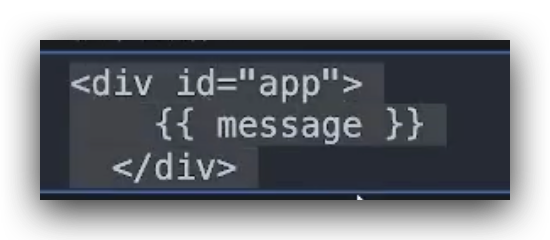

转换成

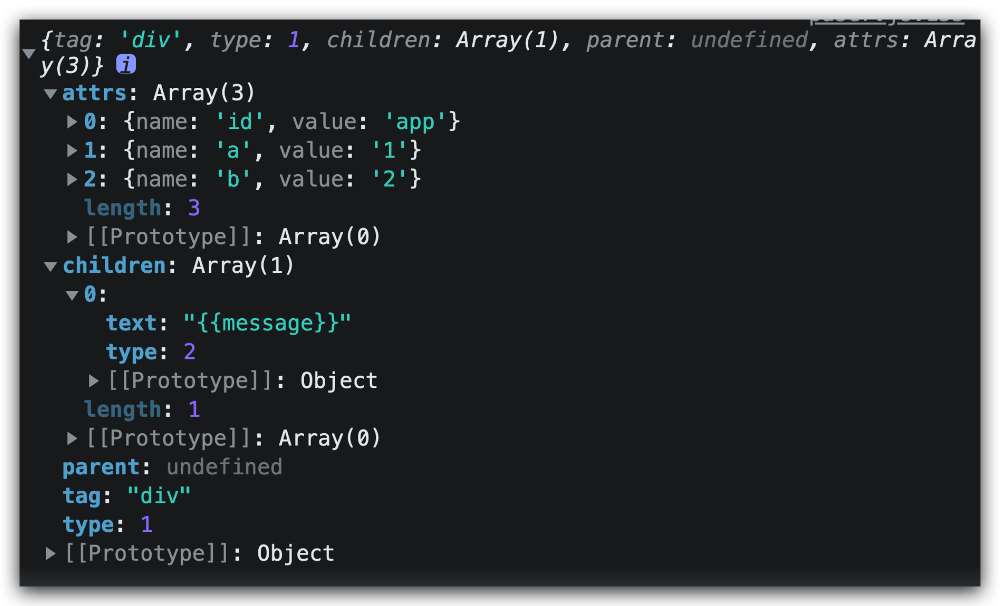

的结构


首先我们新建`src/compiler/index.js `定义一个`compileToFunction`方法，并导入

~~~~js
//  src/compiler/index.js

export function compileToFunction(template) {
  // 1，将模板变成 AST 语法树
  let ast = parser(template);
  // 2，使用 AST 生成 render 函数
  let code = generate(ast);
}

function parser(template) {
  console.log("parser-template : " + template)
}

function generate(ast) {
  console.log("parserHTML-ast : " + ast)
}
~~~~

~~~~js
// /src/index.js
import  {compileToFunction} from './compiler/index.js'

Vue.prototype.$mount = function (el) {
  console.log('#######进入dom挂载########')
  const vm = this
  const opts = vm.$options
  el = document.querySelector(el)
  vm.$el = el
  console.log('获取的真实元素', el)
  // 判断是否有render，如果有就使用render函数
  // 判断是否有template 如果有就使用template
  // 使用outerHtml获取html内容
  if (!opts.render) {
    console.log('options上没有render')
    let template = opts.template
    if (!template) {
      console.log("options 中没有 template, 取 el.outerHTML = " + el.outerHTML)
      template = el.outerHTML
    } else {
      console.log('options上有template')
    }
    let render = compileToFunction(template);
    opts.render = render; // <==== 将render保存在opt上
    console.log('######compileToFunction执行######')
  } else {
    console.log('options上有render')
  }
}
~~~~

在 Vue2 中，compileToFunction 方法是整个Vue编译的入口，完成以上两步操作之后，template 模板最终将会被编译成为render函数。

而将 html 模板编译为 ast 语法树，就需要对 html 模板进行解析，解析方式就是使用正则不断匹配和处理


### 2、模板的处理原理

【目标】了解模板字符串的分割方法和原理，作为下一步定义parser方法的依据

我们先用一个动图来初探模板解析过程


通过上面的图，我们发现模板解析的过程就是使用正则对`html`模板进行顺序解析和处理，每处理完一段，就将这部分截取掉，就这样不停的进行解析和截取，直至将整个模板全部解析完毕；用文字表示如下：

~~~~html
<!-- start：从头开始，使用正则不断进行匹配和截取 -->

<!-- 1，解析开始标签，并截取删除 -->
<div><span></span>{{ message }}</div>		开始标签：<div>
<!-- 2，解析开始标签，并截取删除 -->
     <span></span>{{ message }}</div>   开始标签：<span>
<!-- 3，解析结束标签，并截取删除 -->
           </span>{{ message }}</div>		结束标签：</span>
<!-- 4，解析文本内容，并截取删除 -->
                  {{ message }}</div>		文本内容：{{ message }}
<!-- 5，解析结束标签，并截取删除 -->
                               </div>		结束标签：</div> 
<!-- end：全部匹配完成 -->
~~~~

根据示例的逻辑，在`parser`方法中，可以使用`while`循环对模板不停执行截取操作，直至全部解析完毕后，即可构建出`ast`语法树：

~~~~js
function parser(html) {
  while(html){
    // todo: 解析 html 并构建 ast 语法树
    break
  }
}
~~~~

下面我们来看一下用来识别节点的正则规则

### 3、正则表达式说明

【目标】了解vue中模板截取的字符串匹配规则

在`Vue2`源码中，使用正则对`html`标签和内容进行匹配并解析出结果，涉及相关正则如下：

~~~~js
// 匹配标签名 my-button
// 第一个\：用来转译第二个\，所以第一组\\相当于\；
// 第三个\：用来转译第四个\，所以第二组\\也相当于\；
// 字符串\\-转译后，成为正则中的\-，正则中表示-；
// 字符串\\.转译后，成为正则中的\.，正则中表示.；
const ncname = `[a-zA-Z_][\\-\\.0-9_a-zA-Z]*`;  
// 命名空间标签 aa:aa-xxx
// ?:: 表示匹配，但不捕获；
// ${ncname}: 标签名，参考ncname正则；
// \\:: 正则中的\:，表示后面有一个冒号；
// ?: 最后的问号，表示前面的内容可有可无；比如：aa:可以没有
// ${ncname} 标签名，参考ncname正则；
// 用于匹配aa:aa-xxx，这种标签叫做“命名空间标签”，很少会使用到；
const qnameCapture = `((?:${ncname}\\:)?${ncname})`;
// 开始标签-捕获标签名
// ^<：表示以<开头；
const startTagOpen = new RegExp(`^<${qnameCapture}`); 
// 结束标签-匹配标签结尾的 </div>
// ^<\\/：<符号开头，后面跟一个/，即以</开头；
// ${qnameCapture}：参考命名空间标签；
// [^>]*：中间可以是任意数量不为>的字符；
// >：最后一位必须是>；
const endTag = new RegExp(`^<\\/${qnameCapture}[^>]*>`);
// 匹配属性这个相对比较复杂
// ^\s*： 开头为 n 个空格（0个或n个空格）
// [^\s"'<>\/=]+: 匹配属性名； 不是空格、引号、尖脚号、等号的n个字符；
// ?:\s*(=)\s*： 空格和空格之间可以夹着一个等号=；
// ?:“([“]*)”+|'([‘]*)’+|([^\s”'=<>`]+) ：匹配属性值
// "([^"]*)": 可能是双引号；
// '([^']*)': 可能是单引号；
// [^\s"'=<>`]+: 不是空格、引号、尖脚号、等号的 n 个字符；
// 属性的三种可能写法
// 情况 1：双引号的情况，如：aaa="xxx";
// 情况 2：单引号的情况，如：aaa='xxx';
// 情况 3：没引号的情况，如：aaa=xxx;
const attribute = /^\s*([^\s"'<>\/=]+)(?:\s*(=)\s*(?:"([^"]*)"+|'([^']*)'+|([^\s"'=<>`]+)))?/; 
// 匹配标签结束的 >
// ^\s*: 空格 n 个
// (\/?)>: 尖角号有以下两种情况
// -/>: 自闭合
// ->: 没有/的闭合
const startTagClose = /^\s*(\/?)>/;
~~~~

为了更好的理解正则可以将正则的语法在正则可视化工具中查看https://jex.im/regulex大家结合注释来分析每个正则的作用 


### 4、ast语法树的生成

模板解析的思路：对模板不停截取，直至全部解析完毕；

模板解析代码实现：在`while`循环，使用正则不断的对`html`模板中的有效信息进行匹配和截取；看内容的开头第一个字符是否为`<`尖角号：如果是尖角号，说明是标签；如果不是尖角号，说明是文本；

#### 1、节点类型判断

【目标】能够区分模板中的标签节点和文本节点

方法：判断内容开头的第一个字符是否为尖角号`<` ：

- 如果是尖角号，说明是标签
- 如果不是尖角号，说明是文本

~~~~js
// src/compiler/index.js#parserHTML

function parser(html) {
  while(html){
    // 解析标签or文本，判断html的第一个字符，是否为 < 尖角号
    let index = html.indexOf('<');
    if(index == 0){
      console.log("是标签")
    } else{
      console.log("是文本")
    }
  }
}
~~~~

#### 2、解析开始标签parseStartTag方法

【目标】能够使用match方法匹配开始标签，并输出开始标签。

包含尖括号 < 的情况：可能是开始标签 <div>，也可能是结束标签</div>;

所以，当解析到标签时，应先使用正则匹配开始标签；如果没有匹配成功，再使用结束标签进行匹配

parseStartTag方法：匹配开始标签，返回匹配结果，即标签名；

【注意】匹配结果的索引 1 ，为标签名

~~~~js
// src/compiler/index.js#parserHTML

function parser(html) {
  /**
  * 匹配开始标签，返回匹配结果(开始标签名)
  */
  function parseStartTag() {
    // 匹配开始标签
    const start = html.match(startTagOpen);
    // 构造匹配结果对象：包含标签名和属性
    if (start) {
      const match = {
        tagName: start[1], // 数组索引 1 为标签名
        attrs: []
      }
      console.log("match结果：" + JSON.stringify(match))
      // todo 删除字符串中匹配完成的部分
      
      return match;
    }
  }

  // 对模板不停做匹配和截取操作，直至全部解析完毕
  while (html) {
    // 解析标签和文本(看开头是否为 <)
    let index = html.indexOf('<');
    if (index == 0) {
      console.log("解析 html：" + html + ",结果：是标签")
      // 如果是标签，继续解析开始标签和属性
      const startTagMatch = parseStartTag();// 匹配开始标签，返回匹配结果
      // 1，匹配到开始标签：无需执行后续逻辑，直接进入下一次 while，继续解析后续内容
      if (startTagMatch) {
        console.log('匹配到了开始标签' + JSON.stringify(startTagMatch))
        // continue;
      }
    } else {
      console.log("解析 html：" + html + ",结果：是文本")
    }
    // 当html的元素被截取完成之后循环退出
    // 这里暂时强制退出循环防止死循环 之后会删除掉
    break
  }
}
~~~~

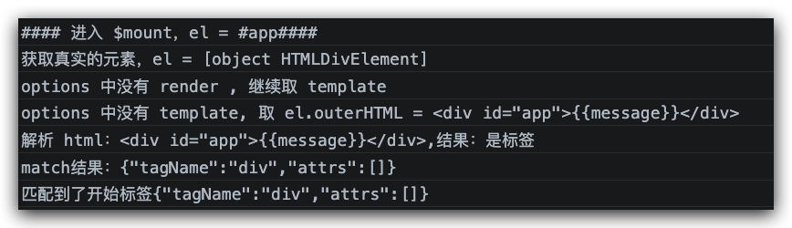

#### 3、截取匹配完成的部分 advance 方法

【目标】通过定义的advance方法实现标签的截取，并返回截取后的剩余标签部分

开始标签解析完成后，需要将匹配完成的部分截掉，达到如下效果：

~~~~html
<!-- 解析前 -->
<div id=app>{{message}}</div>
<!-- 解析后：开始标签<div被截掉 -->
     id=app>{{message}}</div>
~~~~

为达到以上效果，创建`advance`(前进)方法：截取`html`内容至当前已解析的位置，即删除已处理完成的部分；

~~~~js
// src/compiler/index.js#parserHTML

function parserHTML(html) {
  /**
   * 截取字符串
   * @param {*} len 截取长度
   */
  function advance(len){
    html = html.substring(len);
  }

  /**
  * 匹配开始标签，返回匹配结果(开始标签名)
  */
  function parseStartTag() {
    // 匹配开始标签
    const start = html.match(startTagOpen);
    // 构造匹配结果对象：包含标签名和属性
    if (start) {
      const match = {
        tagName: start[1], // 数组索引 1 为标签名
        attrs: []
      }
      console.log("match结果：" + JSON.stringify(match))
      // todo 删除字符串中匹配完成的部分
      advance(start[0].length)
      console.log("截取后的 html：" + html)
      return match;
    }
  }
  ......
}
~~~~

调试并查看截取后的`html`片段：

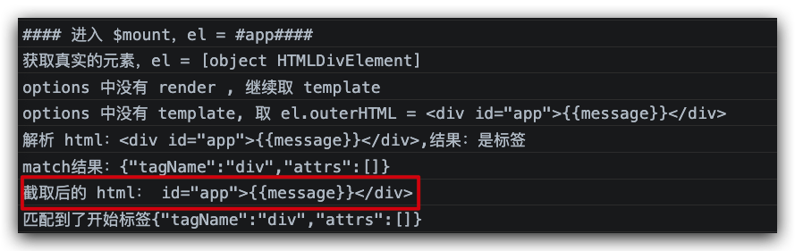

#### 4，解析开始标签中的属性-while循环

【目标】通过while循环将字符串从头截取到尾部直至参数html变成空字符串停止循环

```html
id="app">{{message}}</div>
```

在开始标签中，由于可能存在多个属性，因此这部分需要进行多次处理；

```js
// src/compiler/index.js#parserHTML#parseStartTag

/**
  * 匹配开始标签，返回匹配结果(开始标签名)
  */
  function parseStartTag() {
    // 匹配开始标签
    const start = html.match(startTagOpen);
    // 构造匹配结果对象：包含标签名和属性
    if (start) {
      const match = {
        tagName: start[1], // 数组索引 1 为标签名
        attrs: []
      }
      console.log("match结果：" + JSON.stringify(match))
      // todo 删除字符串中匹配完成的部分
      advance(start[0].length)

      // ******* 开始解析标签的属性 id="app" a=1 b=2>*******//
      let end;  // 是否匹配到开始标签的结束符号 > 或 /> 
      let attr; // 存储属性匹配的结果
      // 匹配并获取属性，放入 match.attrs 数组
      // 例如 <div>标签：当匹配到字符 >，表示标签结束，不再继续匹配标签内的属性
      //    attr = html.match(attribute)  匹配属性并赋值当前属性的匹配结果
      //    !(end = html.match(startTagClose))   没有匹配到开始标签的结束符号 > 或 />
      while (!(end = html.match(startTagClose)) && (attr = html.match(attribute))) {
        // 将匹配到的属性记录到数组 match.attrs(属性对象包含属性名和属性值)
        // 因为没在vue环境中所以只有attr[3]一种情况
        match.attrs.push({ name: attr[1], value: attr[3] || attr[4] || attr[5] })
        // 截取掉已匹配完成的属性，如：xxx=xxx
        advance(attr[0].length)
      }

      // 当匹配到开始标签的关闭符号 > 时，当前标签处理完成，while 结束
      // 此时，<div id="app" 处理完成，需要连同关闭符号 > 一起截取掉
      if (end) {
        advance(end[0].length)
      }

      console.log("截取后的 html：" + html)
      
      // 开始标签处理完成后，返回匹配结果：tagName 标签名 + attrs 属性对象
      return match;
    }
  }
```

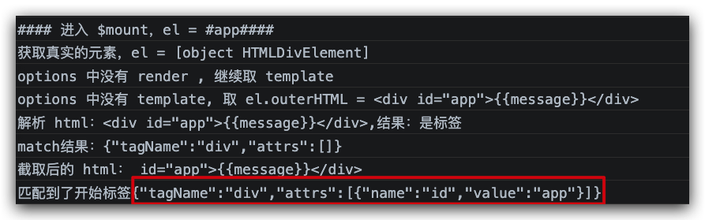

【备注】前面提到过，属性的值可能是`"xxx"`、`'xxx'`、`xxx`三种之一，所以属性取值为`attr[3] || attr[4] || attr[5]`，即取匹配结果中有值的一个即可；

【总结】**开始标签处理过程的详细说明**

~~~~html
<div id="app" a='1' b=2>
~~~~

对开始标签处理过程的每一步进行说明：

1、以 < 开头，说明是标签；此时，可能是开始标签，也可能是结束标签
2、匹配 正则startTagOpen，获取属性名和属性
3、匹配 <div 剩 id="app" a='1' b=2>
4、匹配 id="app" 剩 a='1' b=2>
5、匹配 a='1' 剩 b=2>
6、匹配 b=2 剩 >
7、匹配到 > 时，匹配结束 while 循环终止
8、至此，开始标签就解析完成了

注意：对于`match`的匹配结果，`match[0]`表示到的匹配内容，`match[1]`表示捕获到的内容

#### 5、处理剩下的结束标签及文本

~~~~js
// src/compiler/index.js

/**
  * 匹配开始标签，返回匹配结果(开始标签名)
  */
  function parseStartTag() {...}

  // 对模板不停做匹配和截取操作，直至全部解析完毕
  while (html) {
    // 解析标签和文本(看开头是否为 <)
    let index = html.indexOf('<');
    if (index == 0) {
      console.log("解析 html：" + html + ",结果：是标签")
      // 如果是标签，继续解析开始标签和属性
      const startTagMatch = parseStartTag();// 匹配开始标签，返回匹配结果
      // 1，匹配到开始标签：无需执行后续逻辑，直接进入下一次 while，继续解析后续内容
      if (startTagMatch) {
        console.log('匹配到了开始标签' + JSON.stringify(startTagMatch))
        continue; // <==== 放开
      }
      // 2，未匹配到开始标签：此时有可能为结束标签</div>
      // 如果匹配到结束标签，无需执行后续逻辑，直接进入下一次 while，继续解析后续内容

      // 如果开始标签没有匹配到，有可能是结束标签 </div>
      let endTagMatch;
      // 匹配到了，说明是结束标签
      if (endTagMatch = html.match(endTag)) {
        // 删除已匹配完成的部分
        advance(endTagMatch[0].length)
        continue; // <==== 放开
      }

    } else {
      
      console.log("解析 html：" + html + ",结果：是文本")
      // 此时的 html 片段为：hello</div>
      // 获取文本部分
      let chars = html.substring(0, index)
      // 删除已匹配完成的部分
      advance(chars.length)
    }
    // 当html的元素被截取完成之后循环退出
    // 这里暂时强制退出循环防止死循环 之后会删除掉
    // break
  }
}
~~~~


##  四、树形结构生成

### 1、构造ast的树形结构

【目标】了解如何将拆分的字符串拼接成ast语法树形结构

下面是一段常见的dom结构，我们逐层拆分一下

~~~~html
<div><sapn></span><p></p></div>
{
	tag: 'div',
	children: [
		{
			tag: 'span',
			children: []
  	},
		{
			tag: 'p',
			children: []
  	}
  ]
}
~~~~

`html`标签特点：成对出现（开始标签 + 结束标签），如：`<span>` 和 `</span>`；基于模板解析从左到右的顺序和以上`html`标签特点，就可以借助栈型的数据结构来辅助构建元素的父子关系；

~~~~shell
将解析到的标签名按顺序放入栈中：

[div]

[div,span]        span 是 div 的儿子

[div,] span,span  span 标签闭合，span 出栈，将 span 作为 div 的儿子

[div,p]           p 是 div 的儿子

[div,] p,p        p 标签闭合，p 出栈，将 p 作为 div 的儿子(即 p 和 span 是同层级的兄弟)

[] div,div        div 标签闭合 div出栈
~~~~

在栈中如果出现了一个开始标签，后面出现了一对标签说明该标签是这个开始标签节点下的子集，根据这样的对应关系，通过以上逻辑，借助栈的数据结构，就能够模拟出了`html`元素的父子关系了，为了构造这样一个栈的结构，我们需要定义三个方法start用于向栈内发射标签，text方法，用于在栈内的父节点上绑定文本属性，end方法用于在栈内做标签成对匹配的校验。

我们用下面一张图来初探ast语法树构建的过程。


### 2、抛出开始标签、结束标签及文本

【目标】定义start方法 end方法 text方法并在适当的位置调用，为下一步入栈做准备

将开始标签的状态（开始标签、结束标签、文本标签）发射出去，编写三个发射状态的方法，分别用于向栈内发射开始标签、结束标签、文本标签

~~~~js
// src/compiler/index.js

// 开始标签
function start(tagName, attrs) {
  console.log("start", tagName, attrs)
}

// 结束标签
function end(tagName) {
  console.log("end", tagName)
}

// 文本标签
function text(chars) {
  console.log("text", chars)
}
~~~~

当匹配到开始标签、结束标签、文本时，将数据发送出去

~~~~js
// src/compiler/index.js

/**
  * 匹配开始标签，返回匹配结果(开始标签名)
  */
  function parseStartTag() {
    // 匹配开始标签
    const start = html.match(startTagOpen);
    // 构造匹配结果对象：包含标签名和属性
    if (start) {
      const match = {
        tagName: start[1], // 数组索引 1 为标签名
        attrs: []
      }
      console.log("match结果：" + JSON.stringify(match))
      // todo 删除字符串中匹配完成的部分
      advance(start[0].length)

      // ******* 开始解析标签的属性 id="app" a=1 b=2>*******//
      let end;  // 是否匹配到开始标签的结束符号 > 或 /> 
      let attr; // 存储属性匹配的结果
      // 匹配并获取属性，放入 match.attrs 数组
      // 例如 <div>标签：当匹配到字符 >，表示标签结束，不再继续匹配标签内的属性
      //    attr = html.match(attribute)  匹配属性并赋值当前属性的匹配结果
      //    !(end = html.match(startTagClose))   没有匹配到开始标签的结束符号 > 或 />
      while (!(end = html.match(startTagClose)) && (attr = html.match(attribute))) {
        // 将匹配到的属性记录到数组 match.attrs(属性对象包含属性名和属性值)
        match.attrs.push({ name: attr[1], value: attr[3] || attr[4] || attr[5] })
        // 截取掉已匹配完成的属性，如：xxx=xxx
        advance(attr[0].length)
      }

      // 当匹配到开始标签的关闭符号 > 时，当前标签处理完成，while 结束
      // 此时，<div id="app" 处理完成，需要连同关闭符号 > 一起截取掉
      if (end) {
        advance(end[0].length)
      }

      console.log("截取后的 html：" + html)

      // 开始标签处理完成后，返回匹配结果：tagName 标签名 + attrs 属性对象
      return match;
    }
  }

  // 开始标签
  function start(tagName, attrs) {
    console.log("start", tagName, attrs)
  }

  // 结束标签
  function end(tagName) {
    console.log("end", tagName)
  }

  // 文本标签
  function text(charts) {
    console.log("text", chars)
  }

  // 对模板不停做匹配和截取操作，直至全部解析完毕
  while (html) {
    // 解析标签和文本(看开头是否为 <)
    let index = html.indexOf('<');
    if (index == 0) {
      console.log("解析 html：" + html + ",结果：是标签")
      // 如果是标签，继续解析开始标签和属性
      const startTagMatch = parseStartTag();// 匹配开始标签，返回匹配结果
      // 1，匹配到开始标签：无需执行后续逻辑，直接进入下一次 while，继续解析后续内容
      if (startTagMatch) {
        // 匹配到开始标签，调用start方法，传递标签名和属性
        start(startTagMatch.tagName, startTagMatch.attrs)
        console.log('匹配到了开始标签' + JSON.stringify(startTagMatch))
        continue; // <==== 放开
      }
      // 2，未匹配到开始标签：此时有可能为结束标签</div>
      // 如果匹配到结束标签，无需执行后续逻辑，直接进入下一次 while，继续解析后续内容

      // 如果开始标签没有匹配到，有可能是结束标签 </div>
      let endTagMatch;
      if (endTagMatch = html.match(endTag)) {// 匹配到了，说明是结束标签
        // 匹配到开始标签，调用 start 方法，向外传递标签名和属性
        end(endTagMatch[1])
        // 删除已匹配完成的部分
        advance(endTagMatch[0].length)
        continue; // <==== 放开
      }

    } else {
      console.log("解析 html：" + html + ",结果：是文本")
      // 此时的 html 片段为：hello</div>
      let chars = html.substring(0, index)
      // 向外传递文本
      text(chars);
      // 删除已匹配完成的部分
      advance(chars.length)
    }
    // 当html的元素被截取完成之后循环退出
    // 这里暂时强制退出循环防止死循环 之后会删除掉
    // break
  }
}
~~~~

至此，通过对`html`模板的解析，已经获取到了模板中的标签名、属性等关键信息，后续再通过这些信息构建出`AST`语法树；

使用正则对 html 模板进行解析和处理，匹配到模板中的标签和属性

- 解析开始标签-parseStartTag方法
- 截取匹配完成的部分-advance方法
- 解析开始标签中的属性-while循环
- 开始标签处理过程的详细说明
- 对开始标签、结束标签及文本的发射处理

【尝试】在控制台输出一下内容查看解析语法树之后的输出

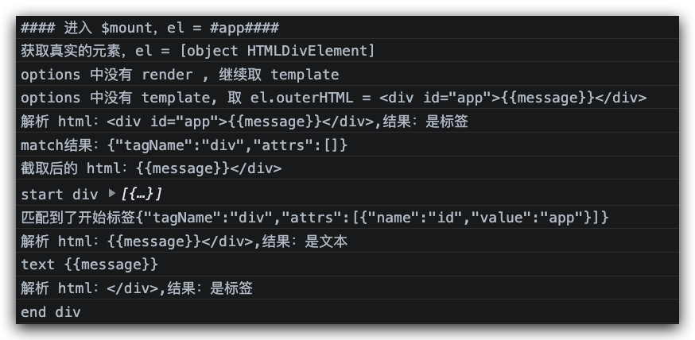

### 3、ast 节点元素的数据结构

【目标】通过vue源码的查询定义一份返回ast节点的基本结构的工厂函数。

在构建父子关系（标签）的对象中，我们还需要记录需要记录以下信息：

~~~~js
// 工厂函数构建 AST 元素节点
function createASTElement(tag, attrs, parent) {
  return {
    tag,          // 标签名
    type:1,       // 元素
    children:[],  // 儿子
    parent,       // 父亲
    attrs         // 属性
  }
}
~~~~

### 4、处理开始标签

【目标】判断根节点、父节点，将开始标签的内容在ast树上进行定义和关联

处理开始标签的逻辑，如果当前标签是第一个节点，则自动成为整棵树的根节点 root，如果已存在根节点 ，则取栈中最后一个标签作为父节点，创建ast节点元素并入栈

代码实现

~~~~js
// 处理开始标签,如：[div,p]
let stack = [];
let root = null;

function start(tag, attrs) {
  console.log("发射匹配到的开始标签-start,tag = " + tag + ",attrs = " + JSON.stringify(attrs))
  // 取栈中最后一个标签，作为父节点
  let parent = stack[stack.length-1];
  // 创建当前 ast 节点
  let element = createASTElement(tag, attrs, parent);
  // 如果是第一个标签，则作为根节点
  if(root == null) root = element;
  // 如果存在父亲，就父子相认（为当前节点设置父亲，同时为父亲设置儿子）
  if(parent){
    element.parent = parent;
    parent.children.push(element)
  }
  // 当前 ast 元素节点构建完成后，加入到栈中
  stack.push(element)
  console.log('栈内元素', stack)
}
~~~~

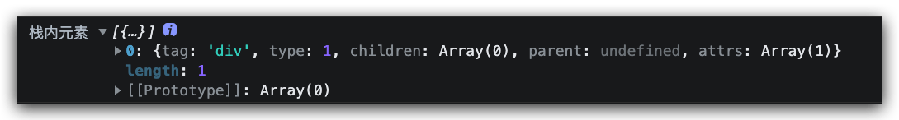

### 5、处理结束标签

【目标】完成节点出栈和节点闭合的校验

处理结束标签的逻辑：抛出栈中最后一个标签，即与当前结束标签成对的开始标签；
验证栈中抛出的标签是否与当前结束标签成对
代码实现

~~~~js
// 处理结束标签
function end(tagName) {
  console.log("发射匹配到的结束标签-end,tagName = " + tagName)
  // 从栈中抛出结束标签
  let endTag = stack.pop();
  // check:抛出的结束标签名与当前结束标签名是否一致
  // 开始/结束标签的特点是成对的，当抛出的元素名与当前元素名不一致时报错
  if(endTag.tag != tagName)console.log("标签出错")
}
~~~~

### 6、处理文本

【目标】能够将文本作为子节点添加到父节点下的children中

处理文本的逻辑：删除文本中可能存在的空白字符；若文本不为空，则取当前栈中最后一个标签作为父节点；
注意：文本不需要入栈，直接绑定为父节点的儿子即可；

代码实现

~~~~js
// 处理文本（文本中可能包含空白字符）
function text(chars) {
  console.log("发射匹配到的文本-text,chars = " + chars)
  // 找到文本的父亲，即当前栈中的最后一个元素
  let parent = stack[stack.length-1];
  // 删除文本中可能存在的空白字符：将空格替换为空
  chars = chars.replace(/\s/g, ""); 
  if(chars){
    // 绑定父子关系
    parent.children.push({
      type:2,     // type=2 表示文本类型
      text:chars,
    })
  }
}
~~~~

备注：使用type=2 表示文本类型，与 astexplorer.net 一致;

最后别忘了将root返回

~~~~js 
export function parserHTML(html) {
  
  ......
  
	return root;
}

~~~~

【恭喜🎉】至此我们已经生成了ast语法树的结构，通过这个结构可以对多平台进行各种适配化的解析

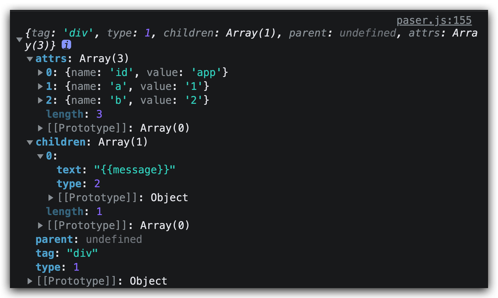

## 五、代码梳理

### 1、封装 parser.js 文件

新建parser文件将dom转换相关代码cv到文件中

~~~~js
// src/compile/parser.js

// 匹配标签名：aa-xxx
const ncname = `[a-zA-Z_][\\-\\.0-9_a-zA-Z]*`;
// 命名空间标签：aa:aa-xxx
const qnameCapture = `((?:${ncname}\\:)?${ncname})`;
// 匹配标签名(索引1)：<aa:aa-xxx
const startTagOpen = new RegExp(`^<${qnameCapture}`);
// 匹配标签名(索引1)：</aa:aa-xxxdsadsa> 
const endTag = new RegExp(`^<\\/${qnameCapture}[^>]*>`);
// 匹配属性（索引 1 为属性 key、索引 3、4、5 其中一直为属性值）：aaa="xxx"、aaa='xxx'、aaa=xxx
const attribute = /^\s*([^\s"'<>\/=]+)(?:\s*(=)\s*(?:"([^"]*)"+|'([^']*)'+|([^\s"'=<>`]+)))?/;
// 匹配结束标签：> 或 />
const startTagClose = /^\s*(\/?)>/;
// 匹配 {{   xxx    }} ，匹配到 xxx
const defaultTagRE = /\{\{((?:.|\r?\n)+?)\}\}/g

export function parserHTML(html) {
  console.log("***** 进入 parserHTML：将模板编译成 AST 语法树 *****")
  let stack = [];
  let root = null;
  // 构建父子关系
  function createASTElement(tag, attrs, parent) {
    return {
      tag,  // 标签名
      type:1, // 元素类型为 1
      children:[],  // 儿子
      parent, // 父亲
      attrs // 属性
    }
  }
  // 开始标签,如:[div,p]
  function start(tag, attrs) {
    console.log("发射匹配到的开始标签-start,tag = " + tag + ",attrs = " + JSON.stringify(attrs))
    // 遇到开始标签，就取栈中最后一个，作为父节点
    let parent = stack[stack.length-1];
    let element = createASTElement(tag, attrs, parent);
    // 还没有根节点时，作为根节点
    if(root == null) root = element;
    if(parent){ // 父节点存在
      element.parent = parent;  // 为当前节点设置父节点
      parent.children.push(element) // 同时，当前节点也称为父节点的子节点
    }
    stack.push(element)
  }
  // 结束标签
  function end(tagName) {
    console.log("发射匹配到的结束标签-end,tagName = " + tagName)
    // 如果是结束标签，就从栈中抛出
    let endTag = stack.pop();
    // check:抛出的结束标签名与当前结束标签名是否一直
    if(endTag.tag != tagName)console.log("标签出错")
  }
  // 文本
  function text(chars) {
    console.log("发射匹配到的文本-text,chars = " + chars)
    // 文本直接放到前一个中 注意：文本可能有空白字符
    let parent = stack[stack.length-1];
    chars = chars.replace(/\s/g, ""); // 将空格替换为空，即删除空格
    if(chars){
      parent.children.push({
        type:2, // 文本类型为 2
        text:chars,
      })
    }
  }
  /**
   * 截取字符串
   * @param {*} len 截取长度
   */
  function advance(len) {
    html = html.substring(len);
    console.log("截取匹配内容后的 html:" + html)
    console.log("===============================")
  }

  /**
   * 匹配开始标签,返回匹配结果
   */
  function parseStartTag() {
    console.log("***** 进入 parseStartTag，尝试解析开始标签，当前 html： " + html + "*****")
    // 匹配开始标签，开始标签名为索引 1
    const start = html.match(startTagOpen);
    if(start){// 匹配到开始标签再处理
      // 构造匹配结果，包含：标签名 + 属性
      const match = {
        tagName: start[1],
        attrs: []
      }
      console.log("html.match(startTagOpen) 结果:" + JSON.stringify(match))
      // 截取匹配到的结果
      advance(start[0].length)
      let end;  // 是否匹配到开始标签的结束符号>或/>
      let attr; // 存储属性匹配的结果
      // 匹配属性且不能为开始的结束标签，例如：<div>，到>就已经结束了，不再继续匹配该标签内的属性
      //    attr = html.match(attribute)  匹配属性并赋值当前属性的匹配结果
      //    !(end = html.match(startTagClose))   没有匹配到开始标签的关闭符号>或/>
      while (!(end = html.match(startTagClose)) && (attr = html.match(attribute))) {
        // 将匹配到的属性,push到attrs数组中，匹配到关闭符号>,while 就结束
        console.log("匹配到属性 attr = " + JSON.stringify(attr))
        // console.log("匹配到属性 name = " + attr[1] + "value = " + attr[3] || attr[4] || attr[5])
        match.attrs.push({ name: attr[1], value: attr[3] || attr[4] || attr[5] })
        advance(attr[0].length)// 截取匹配到的属性 xxx=xxx
      }
      // 匹配到关闭符号>,当前标签处理完成 while 结束,
      // 此时，<div id="app" 处理完成，需连同关闭符号>一起被截取掉
      if (end) {
        console.log("匹配关闭符号结果 html.match(startTagClose):" + JSON.stringify(end))
        advance(end[0].length)
      }

      // 开始标签处理完成后，返回匹配结果：tagName标签名 + attrs属性
      console.log(">>>>> 开始标签的匹配结果 startTagMatch = " + JSON.stringify(match))
      return match;
    }
    console.log("未匹配到开始标签，返回 false")
    console.log("===============================")
    return false;
  }

  // 对模板不停截取，直至全部解析完毕
  while (html) {
    // 解析标签和文本(看开头是否为<)
    let index = html.indexOf('<');
    if (index == 0) {// 标签
      console.log("解析 html：" + html + ",结果：是标签")
      // 如果是标签，继续解析开始标签和属性
      const startTagMatch = parseStartTag();// 匹配开始标签，返回匹配结果
      if (startTagMatch) {  // 匹配到了，说明是开始标签
        // 匹配到开始标签，调用start方法，传递标签名和属性
        start(startTagMatch.tagName, startTagMatch.attrs)
        continue; // 如果是开始标签，就不需要继续向下走了，继续 while 解析后面的部分
      }
      // 如果开始标签没有匹配到，有可能是结束标签 </div>
      let endTagMatch;
      if (endTagMatch = html.match(endTag)) {// 匹配到了，说明是结束标签
        // 匹配到开始标签，调用start方法，传递标签名和属性
        end(endTagMatch[1])
        advance(endTagMatch[0].length)
        continue; // 如果是结束标签，也不需要继续向下走了，继续 while 解析后面的部分
      }
    } else {// 文本
      console.log("解析 html：" + html + ",结果：是文本")
    }

    // 文本：index > 0 
    if(index > 0){
      // 将文本取出来并发射出去,再从 html 中拿掉
      let chars = html.substring(0,index) // hello</div>
      text(chars);
      advance(chars.length)
    }
  }
  console.log("当前 template 模板，已全部解析完成")
  console.log(root)
  return root;
}
~~~~

生成的ast树形结构

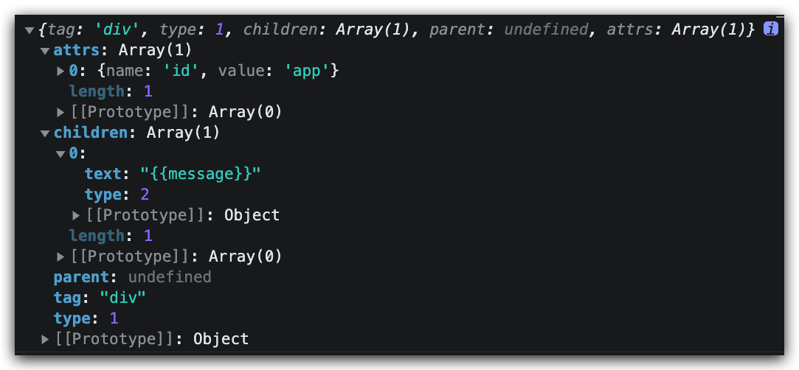

### 2、导入模块

在src/compile/index.js中，导入src/compile/parser.js#parserHTML：

~~~~js
// src/compile/index.js

import {parserHTML} from './parser.js'

export function compileToFunction(template) {
  console.log("***** 进入 compileToFunction：将 template 编译为 render 函数 *****")
  // 1，将模板变成 AST 语法树
  let ast = parserHTML(template);
  console.log("解析 HTML 返回 ast 语法树====>")
  // 2，使用 AST 生成 render 函数
  let code = generate(ast);
}

function generate(ast) {
  console.log("parserHTML-ast : " + ast)
}
~~~~

### 3、测试 ast 构建逻辑

~~~~html
<div><p>{{message}}<sapn>HelloVue</span></p></div>
~~~~


控制台输出：对应元素结构如下：

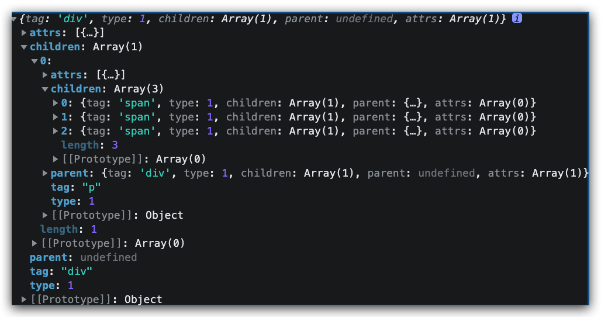

## 六、render函数的组装

【目标】能够通过生成的ast结构转换成render函数并且生成vdom，实现vdom的挂载和更新

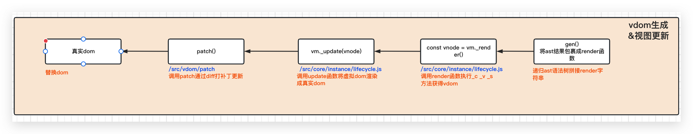

当外部调用generate方法时，传入ast语法树，返回render函数，根据“模板编译示例”中render函数的结构，通过字符串拼接的方式生成render函数代码；

[Vue在线转换成render的网站](https://vue-template-explorer.netlify.app/#%3Cdiv%20id%3D%22app%22%3E%7B%7B%20msg%20%7D%7D%3C%2Fdiv%3E)： 根据 render 函数特征，使用_c包裹节点， _v包裹文本，使用 _s 包裹变量

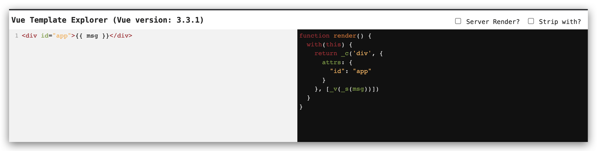

下面仿照模板编译示例中render函数的语法和结构，根据ast语法树中的元素节点信息，采用字符串拼接的方式构建出render函数：

### 1、封装generate函数，生成基本结构

~~~~js
// src/compiler/index.js

function generate(ast) {
 // 字符串拼接 render 函数
 let code = `_c(
 '${ast.tag}',
    ${
      // 暂不处理属性，后面单独处理
      ast.attrs.length? JSON.stringify({}):'undefined'	
    }
    ${
      ast.children?`,[]`:''  // 暂不处理儿子，后面单独处理
 		}
 	)`

 return code;
}

// 输出结果：_c('div',{},[]}
~~~~

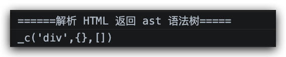

以上操作拼接出了`render`函数的大致结构，接下来继续处理属性和儿子；

### 2、处理属性：genProps(ast.attrs)

创建用于处理属性的`genProps`方法：将数组格式化为字符串，根据格式进行拼接

~~~~js
// src/compiler/index.js

// 将 attrs 数组格式化为：{key=val,key=val}
function genProps(attrs) {
  let str = '';
  for(let i = 0; i< attrs.length; i++){
    let attr = attrs[i];
    // 使用 JSON.stringify 将 value 转为 string 类型
    // 注意：每个属性值的最后都会添加一个逗号
    str += `${attr.name}:${JSON.stringify(attr.value)},`
  }
  return `{${str.slice(0, -1)}}`;// 去掉最后一位多余的逗号，在外层以{}包裹
 }

// 在 generate 中调用 genProps 处理属性
function generate(ast) {
 let code = `_c('${ast.tag}',${
  ast.attrs.length? genProps(ast.attrs):'undefined'
 }${
  ast.children?`,[]`:''
 })`
 return code;
}

export function compileToFunction(template) {
  let ast = parserHTML(template);
  let code = generate(ast);
  console.log(code)
}

// _c('div',{id:"app"},[])
~~~~

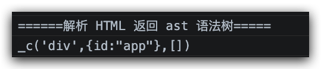


### 3、处理儿子(递归)：genChildren(el)

处理好属性之后，继续处理儿子，示例如下：

~~~~html
<div id="app" a='1' b=2 style="color: red;background: blue;">
  <p>{{message}} 
    <span>Hello Vue1</span>
    <span>Hello Vue2</span>
    <span>Hello Vue3</span>
  </p>
</div>
~~~~

- 儿子可能是标签，也可能是文本；
- 当儿子为标签时，标签中可能还存在多个儿子，需要对当前标签做递归处理；

~~~~js
// src/compiler/index.js

// 输出结果：_c(div,{},c1,c2,c3...)
function generate(ast) {
  // 处理儿子
  let children = genChildren(ast);
  
  let code = `_c('${ast.tag}',${
    ast.attrs.length? genProps(ast.attrs):'undefined'
  }${
    children?`,${children}`:''
  })`
  
  return code;
}

function genChildren(el) {
  console.log("===== genChildren =====")
  let children = el.children;
  if(children){
    console.log("存在 children, 开始遍历处理子节点．．．", children)
    let result = children.map(item => gen(item)).join(',');
    console.log("子节点处理完成，result = " + JSON.stringify(result))
    return result
  }
  console.log("不存在 children, 直接返回 false")
  return false;
}

function gen(el) {
  console.log("===== gen ===== el = ",el)
  if(el.type == 1){ 
    console.log("元素标签 tag = "+el.tag+"，generate继续递归处理")
    // 标签类型：标签中可能还存在多个儿子，需要继续递归处理当前元素（标签）
    return generate(el);
  }else{
    console.log("文本类型,text = " + el.text)
    // 文本类型：直接返回
    return el.text ;    
  }
}
~~~~

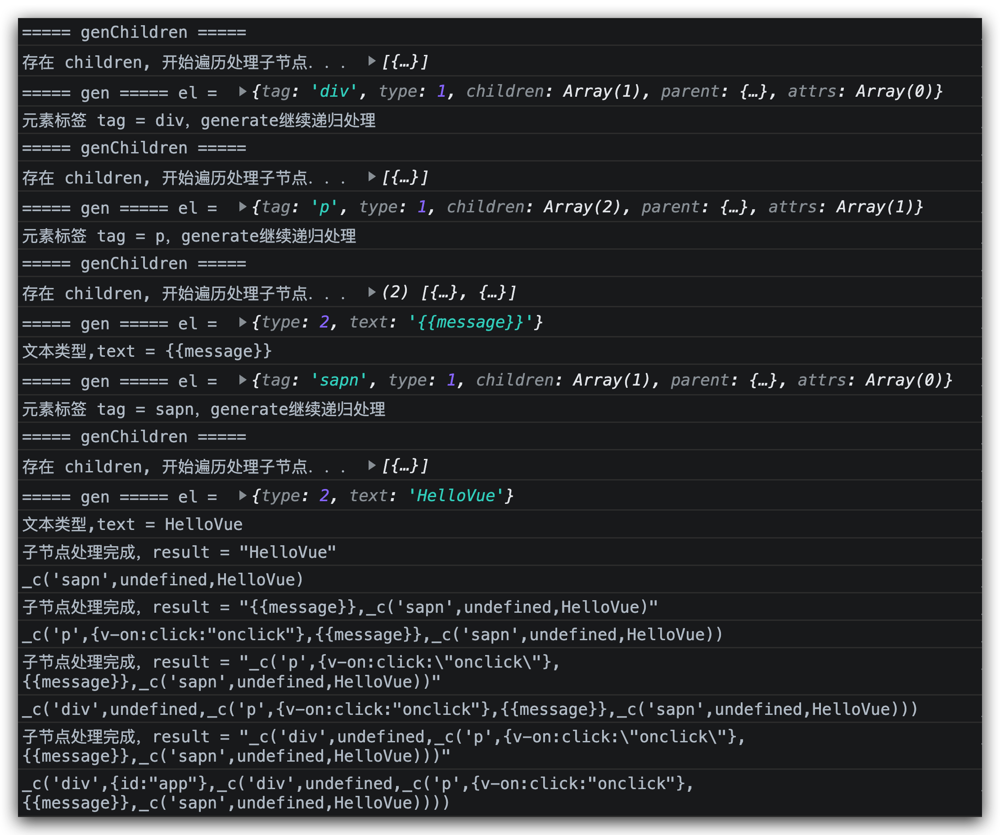

### 4、使用_v包裹文本

~~~~js
function gen(el) {
  console.log("===== gen ===== el = ",el)
  if(el.type == 1){// 
    console.log("元素标签 tag = "+el.tag+"，generate继续递归处理")
    return generate(el);// 如果是元素就递归的生成
  } else {// 文本类型
    let text = el.text
    console.log("文本类型,text = " + text)
    return `_v('${text}')`  // 包装 _v
  }
}
~~~~

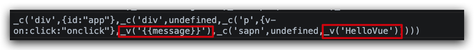

在`type == 2`的文本类型中，还有可能存在插值表达式的情况，如：`{{ msg }}`

而插值表达式属于变量，需要包裹`_s`，需通过正则匹配的方式将其过滤掉；

### 5、使用 _s 包裹变量

实现思路：

1、模板中的插值表达式`{{ msg }}`：`msg`可能是一个对象，因此需要使用`_s`(同`JSON.stringify`)转换成为字符串；

2、通过正则 defaultTagRE 检查 text 文本中是否包含 {{}} ：

3、若不包含，说明是文本，直接返回 _ v('${text}')；

4、若包含，说明是表达式，需要对表达式 和 普通值执行拼接操作：将表达式和普通值按顺序放入tokens数组中，执行拼接操作后再返回，即：_ v(${tokens.join('+')})；

5、【拓展】差值表达式中不支持if 和for是因为在这一步并没有对这两个情况做处理


匹配 {{}} 表达式的正则： const defaultTagRE = /\{\{((?:.|\r?\n)+?)\}\}/g

完整代码

~~~~js
// src/compiler/parser.js
// 匹配 {{}} 表达式
const defaultTagRE = /\{\{((?:.|\r?\n)+?)\}\}/g

function gen(el) {
  console.log("===== gen ===== el = ", el)
  if (el.type == 1) {// 
    console.log("元素标签 tag = " + el.tag + "，generate继续递归处理")
    return generate(el);// 如果是元素就递归的生成
  } else {// 文本类型
    let text = el.text
    console.log("文本类型,text = " + text)
    if (!defaultTagRE.test(text)) {
      return `_v('${text}')`  // 普通文本，包装_v
    } else {
      // 存在{{}}表达式，需进行表达式 和 普通值的拼接 
      // 目标：['aaa',_s(name),'bbb'].join('+') ==> _v('aaa' + s_(name) + 'bbb')
      // 当正则表达式后面有 /g 的时候每一次匹配都会导致正则中的不可枚举属性lastIndex 改变到匹配位置的下标
      // 如果匹配不到就会变为 0
      // 所以刚开始我们将它指定为0
      let lastIndex = defaultTagRE.lastIndex = 0;
      let tokens = []; // <div>aaa {{name}} bbb</div>
      let match
      
      // exec方法和match方法用法基本一致，多了一个捕获组，可以实现更复杂的逻辑
      while (match = defaultTagRE.exec(text)) {
        console.log("匹配内容" + text)
        let index = match.index;// match.index：指当前捕获到的位置
        console.log("当前的 lastIndex = " + lastIndex)
        console.log("匹配的 match.index = " + index)
        if (index > lastIndex) {  // 将前一段 ’<div>aaa '中的 aaa 放入 tokens 中
          let preText = text.slice(lastIndex, index)
          console.log("匹配到表达式-找到表达式开始前的部分：" + preText)
          tokens.push(JSON.stringify(preText))// 利用 JSON.stringify 加双引号
        }

        console.log("匹配到表达式：" + match[1].trim())
        // 放入 match 到的表达式，如{{ name  }}（match[1]是花括号中间的部分，并处理可能存在的换行或回车）
        tokens.push(`_s(${match[1].trim()})`)
        // 更新 lastIndex 长度到'<div>aaa {{name}}'
        lastIndex = index + match[0].length;  // 更新 lastIndex 长度到'<div>aaa {{name}}'
      }

      // while 循环后可能还剩余一段，如：’ bbb</div>’，需要将 bbb 放到 tokens 中
      if (lastIndex < text.length) {
        let lastText = text.slice(lastIndex);
        console.log("表达式处理完成后，还有内容需要继续处理：" + lastText)
        tokens.push(JSON.stringify(lastText))// 从lastIndex到最后
      }

      return `_v(${tokens.join('+')})`
    }
  }
}
~~~~

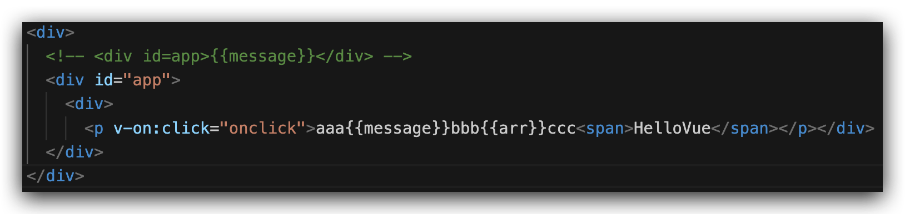

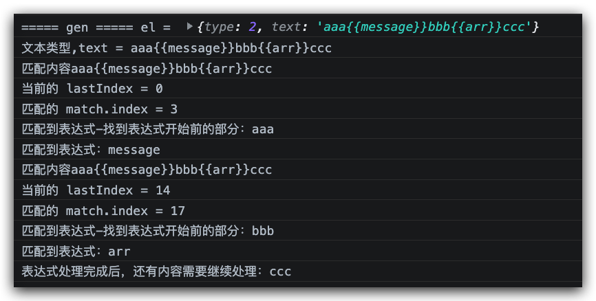

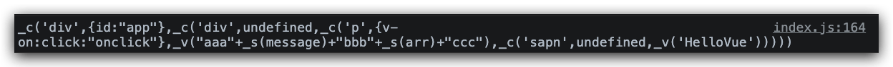

### 6、render函数with和function的组装

目前render函数的返回值已经基本搞到，剩下需要在外面包裹一层with代码块，外面再包裹一层function即可实现完整的render函数

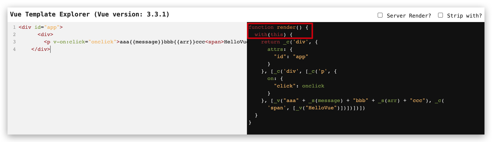

将render函数外层包裹上with并不是一件复杂的事情，但是这个with函数在开发中很少见到，那么这个with的作用是什么呢？

【拓展】with函数

目前现在有一个这样的对象

~~~~js
var obj = {
	a: 1,
	b: 2,
	c: 3
};
~~~~

如果想要改变 obj 中每一项的值，一般写法可能会是这样

~~~~js
// 重复写了3次的“obj”
obj.a = 2;
obj.b = 3;
obj.c = 4;
~~~~

而用了 with 的写法，会有一个简单的快捷方式

~~~~js
with (obj) {
	a = 3;
	b = 4;
	c = 5;
}
~~~~

在这段代码中，使用了 with 语句关联了 obj 对象，这就意味着在 with 代码块内部，每个变量首先被认为是一个局部变量，如果局部变量与 obj 对象的某个属性同名，则这个局部变量会指向 obj 对象属性。翻译一下就是就是引用obj对象，然后对该对象上的属性进行操作，其作用是可以省略重复书写该对象名称，起到简化书写的作用。

在 with 语句中，**访问变量会先去看这个变量是不是在给定的对象中作为属性存在**，如果存在，则取对象中属性的值，否则继续往上层找。

一般情况下我们不推荐使用with，因为他会造成作用域污染

来到render函数中为什么我们要使用with呢，主要为了简化代码，我们先来看render的执行render.call(vm)，当调用render函数的时候会向函数里面传入vue实例，同时render中也有很多的方法 指令 属性 变量使用到vue实例上的数据和方法，所以使用with可以简化书写。因此前端模板引擎的实现原理，大多都是依靠 `new Function` + `with` 来实现的，比如：`ejs`、`jade`、`handlerbar`；

~~~~js
import { parserHTML } from "./parser.js";

export function compileToFunction(template) {
  console.log("#### 进入 compileToFunction：将 template 编译为 render 函数 ####")
  // 1，将模板变成 AST 语法树
  let ast = parserHTML(template);
  console.log("解析 HTML 返回 ast 语法树====>")
  console.log('ast 语法树', ast)
  // 2，使用 AST 生成 render 函数
  let code = generate(ast); // 生成 code
  let render = new Function(`with(this){return ${code}}`);  // 包装 with + new Function
  console.log("包装 with 生成 render 函数：" + render.toString())

  return render;
}
~~~~

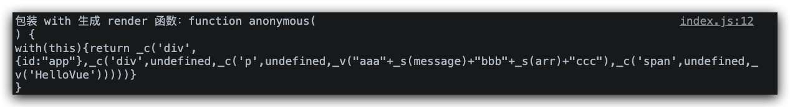

将生成的`render`函数保存到`options`选项上

~~~~js
Vue.prototype.$mount = function (el) {
    ......
    
    if (!opts.render) {
        console.log("options 中没有 render , 继续取 template")
        // 如果没有 template, 采用元素内容
        let template = opts.template;
        if (!template) {
            console.log("options 中没有 template, 取 el.outerHTML = " + el.outerHTML)
            // 拿到整个元素标签,将模板编译为 render 函数
            template = el.outerHTML;
        } else {
            console.log("options 中有 template = " + template)
        }
        let render = compileToFunction(template);
        opts.render = render; // <=================== 将render保存在opt上
        console.log("打印 compileToFunction 返回的 render = " + render.toString())
    }
  
.......
}
~~~~

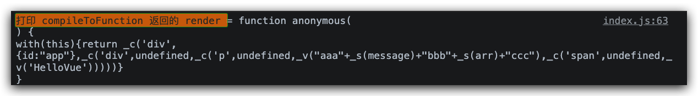


