## 一、虚拟dom的创建

`html`模板最终会被编译为`render`函数，为了避免重复编译，会将生成好的`render`函数保存到 `opts.render`上，现在我们的options上已经有了 render 函数，下面我们需要做两件事情

1、使用 render 函数是生成虚拟dom

2、根据虚拟节点和数据生成真实节点，中间混入方法指令等，这里执行的函数就是 vm._update(vm._render())，

这一小节我们来学习 vm._render() 的执行过程。 首先我们将`_render`方法挂载Vue原型上，并调用render

~~~~js
// src/index.js
Vue.prototype._render = function () {
    const vm = this;  // vm 中有所有数据  vm.xxx => vm._data.xxx
    let { render } = vm.$options;
    let vnode = render.call(vm);  // 此时内部会调用_c,_v,_s，执行完成后返回虚拟节点
    return vnode
}
~~~~

当render执行的时候需要 _c _v _s 方法，我们将这些方法挂载到Vue原型上

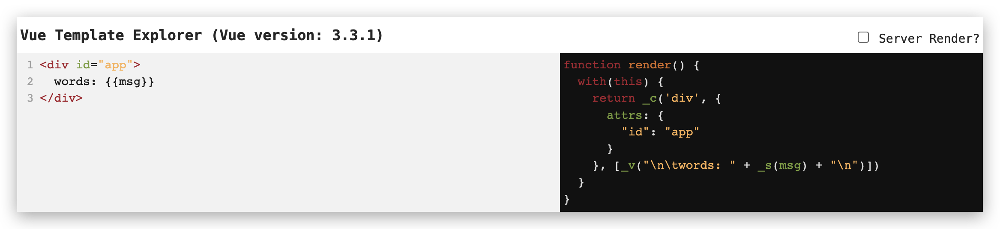

~~~~js
// src/index.js
// createElement 创建元素型的节点
Vue.prototype._c = function () {  
    const vm = this;
	  // 传入 vm 及之前的所有参数
    return createElement(vm, ...arguments); 
}
// 创建文本的虚拟节点
Vue.prototype._v = function (text) {  
    const vm = this;
    return createText(vm, text);
}
// JSON.stringify
Vue.prototype._s = function (val) {  
	  // 是对象就转成字符串
    if (typeof val == 'object' && val !== null) {  
        return JSON.stringify(val)
    } else {  
	      // 不是对象就直接返回
        return val
    }
}

~~~~

这里的 createElement 返回虚拟 dom 节点，createText 返回虚拟文本节点，这一类处理虚拟 dom 的方法我们统一封封装在 vdom 文件夹下，创建目录 src/vdom/index.js

~~~~js
// src/vdom/index.js

export function createElement() { 
  // 返回元素虚拟节点
}
export function createText() {  
  // 返回文本虚拟节点
}
~~~~

~~~~js
// src/vdom/index.js

// 通过函数返回 vnode 对象
// key 标识作用：后边元素根据 key 标识做 diff 算法，取值 data.key；
function vnode(vm, tag, data, children, key, text) {
  return {
    vm,       // 所属实例
    tag,      // 标签
    data,     // 数据
    children, // 孩子
    key,      // 标识
    text      // 文本
  }
}
// 参数：_c('标签', {属性}, ...孩子)
export function createElement(vm, tag, data={}, ...children) {
  // 返回元素的虚拟节点（元素是没有文本的）
  return vnode(vm, tag, data, children, data.key, undefined);
}
export function createText(vm, text) {
  // 返回文本的虚拟节点（文本没有标签、数据、孩子、key）
  return vnode(vm, undefined, undefined, undefined, undefined, text);
}
~~~~

最终输出的vnode对象

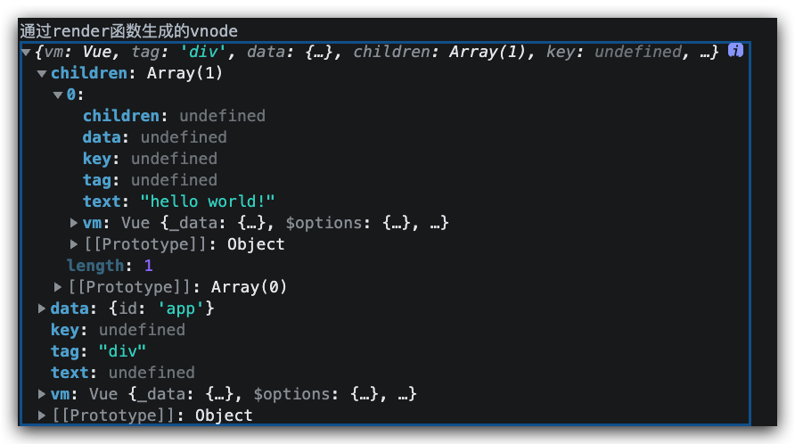

有了虚节点，下面我们就可以来生成真实dom了 ，至此render生成vnode部分就已经完成了！


## 二、真实Dom的创建

这里的 vnode 我们已经拿到了，因为vue中的dom更新实际是一个打补丁的过程，接下来需要一个补丁（patch）方法实现虚拟dom的更新，我们在Vue的原型上挂载一个 _update 方法，接受传入的vnode，然后就可以在 $mount 中调用 update 函数了

~~~~js
// src/index.js
// 支持 new Vue({el}) 和 new Vue().$mount 两种情况
Vue.prototype.$mount = function (el) {
    ......
    // 获取虚拟dom进行对比更新
    vm._update(vm._render());
    console.log('通过render函数生成的vnode', vm._render())
    ......
}


Vue.prototype._update = function (vnode) {
    console.log("_update-vnode", vnode)
    const vm = this;
}
~~~~

接下来我们行需要创建真实节点

【思考】对于vnode树形数据的遍历使用什么方式？

【回答】递归遍历

递归处理`vnode`对象，生成真实节点；遍历更新节点我们使用patch方法，将虚拟节点转化为真实节点，并插入到元素中

创建`src/vdom/patch.js`

~~~~js
// src/vdom/patch.js

/**
 * 将虚拟节点转为真实节点后插入到元素中
 * @param {*} el    当前真实元素 id#app
 * @param {*} vnode 虚拟节点
 * @returns         新的真实元素
 */
export function patch(el, vnode) {
  console.log(el, vnode)
  // 根据虚拟节点创造真实节点，替换为真实元素并返回
}
~~~~

在`vm._update`中，调用`patch`方法，返回新的真实元素：

这里我们对dom渲染做一下区分，如果是第一次渲染，不需要进行dom diff直接渲染即可，如果已经有了dom则进行dom的更新需要进行diff，区分的步骤如下：

- 第一次渲染时，在`vm.preVnode`上保存当前`Vnode`;
- 第二次渲染时，先取`vm.preVnode`，若有值，即为更新渲染；
- 初渲染，执行`patch(vm.$el, vnode)`；
- 更新渲染，执行`patch(preVnode, vnode)`；

~~~~js
// src/index.js

Vue.prototype._update = function (vnode) {
    console.log("_update-vnode", vnode)
    const vm = this;
    // 取上一次的 preVnode
    let preVnode = vm.preVnode;
    // 渲染前，先保存当前 vnode
    vm.preVnode = vnode;
    // preVnode 有值，说明已经有节点了，本次是更新渲染；没值就是初渲染
  	// 初渲染
    if (!preVnode) {
        // 传入当前真实元素vm.$el，虚拟节点vnode，返回新的真实元素
        vm.$el = patch(vm.$el, vnode);
    } else {// 更新渲染:新老虚拟节点做 diff 比对
        vm.$el = patch(preVnode, vnode);
    }
}
~~~~

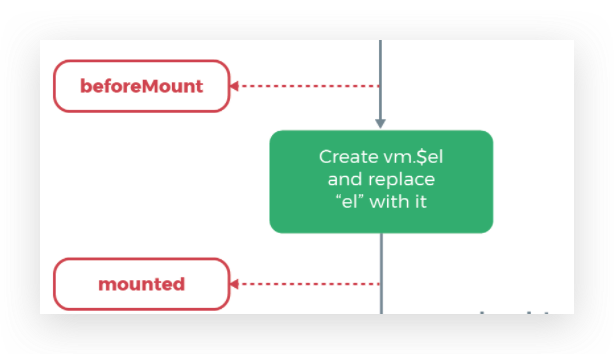

在 vue 的生命周期中也提示了这一步，创建一个新的 $el 节点替换之前的 el 节点这里的老的 el 节点就是 id 为 app 的 div，而新的 $el 节点是根据 vnode 生成的真实 dom，所以我们需要两步骤：

1、生成真实dom节点

2、将真实dom节点挂载到el上

### 1、createElm方法

我们在patch中定义一个creatElm方法用来递归虚拟dom生成真实节点

~~~~js
// src/vdom/patch.js

/**
 * 将虚拟节点转为真实节点后插入到元素中
 * @param {*} el    当前真实元素 id#app
 * @param {*} vnode 虚拟节点
 * @returns         新的真实元素
 */
export function patch(el, vnode) {

  // 1,根据虚拟节点创建真实节点
  const elm = createElm(vnode);
  
  // 2,使用真实节点替换老节点
  
  return elm;
}
~~~~

通过createElm方法，完成了根据虚拟节点生成真实节点，详细步骤如下：

通过vnode中的tag，判断节点是元素还是文本：文本的tag为undefined；
若当前节点是文本，创建文本真实节点：document.createTextNode(text)；
若当前节点是元素，创建元素真实节点：document.createElement(tag)；
当前节点是元素且存在儿子，需要递归处理创建出儿子的真实节点，并添加到对应的父亲中：children.forEach(child => {el.appendChild(createElm(child))});；
返回生成的真实节点；

~~~~js
// src/vdom/patch.js

function createElm(vnode) {
  let{tag, children, text} = vnode;
  // 通过 tag 判断当前节点是元素 or 文本，判断逻辑：文本 tag 是 undefined
  if(typeof tag === 'string'){
    // 创建元素的真实节点
    vnode.el = document.createElement(tag)    
    // 继续处理元素的儿子：递归创建真实节点并添加到对应的父亲上
    children.forEach(child => {
      // 若不存在儿子，children为空数组，递归终止
      vnode.el.appendChild(createElm(child))
    });
  } else {
    // 创建文本的真实节点
		vnode.el = document.createTextNode(text)  
  }
  console.log(vnode.els)
  return vnode.el;
}
~~~~

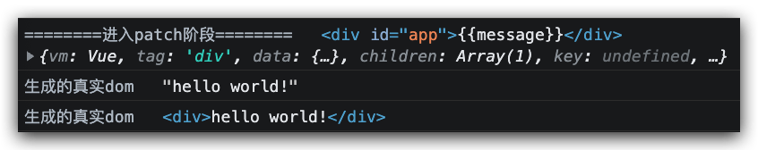

在生成元素时，如果有`data`属性，需要将`data`设置到元素上，否则就会丢失`id#app`；

~~~~js
// src/vdom/patch.js

function createElm(vnode) {
  let {tag, children, text, data, vm} = vnode;
  if(typeof tag === 'string'){
    vnode.el = document.createElement(tag)
    // 处理 data 属性
    updateProperties(vnode.el, data)
    children.forEach(child => {
      vnode.el.appendChild(createElm(child))
    });
  } else {
    vnode.el = document.createTextNode(text)
  }
  console.log('生成的真实dom', vnode.el)
  return vnode.el;
}

// 循环 data 添加到 el 的属性上
function updateProperties(el, props = {} ) {
  // todo 当前实现没有考虑样式属性
  for(let key in props){
    el.setAttribute(key, props[key])
  }
}
~~~~

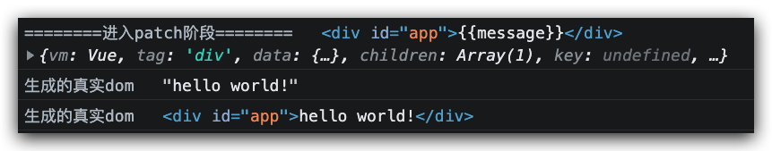

目前我们已经完成了对虚拟dom的递归处理，并且通过dom操作生成了真实节点，下面只需要将新节点替换之前的老节点即可。

### 2、节点替换

节点的替换分为三个步骤

1. 找到老节点；
2. 将新节点插入到老节点之后，使新老节点成为兄弟节点；
3. 删除老节点；

这样能够保证在新老节点完成更新后，文档的顺序不变，下面将真实节点绑定到`vnode`的扩展属性`el`上，这样当后续虚拟节点更新时，便于跟踪并找到与`vnode`对应的真实节点`el`，快速完成真实节点的更新操作；

下面我们实现dom的更新

~~~~js
/**
 * 将虚拟节点转为真实节点后插入到元素中
 * @param {*} el    当前真实元素 id#app
 * @param {*} vnode 虚拟节点
 * @returns         新的真实元素
 */
export function patch(el, vnode) {
  console.log(el, vnode)
  
  // 1，根据虚拟节点创建真实节点
  const elm = createElm(vnode);
  console.log("createElm", elm);

  // 2，使用真实节点替换掉老节点
  // 1）找到元素的父亲节点
  const parentNode = el.parentNode;
  // 2）找到老节点的下一个兄弟节点（nextSibling 若不存在将返回 null）
  const nextSibling = el.nextSibling;
  // 3）将新节点 elm 插入到老节点 el 的下一个兄弟节点nextSibling的前面
  // 备注：若 nextSibling 为 null，则 insertBefore 等价于 appendChild
  parentNode.insertBefore(elm, nextSibling); 
  // 4）删除老节点 el
  parentNode.removeChild(el);

  return elm;
}
~~~~

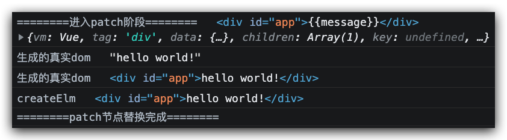

看看页面上是不是渲染出来了内容


至此dom的初步渲染就已经完成了，下面我们来看看dom的更新过程，这里的更新正好可以使用我们之前定义的watcher和dep首先在视图渲染的过程中，将被使用到的数据记录下来，后续仅针对这些收集到的数据变化才触发视图更新操作。


## 三、视图更新

### 1、异步更新 $nextTick的实现

在vue中视图更新是异步的，视图的更新是基于nextTick实现的，同时vue上也有一个$nextTick方法，他们是同一个，这一小节我们手动实现一个$nextTick

【目标】实现$nexTick方法

【思考】$nextTick的作用

【回答】因为Vue中的dom渲染是异步的，想要获取到渲染之后的dom结果需要等待dom更新完成之后再获取。$nextTick的功能，就是等待之前的异步执行之后再执行$nextTcik方法中的回调

【思考】如何定一个$nextTick?

【回答】

1、在Vue上挂载成员方法$nextTick

2、在utils中定义NextTick并导出

​		将传入的参数放入任务队列中

​		判断执行状态用于防抖

​		将控制防抖的状态改为true

​		任务队列中的任务依次调用

3、在$nextTick中调用nextTick方法

~~~~js
// src/utils
let callbacks = []; // 缓存异步更新的 nextTick
let pending = false;
function flushsCallbacks() {
  callbacks.forEach(fn => fn()) // 依次执行 nextTick
  callbacks = [];   // reset
  pending = false;  // reset
}

/**
 * 将方法异步化
 * @param {*} fn 需要异步化的方法
 * @returns 
 */
export function nextTick(fn) {
  // return Promise.resolve().then(fn);
  callbacks.push(fn); // 先缓存异步更新的nextTick,后续统一处理
  if(!pending){
    pending = true; // 首次进入被置为 true,控制逻辑只走一次
    Promise.resolve().then(flushsCallbacks);   
  }
} 
~~~~

~~~~js
// /src/index.js
import {nextTick} from './utils.js'

Vue.prototype.$nextTick = function (fn) {
  nextTick(fn)
}
~~~~

现在在vue的实例上就有一个nextTIck方法，接下来我们来试一试

~~~~js
let dom = document.querySelector('.dom')
// 模拟更新dom vue内部的更新使用的也是nextTick
vm.$nextTick(() => {
  dom.innerHTML = 3
})
// 数据发生改变之后直接获取dom，发现获取的还是之前的
console.log(dom.innerHTML, '更新之前的dom')
// 在nextTick中获取dom，此时获取的dom是更新之后的
vm.$nextTick(() => {
  console.log(dom.innerHTML, '更新之后的dom')
})
~~~~

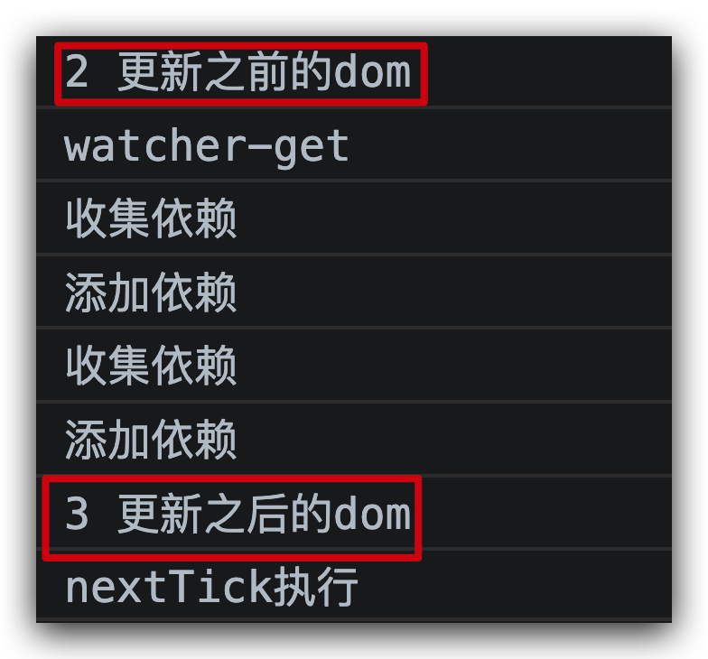


### 2、watcher的引入

当数据发生改变之后我们需要通过依赖收集来触发更新，所以在dom渲染的时候也需要实例化watcher

【目标】将dom渲染和watcher关联起来

~~~~js
// src/index.js
// 支持 new Vue({el}) 和 new Vue().$mount 两种情况
Vue.prototype.$mount = function (el) {
    // ......省略.......
    let updateComponent = () => {
        vm._update(vm._render());
    }

    // 渲染 watcher ：每个组件都有一个 watcher
    new Watcher(vm, updateComponent, () => {
        console.log('Watcher-update')
        // 视图更新后，调用钩子: updated
    })
}
~~~~

此时我们在控制台中修改数据

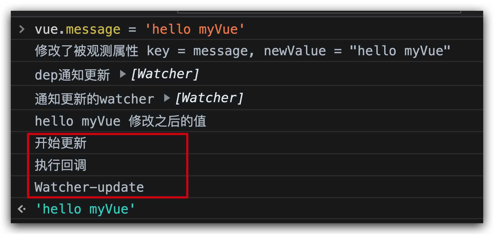

此时数据已经触发了Watcher-Update 进行更新回调

在视图渲染阶段会进行依赖收集，数据改变将通知所有被收集的渲染 `watcher`更新视图，如果频繁切换数据视图也会频繁的渲染，在vue中做了异步更新的功能 vue.nextTick，他会将更新 watcher 的方法缓存起来然后一起处理，获取处理之后的结果。

- 同步更新，每次数据更新都会同步调用`update`方法；
- 异步更新，先将更新逻辑`Watcher`缓存起来，合并后一起处理；

将`watcher`集中缓存到一个队列中，在缓存过程中进行合并，最后一次性执行，由于此时为异步代码，当逻辑全部执行完成后，才会将队列中的`watcher`都`run`执行。

新建一个调度任务 `src/observe/schedule.js`，在文件中定义queueWatcher 监听队列方法，实现两个功能watcher的去重和watcher的缓存。

~~~~js
// src/observe/schedule.js

import { nextTick } from "../utils.js";

let queue = []; // 用于缓存渲染 watcher
let has = {};   // 存放 watcher 唯一 id，用于 watcher 的查重
let waiting = false;// 控制 setTimeout 只走一次

/**
 * 刷新队列：执行所有 watcher.run 并将队列清空；
 */
function flushschedulerQueue() {
  // 更新前,执行生命周期：beforeUpdate
  queue.forEach(watcher => watcher.run()) // 依次触发视图更新
  queue = [];       // reset
  has = {};         // reset
  waiting = false;  // reset
  // 更新完成,执行生命周期：updated
}

/**
 * 将 watcher 进行查重并缓存，最后统一执行更新
 * @param {*} watcher 需更新的 watcher
 */
export function queueWatcher(watcher) {
  let id = watcher.id;
  if (has[id] == null) {
    has[id] = true;
    queue.push(watcher);  // 缓存住watcher,后续统一处理
    if (!waiting) {       // 等效于防抖
      waiting = true;     // 首次进入被置为 true，使微任务执行完成后宏任务才执行
      nextTick(flushschedulerQueue);
    }
  }
}
~~~~

【思考】为什么watcher中有一个控制执行的 waiting，nextTick中有一个控制执行的 pending？

【回答】因为watcher本身可以有多个，比如多个渲染watcher此时waterqueue本身是个队列，需要等待这个队列中每一个watcher下的function回调队列都执行完成再执行下一个watcherQueue

而nextTick中的pending是用来控制方法队列完全执行后再执行下一个方法队列


### 3、在watcher中实现异步更新

~~~~js
import Dep from "./dep.js";
import {queueWatcher} from './scheduler.js'

export default class Watcher {
  // constructor(vm, exp, cb) {
  constructor(vm, exp, cb, options = {}) {
    this.vm = vm
    this.exp = exp
    this.cb = cb
    // 默认watcher是立即执行的
    // !!将undefined 转换成false
    this.lazy = this.dirty = !!options.lazy
    // 如果lazy是true 则不上来就执行get

    if (!this.lazy) {
      this.value = this.get()
    }
  }
  get () {
    // 获取数据
    Dep.target = this
    // 在当前的watcher中 获取数据
    // 当前的watcher 和 数据 关联在了一起
    // 获取数据会触发 get
    if (typeof this.exp === 'function') {
      // 此时第二个参数是一个函数
      // sum = this.n1 + this.n2
      this.value = this.exp.call(this.vm)
    }
    else {
      this.value = this.vm[this.exp]
    }
    Dep.target = null
  }
  update (newVal) {
    if (this.lazy) {
      this.dirty = true
    } else {
      var newVal = newVal ? newVal : this.get();
      console.log('开始更新')
      if(this.value != newVal){
          console.log('执行回调')
          this.cb && this.cb(newVal,this.value);
          this.value = newVal;
      }
      console.log("watcher-update", "查重并缓存需要更新的watcher")
      queueWatcher(this);  // <======
    }
  }
  // 补充run方法，用于处理异步更新的回调
  run(){
    console.log("watcher-run", "真正执行视图更新")
    this.get();
  }
}
~~~~

~~~~js
// 略
// /src/utils.js
// 将parseExpression 封装到utils文件中
/**
 * 获取对象的最后一个属性值
 * @param {*} str
 * @returns 
 */
function parseExpression(str) {
  var seg = str.split('.')
  return (obj) => {
    for(let i = 0; i < seg.length; i++) {
      if (!obj) return
      obj = obj[seg[i]]
    }
    return obj
  }
}
~~~~

由于在 watcher 的回调中执行了updateComponent 又重新渲染了dom，这样重新渲染也可以实现效果，但是性能开销比较大，所以在 Vue 中实现了diff算法进行 dom 的更新这样可以充分利用虚拟 dom 的优势进行页面渲染也可以提升渲染效率。

### 4、vue 源码 patch.js 引入并实现完整的 dom 更新

【目标】将vue源码中的patch.js直接覆盖到**/src/vdom/patch.js**中实现dom的diff更新

~~~~js
export function isSameVnode(newVnode, oldVnode) {
  return (newVnode.tag === oldVnode.tag) && (newVnode.key === oldVnode.key);
}

/**
 * 将虚拟节点转为真实节点后插入到元素中
 * @param {*} oldVnode  老的虚拟节点
 * @param {*} vnode     新的虚拟节点
 * @returns             新的真实元素
 */
export function patch(oldVnode, vnode) {
  // console.log("patch-oldVnode", oldVnode);
  // console.log("patch-newVnode", vnode);
  const isRealElement = oldVnode.nodeType;  // 元素的节点类型是1，虚拟节点无此属性
  if (isRealElement) {// 元素代表是真实节点
    // 1，根据虚拟节点创建真实节点
    const elm = createElm(vnode);
    // 2，使用真实节点替换掉老节点
    // 找到元素的父亲节点
    const parentNode = oldVnode.parentNode;
    // 找到老节点的下一个兄弟节点（nextSibling 若不存在将返回 null）
    const nextSibling = oldVnode.nextSibling;
    // 将新节点 elm 插入到老节点el的下一个兄弟节点 nextSibling 的前面
    // 备注：若 nextSibling 为 null，insertBefore 等价于 appendChild
    parentNode.insertBefore(elm, nextSibling);
    // 删除老节点 el
    parentNode.removeChild(oldVnode);
    return elm;
  } else {
    console.log("patch-oldVnode", oldVnode);
    console.log("patch-newVnode", vnode);
    // diff：新老虚拟节点比对
    if (!isSameVnode(oldVnode, vnode)) {// 同级比较，不是相同节点时，不考虑复用（放弃跨层复用），直接用新的替换旧的
      return oldVnode.el.parentNode.replaceChild(createElm(vnode), oldVnode.el);
    }

    // 相同节点，就复用节点（复用老的），再更新不一样的地方（属性），注意文本要做特殊处理，文本是没有标签名的

    // 文本的处理：文本直接更新就可以，因为文本没有儿子  组件中 Vue.component（‘xxx’）这就是组件的 tag
    let el = vnode.el = oldVnode.el;  // 节点复用：将老节点el，赋值给新节点el
    if (!oldVnode.tag) {  // 文本：没有标签名
      if (oldVnode.text !== vnode.text) {// 文本内容变化了，更新文本内容：用新的内容更新老的内容
        return el.textContent = vnode.text;
      } else {
        // 文本没变化也结束：否则会继续进入 updateProperties处理元素，再进入情况3的updateChildren
        // 但整体影响不大，会因条件不符不执行,但做好的做法还是直接 return 掉吧
        return;
      }
    }

    // 元素的处理：相同节点，且新老节点不都是文本时
    updateProperties(vnode, oldVnode.data);

    // 比较儿子节点
    let oldChildren = oldVnode.children || {};
    let newChildren = vnode.children || {};
    // 情况 1：老的有儿子，新的没有儿子；直接把老的 dom 元素干掉即
    if (oldChildren.length > 0 && newChildren.length == 0) {
      el.innerHTML = '';//暴力写法直接清空；更好的处理是封装removeChildNodes方法：将子节点全部删掉，因为子节点可能包含组件
      // 情况 2：老的没有儿子，新的有儿子；直接将新的插入即可
    } else if (oldChildren.length == 0 && newChildren.length > 0) {
      newChildren.forEach((child) => {// 注意：这里的child是虚拟节点，需要变为真实节点
        let childElm = createElm(child); // 根据新的虚拟节点，创建一个真实节点
        el.appendChild(childElm);// 将生成的真实节点，放入 dom
      })
      // 情况 3：新老都有儿子
    } else {  // 递归: updateChildren 内部调用 patch, patch, 内部还会调用 updateChildren (patch 方法是入口)
      updateChildren(el, oldChildren, newChildren)
    }

    return el;// 返回新节点
  }
}


/**
 * 新老都有儿子时做比对，即 diff 算法核心逻辑
 * 备注：采用头尾双指针的方式；优化头头、尾尾、头尾、尾头的特殊情况；
 * @param {*} el 
 * @param {*} oldChildren  老的儿子节点
 * @param {*} newChildren  新的儿子节点
 */
function updateChildren(el, oldChildren, newChildren) {
  // vue2中的diff算法内部做了优化，尽量提升性能，实在不行再暴力比对
  // 常见情况：在列表中，新增或删除某一项（用户很少在列表的中间添加一项）

  // 声明头尾指针
  let oldStartIndex = 0;
  let oldStartVnode = oldChildren[0];
  let oldEndIndex = oldChildren.length - 1;
  let oldEndVnode = oldChildren[oldEndIndex];

  let newStartIndex = 0;
  let newStartVnode = newChildren[0];
  let newEndIndex = newChildren.length - 1;
  let newEndVnode = newChildren[newEndIndex];

  /**
   * 根据children创建映射
   */
  function makeKeyByIndex(children) {
    let map = {}
    children.forEach((item, index) => {
      map[item.key] = index;
    })
    return map
  }

  let mapping = makeKeyByIndex(oldChildren);

  // while 循环处理，所以 diff 算法的复杂度为O(n)，只循环一遍
  // 循环结束条件：有一方遍历完了就结束；即"老的头指针和尾指针重合"或"新的头指针和尾指针重合"
  // 备注: 此while循环中主要对4种特殊情况进行优化处理,包括：头头、尾尾、头尾、尾头
  while (oldStartIndex <= oldEndIndex && newStartIndex <= newEndIndex) {
    // 当前循环开始时，先处理当前的oldStartVnode和oldEndVnode为空的情况； 原因：节点之前被移走时置空，直接跳过
    if (!oldStartVnode) {
      oldStartVnode = oldChildren[++oldStartIndex];
    } else if (!oldEndVnode) {
      oldEndVnode = oldChildren[--oldEndIndex];
      // 头头比较：比较新老开始节点
    } else if (isSameVnode(oldStartVnode, newStartVnode)) {
      // isSameVnode只能判断标签和key是否一样，但还有可能属性不一样
      // 所以还需要使用patch方法比对新老虚拟节点的属性，
      // 而patch方法是递归比对的，同时还会递归比较子节点
      patch(oldStartVnode, newStartVnode);
      // 更新新老头指针和新老头节点
      oldStartVnode = oldChildren[++oldStartIndex];
      newStartVnode = newChildren[++newStartIndex];
      // 尾尾比较：比较新老末尾节点
    } else if (isSameVnode(oldEndVnode, newEndVnode)) {
      patch(oldEndVnode, newEndVnode);
      oldEndVnode = oldChildren[--oldEndIndex];
      newEndVnode = newChildren[--newEndIndex];
      // 头尾比较：老的头节点和新的尾节点做对比
    } else if (isSameVnode(oldStartVnode, newEndVnode)) {
      // patch方法只会duff比较并更新属性，但元素的位置不会变化
      patch(oldStartVnode, newEndVnode);// diff:包括递归比儿子
      // 移动节点：将当前的节点插入到最后一个节点的下一个节点的前面去
      el.insertBefore(oldStartVnode.el, oldEndVnode.el.nextSibling);
      // 移动指针
      oldStartVnode = oldChildren[++oldStartIndex];
      newEndVnode = newChildren[--newEndIndex];
      // 尾头比较
    } else if (isSameVnode(oldEndVnode, newStartVnode)) {
      patch(oldEndVnode, newStartVnode);  // patch方法只会更新属性，元素的位置不会变化
      // 移动节点:将老的尾节点移动到老的头节点前面去
      el.insertBefore(oldEndVnode.el, oldStartVnode.el);// 将尾部插入到头部
      // 移动指针
      oldEndVnode = oldChildren[--oldEndIndex];
      newStartVnode = newChildren[++newStartIndex];
    } else {
      // 前面4种逻辑（头头、尾尾、头尾、尾头）,主要是考虑到用户使用时的一些特殊场景，但也有非特殊情况，如：乱序排序
      // 筛查当前新的头指针对应的节点在mapping中是否存在
      let moveIndex = mapping[newStartVnode.key]
      if (moveIndex == undefined) {// 没有，将当前比对的新节点插入到老的头指针对用的节点前面
        // 将当前新的虚拟节点创建为真实节点，插入到老的开始节点前面
        el.insertBefore(createElm(newStartVnode), oldStartVnode.el);
      } else {  // 有,需要复用
        // 将当前比对的老节点移动到老的头指针前面
        let moveVnode = oldChildren[moveIndex];// 从老的队列中找到可以被复用的这个节点
        // 复用：更新复用节点的属性，插入对应位置
        patch(moveVnode, newStartVnode)
        el.insertBefore(moveVnode.el, oldStartVnode.el);
        // 由于复用的节点在oldChildren中被移走了,之前的位置要标记为空(指针移动时，跳过会使用)
        oldChildren[moveIndex] = undefined;
      }
      // 每次处理完成后，新节点的头指针都需要向后移动
      // 备注：
      // 		无论节点是否可复用，新指针都会向后移动，所以最后统一处理；
      //    节点可复用时，老节点的指针移动会在4种特殊情况中被处理完成；
      newStartVnode = newChildren[++newStartIndex];
    }
  }

  // 至此，完成了相同节点的比较，下面开始处理不同的节点

  // 1，新的多（以新指针为参照）插入新增的
  if (newStartIndex <= newEndIndex) {
    // 新的开始指针和新的结束指针之间的节点
    for (let i = newStartIndex; i <= newEndIndex; i++) {
      // 判断当前尾节点的下一个元素是否存在：
      //  1，如果存在：则插入到下一个元素的前面
      //  2，如果不存在（下一个是 null） ：就是 appendChild
      // 取参考节点anchor:决定新节点放到前边还是后边
      //  逻辑：取去newChildren的尾部+1,判断是否为 null
      //  解释：如果有值说明是向前移动的，取出此虚拟元素的真实节点el，将新节点添加到此真实节点前即可
      let anchor = newChildren[newEndIndex + 1] == null ? null : newChildren[newEndIndex + 1].el
      // // 获取对应的虚拟节点，并生成真实节点，添加到 dom 中
      // el.appendChild(createElm(newChildren[i]))
      // 逻辑合并:将 appendChild 改为 insertBefore
      //  效果：既有appendChild又有insertBefore的功能，直接将参考节点放进来即可;
      //  解释：对于insertBefore方法,如果anchor为null，等同于appendChild;如果有值，则是insertBefore;
      el.insertBefore(createElm(newChildren[i]), anchor)
    }
  }
  // 2，旧的多，（以旧指针为参照）删除多余的真实节点
  if (oldStartIndex <= oldEndIndex) {
    for (let i = oldStartIndex; i <= oldEndIndex; i++) {
      let child = oldChildren[i];
      // child有值时才删除；原因：节点有可能在移走时被置为undefined
      child && el.removeChild(child.el);
    }
  }
}

// 面试：虚拟节点的实现？如何将虚拟节点渲染成真实节点
export function createElm(vnode) {
  // 虚拟节点必备的三个：标签，数据，孩子
  let { tag, data, children, text, vm } = vnode;

  // vnode.el:绑定真实节点与虚拟节点的映射关系，便于后续的节点更新操作
  if (typeof tag === 'string') { // 元素
    // 处理当前元素节点
    vnode.el = document.createElement(tag) // 创建元素的真实节点
    updateProperties(vnode, data)  // 处理元素的 data 属性
    // 处理当前元素节点的儿子：递归创建儿子的真实节点，并添加到对应的父亲中
    children.forEach(child => { // 若不存在儿子，children为空数组
      vnode.el.appendChild(createElm(child))
    });
  } else { // 文本：文本中 tag 是 undefined
    vnode.el = document.createTextNode(text)  // 创建文本的真实节点
  }
  return vnode.el;
}

// 循环 data 添加到 el 的属性上
// 后续 diff 算法时进行完善，没有考虑样式等
function updateProperties(vnode, oldProps = {}) {
  // 1,初次渲染，用oldProps给vnode的 el 赋值即可
  // 2,更新逻辑，拿到老的props和vnode中的 data 进行比对
  let el = vnode.el; // dom上的真实节点（上边复用老节点时已经赋值了）
  let newProps = vnode.data || {};  // 拿到新的数据

  let newStyle = newProps.style || {};
  let oldStyle = oldProps.style || {};

  //如果老的样式有，新的没有，就删掉
  for (let key in oldStyle) { // 老的样式有，新的没有，就把页面上的样式删除掉
    if (!newStyle[key]) {
      el.style[key] = '';
    }
  }

  // 新旧比对：两个对象比对差异
  for (let key in newProps) { // 直接用新的盖掉老的就可以了  还要注意：老的里面有，可能新的里面没有了
    // 前后两次一样，浏览器会检测，就不会更新了，不会有性能问题
    // console.log(newProps)
    if (key == 'style') { // 新的里面有样式，直接覆盖即可
      for (let key in newStyle) { // 老的样式有，新的没有，就把页面上的样式删除掉
        console.log("更新style", el.style[key], newStyle[key])
        el.style[key] = newStyle[key]
      }
    } else {
      el.setAttribute(key, newProps[key])
    }
  }
  // 处理老的里面有，可能新的里面没有的情况，需要再删掉
  for (let key in oldProps) {
    if (!newProps[key]) {
      el.removeAttribute(key)
    }
  }
}
~~~~

然后在控制台直接操作数据修改


数据修改之后页面中的内容已经完成了更新并且在控制台中可以查看输出的内容结合给大家准备的流程图查看dom更新过程。


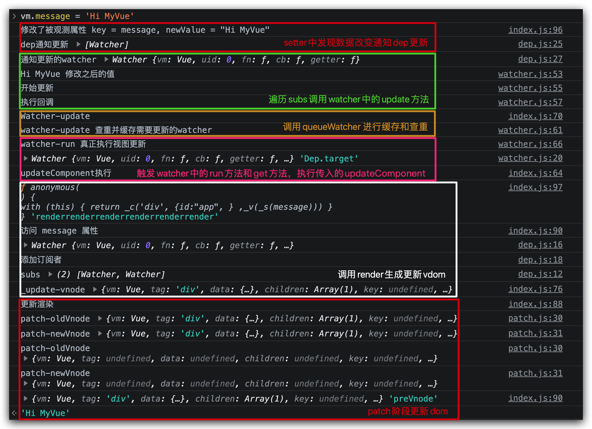

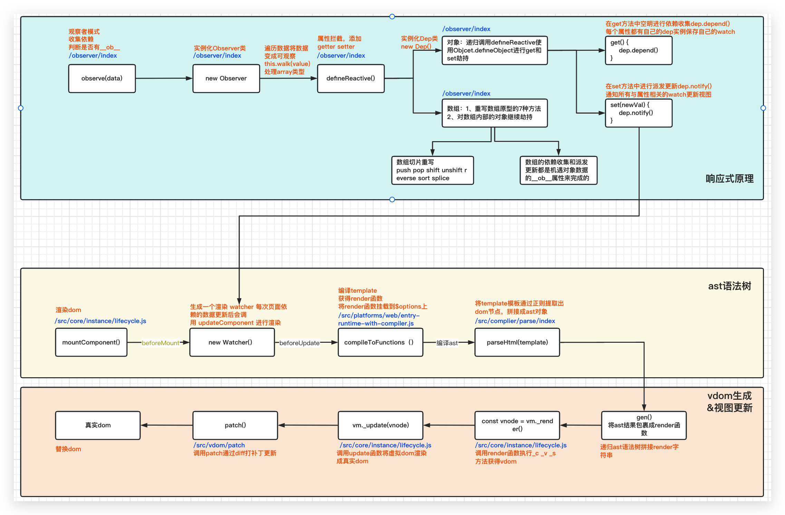


## 四、diff算法

update 方法会使用新的虚拟节点重新生成真实 dom，并替换掉原来的 dom，在 Vue 的实现中，会做一次 diff 算法优化实现就地复用，提升渲染效率。

### 1、patch的改造

所以，下面我们需要用很大的篇幅来实现Vue中的diff算法，对patch方法进行优化，当前的 patch 方法，仅考虑了初始化的情况，只实现了dom的渲染，并没有做dom的渲染更新，下面要处理更新操作。
patch 方法需要对新老虚拟节点进行一次比对，尽可能复用原有节点，以提升渲染性能；
首次渲染，根据虚拟节点生成真实节点，替换掉原来的节点；
更新渲染，生成新的虚拟节点，并与老的虚拟节点进行对比，对比后再渲染；

1、将`patch`方法的入参，改造为新老虚拟节点：`oldVnode` 和 `vnode`；

2、通过判断`oldVnode.nodeType`节点类型，是否为真实节点，确定是初次渲染还是更新渲染；

- `oldVnode`为真实节点（即为真实`dom`），执行初渲染逻辑；
- `oldVnode`非真实节点，执行更新渲染逻辑，需要进行新老虚拟节点比对；

~~~~js
// src/vdom/patch.js
/**
 * 将虚拟节点转为真实节点后插入到元素中
 * @param {*} el    当前真实元素 id#app
 * @param {*} vnode 虚拟节点
 * @returns         新的真实元素
 */
export function patch(oldVnode, vnode) {
  console.log("========进入patch阶段========", oldVnode, vnode)
  const isRealElement = oldVnode.nodeType;
  if (isRealElement) {
  	// 根据虚拟节点创造真实节点，替换为真实元素并返回
    // 1，根据虚拟节点创建真实节点
    const elm = createElm(vnode);
    console.log("createElm", elm);
    // 2，使用真实节点替换掉老节点
    // 1）找到元素的父亲节点
    const parentNode = oldVnode.parentNode;
    // 2）找到老节点的下一个兄弟节点（nextSibling 若不存在将返回 null）
    // 3）将新节点 elm 插入到老节点 el 的下一个兄弟节点nextSibling的前面
    // 备注：若 nextSibling 为 null，则 insertBefore 等价于 appendChild
    parentNode.insertBefore(elm, oldVnode.nextSibling); 
    // 4）删除老节点 el
    parentNode.removeChild(oldVnode);
    console.log("========patch节点替换完成========")

    return elm;
  } else {
    // 虚拟节点：做 diff 算法，新老节点比对
    console.log(oldVnode, vnode)
  }
}

~~~~

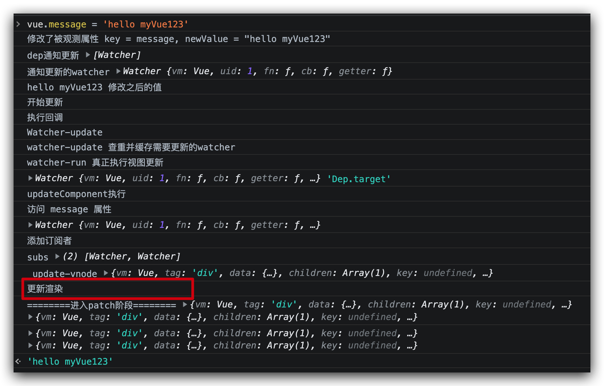

后续，开始针对更新渲染的情况，进行新老虚拟节点的比对，即`diff`算法逻辑；

首先我们对比儿子节点，比对儿子节点，需要将“新的儿子节点”和“老的儿子节点”都拿出来，依次进行比对：

因为我们要判断节点是不是相同，所以先在utils中封装一个判断节点相同的方法

~~~~js
// /src/utils.js
/**
 * 判断两个虚拟节点是否是同一个虚拟节点
 *  逻辑：标签名 和 key 都相同
 * @param {*} newVnode 新虚拟节点
 * @param {*} oldVnode 老虚拟节点
 * @returns 
 */
export function isSameVnode(newVnode, oldVnode){
  return (newVnode.tag === oldVnode.tag) && (newVnode.key === oldVnode.key); 
}
~~~~

~~~~js
//src/vdom/patch.js

/**
 * 将虚拟节点转为真实节点后插入到元素中
 * @param {*} el    当前真实元素 id#app
 * @param {*} vnode 虚拟节点
 * @returns         新的真实元素
 */
export function patch(oldVnode, vnode) {

  ......
  // diff：新老虚拟节点比对
  } else {
    // 虚拟节点：做 diff 算法，新老节点比对
    // 节点不能复用的情况
    if (!isSameVnode(oldVnode, vnode)) {
      return oldVnode.el.parentNode.replaceChild(createElm(vnode), oldVnode.el);
    }

    // 处理文本
    let el = vnode.el = oldVnode.el;
    if (!oldVnode.tag) {
      if (oldVnode.text !== vnode.text) {
        return el.textContent = vnode.text;
      } else {
        return;
      }
    }

    // 处理元素属性
    updateProperties(vnode, oldVnode.data);

    // TODO：比较儿子节点...
    let oldChildren = oldVnode.children || {};
    let newChildren = vnode.children || {};
  }
}

export function createElm(vnode) {
  // 虚拟节点必备的三个：标签，数据，孩子
  let { tag, data, children, text, vm } = vnode;

  // vnode.el:绑定真实节点与虚拟节点的映射关系，便于后续的节点更新操作
  if (typeof tag === 'string') { // 元素
    // 处理当前元素节点
    vnode.el = document.createElement(tag) // 创建元素的真实节点
    // updateProperties(vnode.el, data) // <======= 这里就不需要传入vnode.el了
    updateProperties(vnode, data)  // 处理元素的 data 属性
    // 处理当前元素节点的儿子：递归创建儿子的真实节点，并添加到对应的父亲中
    children.forEach(child => { // 若不存在儿子，children为空数组
      vnode.el.appendChild(createElm(child))
    });
  } else { // 文本：文本中 tag 是 undefined
    vnode.el = document.createTextNode(text)  // 创建文本的真实节点
  }
  return vnode.el;
}

// 循环 data 添加到 el 的属性上
// 后续 diff 算法时进行完善，没有考虑样式等
function updateProperties(vnode, oldProps = {}) {
  // 1,初次渲染，用oldProps给vnode的 el 赋值即可
  // 2,更新逻辑，拿到老的props和vnode中的 data 进行比对
  let el = vnode.el; // dom上的真实节点（上边复用老节点时已经赋值了）
  let newProps = vnode.data || {};  // 拿到新的数据

  // 新旧比对：两个对象比对差异
  for (let key in newProps) { 
    // 直接用新的盖掉老的就可以了  还要注意：老的里面有，可能新的里面没有了
    // 前后两次一样，浏览器会检测，就不会更新了，不会有性能问题
    // console.log(newProps)    
    el.setAttribute(key, newProps[key])
  }
  // 处理老的里面有，可能新的里面没有的情况，需要再删掉
  for (let key in oldProps) {
    if (!newProps[key]) {
      el.removeAttribute(key)
    }
  }
}
~~~~

### 2、新老儿子节点的几种情况

#### 情况 1：老的有儿子，新的没有儿子

- ~~~~js
  // src/vdom/patch.js#patch
  
  ...
  // 比较儿子节点
  let oldChildren = oldVnode.children || {};
  let newChildren = vnode.children || {};
      
  // 情况 1：老的有儿子，新的没有儿子；直接将多余的老 dom 元素删除即可；
  if(oldChildren.length > 0 && newChildren.length == 0){
    // 更好的处理：由于子节点中可能包含组件，需要封装 removeChildNodes 方法，将子节点全部删掉
    el.innerHTML = '';// 暴力写法，直接清空；
  }
  ~~~~

#### 情况 2：老的没有儿子，新的有儿子

- ~~~~js
  //src/vdom/patch.js#patch
  
  ...
  // 比较儿子节点
  let oldChildren = oldVnode.children || {};
  let newChildren = vnode.children || {};
  
  // 情况 1：老的有儿子，新的没有儿子；直接将多余的老 dom 元素删除即可；
  if (oldChildren.length > 0 && newChildren.length == 0){
    el.innerHTML = '';
    
  // 情况 2：老的没有儿子，新的有儿子；直接将新的儿子节点放入对应的老节点中即可
  } else if (oldChildren.length == 0 && newChildren.length > 0){
    newChildren.forEach((child)=>{// 注意：这里的 child 是虚拟节点，需要变为真实节点
      let childElm = createElm(child); // 根据新的虚拟节点，创建一个真实节点
      el.appendChild(childElm);// 将生成的真实节点，放入 dom
    })
  }
  ~~~~

#### 情况 3：新老都有儿子

- ~~~~js
  // src/vdom/patch.js#patch
  
  ...
  // 比较儿子节点
  let oldChildren = oldVnode.children || {};
  let newChildren = vnode.children || {};
  
  // 情况 1：老的有儿子，新的没有儿子；直接将对于的老 dom 元素干掉即可;
  if(oldChildren.length > 0 && newChildren.length == 0){
    el.innerHTML = '';
    
  // 情况 2：老的没有儿子，新的有儿子；直接将新的儿子节点放入对应的老节点中即可
  }else if(oldChildren.length == 0 && newChildren.length > 0){
    newChildren.forEach((child)=>{
      let childElm = createElm(child);
      el.appendChild(childElm);
    })
    
  // 情况 3：新老都有儿子
  }else{
    // diff 比对的核心逻辑 当以上两种情况均不满足，即【情况 3】新老节点都有儿子时，就必须进行diff比对了,所以，updateChildren方法才是diff算法的核心;
    updateChildren(el, oldChildren, newChildren); 
  }
  ~~~~

### 3、新老儿子对比方法 updateChildren

下面我们定义updateChildren方法，进行新老儿子的对比，当新老节点都有儿子时，就需要对新老儿子节点进行比对了；新老节点的比对方案是：采用“头尾双指针”的方式，对新老虚拟节点依次进行比对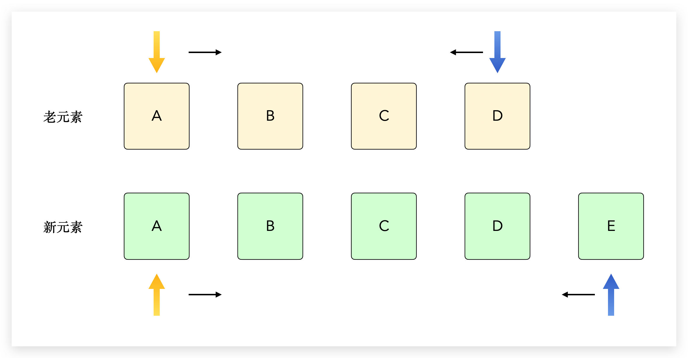

直至一方遍历完成，比对才结束；即：“老的头指针和尾指针重合"或"新的头指针和尾指针重合”；此时需要再次移动一下指针退出循环

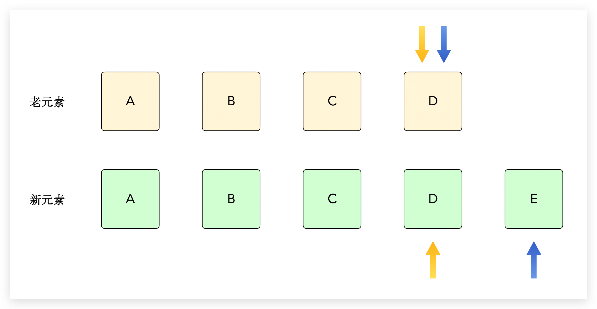

这里，为了能够提升diff算法的性能，并不会直接全部采用最消耗性能的“乱序比对”；

而是结合了实际应用场景，优先对 4 种特殊情况进行了特殊的处理：头头、尾尾、头尾、尾头：

头和头比较，将头指针向后移动，依次对比节点进行dom更新直至指针重合；
尾和尾比较，将尾指针向前移动，依次对比节点进行dom更新直至指针重合；
头和尾比较，将头指针向后移动，尾指针向前移动，依次对比节点进行dom更新直至指针重合；
尾和头比较，将尾指针向前移动，头指针向后移动，依次对比节点进行dom更新直至指针重合；

每次比对时，优先进行头头、尾尾、头尾、尾头的比对尝试，若均未能命中，才会执行最暴力的乱序比对；乱序对比是可以解决所有的更新对比问题，但是时间复杂度最高，因此在diff算法的选择中一般放在最后
将上述逻辑框架转化为代码实现，如下：

~~~~js
// src/vdom/patch.js

/**
 * 新老都有儿子时，执行乱序比对，即 diff 算法的核心逻辑
 * 备注：采用头尾双指针的方式；对头头、尾尾、头尾、尾头 4 种特殊情况做优化；
 *
 * @param {*} el 
 * @param {*} oldChildren  老子节点
 * @param {*} newChildren  新子节点
 */
function updateChildren(el, oldChildren, newChildren) {
    
    // 声明老节点头尾指针
    let oldStartIndex = 0;
    let oldStartVnode = oldChildren[0];
    let oldEndIndex = oldChildren.length - 1;
    let oldEndVnode = oldChildren[oldEndIndex];
    
    // 声明新节点头尾指针
    let newStartIndex = 0;
    let newStartVnode = newChildren[0];
    let newEndIndex = newChildren.length - 1;
    let newEndVnode = newChildren[newEndIndex];

    // while 循环的中止条件：新老其中一方遍历完成即为结束；
    // 即"老的头指针和尾指针重合"或"新的头指针和尾指针重合" 
    while(oldStartIndex <= oldEndIndex && newStartIndex <= newEndIndex){
        // 1，优先做4种特殊情况比对：头头、尾尾、头尾、尾头
        // 2，若未能命中，则采用 diff 乱序比对
        // 3，比对完成后移动指针，继续下一轮比对，直至比对完成
    }

    // 比对完成后，继续处理剩余节点...
}
~~~~

【注意】由于`diff`算法采用了`while`循环进行处理，所以复杂度为`O(n)`;

定义好了updateChildren方法接下来我们就可以来研究一下diff算法了。


## 五、diff算法实现分析

#### 情况 1：新儿子比老儿子多

###### 从头部开始移动指针

从头部开始移动指针头头比对：第一次匹配，匹配后移动新老头指针：

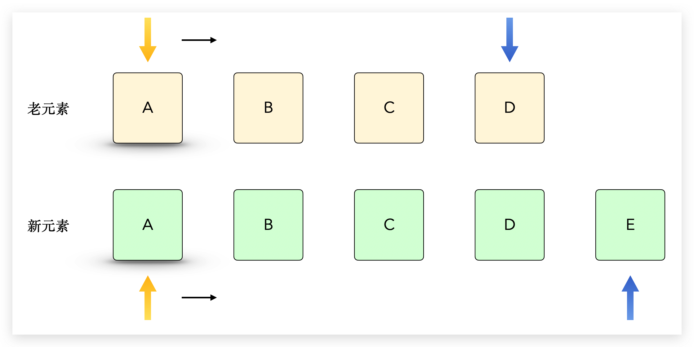

第二次匹配，匹配后移动新老头指针：

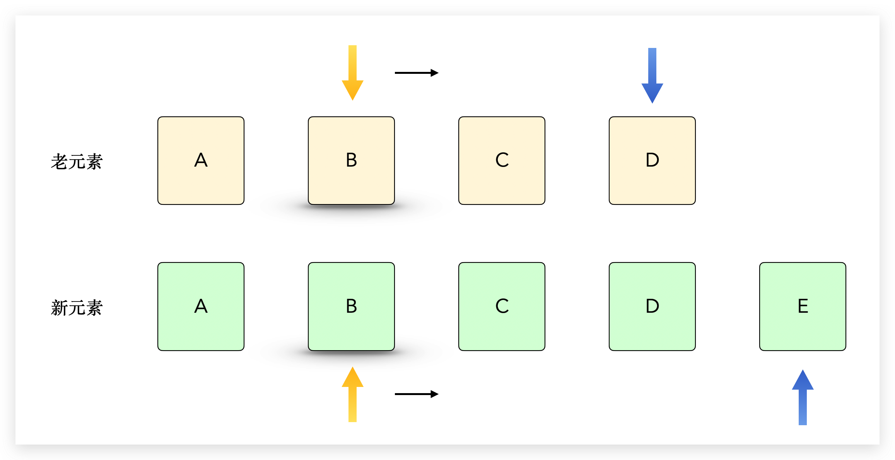

通过多次比对后，直至老节点的头尾指针发生重合，此时，`D`节点就是`while`循环的最后一次比对：

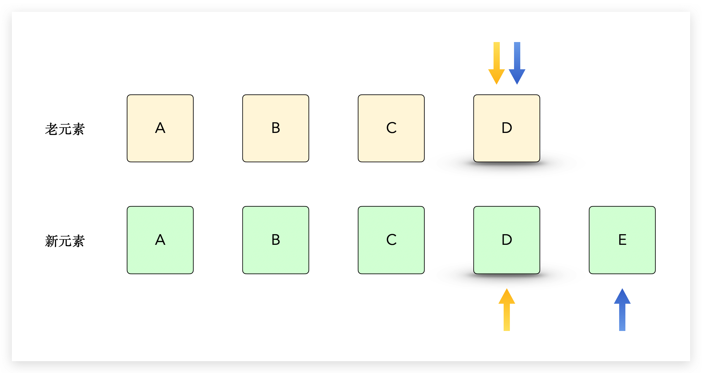

本次比对完成之后，指针会继续向后移动一次，将导致老节点的头指针越过尾指针，此时`while`循环结束；

`while`循环结束时的指针状态如下：

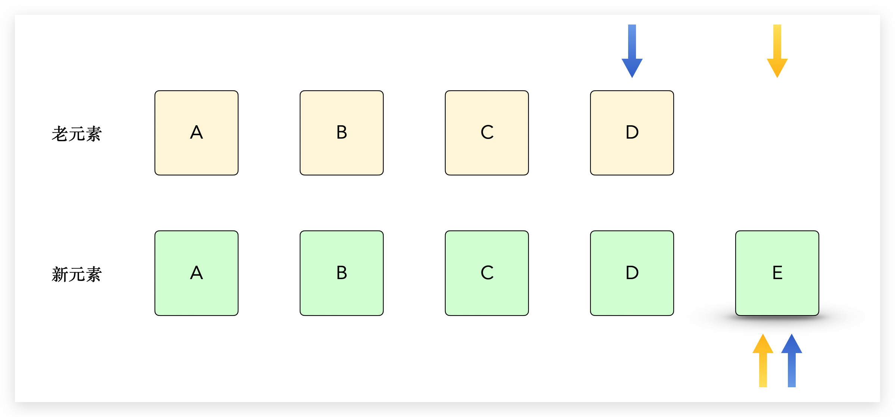

此时，新节点的头指针指向的节点`E`为新增节点，后面可能还存在`F、G、H`等其它新增节点，需要将它们（即从`newStartIndex`到`newEndIndex`之间的所有节点），全部添加到老节点的儿子集合中；

代码实现：

~~~~js
while(oldStartIndex <= oldEndIndex && newStartIndex <= newEndIndex){ 
    
    // 头头比对：
    if(isSameVnode(oldStartVnode, newStartVnode)){ 
    
        // ******* 1，比对新老虚拟节点 *******
        // isSameVnode 只能判断标签和 key 一样，但属性可能还有不同；
        // 因此，继续调用 patch 方法，对新老虚拟节点中的属性做递归更新操作；
        patch(oldStartVnode, newStartVnode); 
        
        // ******* 2，比对完成后，更新指针和节点位置 *******
        oldStartVnode = oldStartVnode[++oldStartIndex]; // 更新老的头指针和头节点
        newStartVnode = newStartVnode[++newStartIndex]; // 更新新的头指针和头节点
    } 
}

// 新的节点有多的子节点时，全部追加到 dom 中
if(newStartIndex <= newEndIndex){ 
    // 遍历多余节点：新的开始指针和新的结束指针之间的节点
    for(let i = newStartIndex; i <= newEndIndex; i++){ 
       // 获取虚拟节点并生成真实节点，添加到 dom 中 
       el.appendChild(createElm(newChildren[i])) 
    } 
}
~~~~

`isSameVnode`方法，只能判断标签和 key 是否完全一样，无法判断属性变化；因此，需要继续通过 patch 方法，对新老虚拟节点中的属性进行递归更新操作

#### 从尾部部开始移动指针

如果新增的节点在头部位置，就不能用`appendChild`了，看下面的尾尾比对分析；

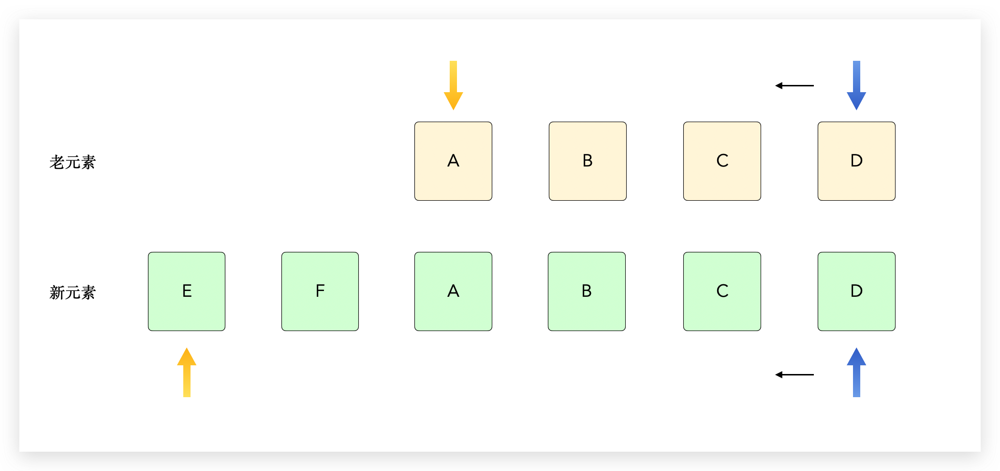

尾指针向前移动，当老节点的头尾指针重合，即`while`循环的最后一次比对：

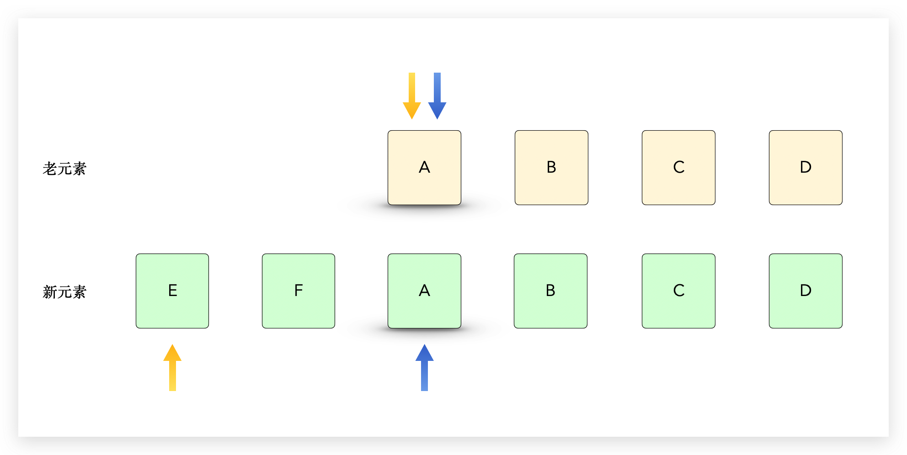

比对完成指针向前移动后，循环结束时的指针状态如下：

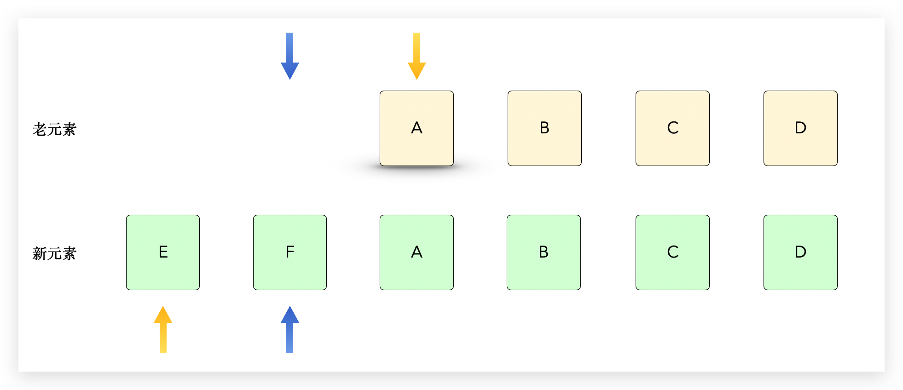

`while`比对完成后，需要将剩余新节点（`E`、`F`）添加到老儿子中的**对应位置**（当前应添加到老儿子集合的头部）

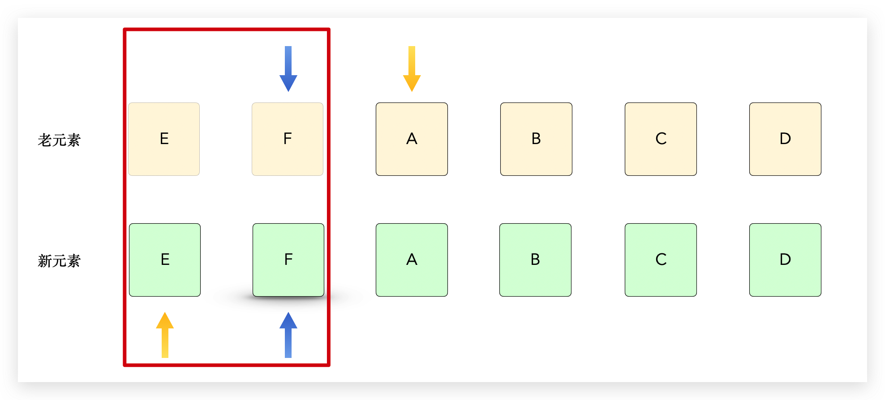

如何将新增节点`E`、`F`放置到`A`前面？

首先，想要添加到A节点的前面，就不能再使用appendChild做向后追加操作了；
前面的代码是指“从新的头指针到新的尾指针”这一区间的节点，即for (let i = newStartIndex; i <= newEndIndex; i++) 所以，从处理顺序上，是先处理E节点，再处理F节点

先处理`E`节点：将`E`节点放置到`A`节点前的位置：

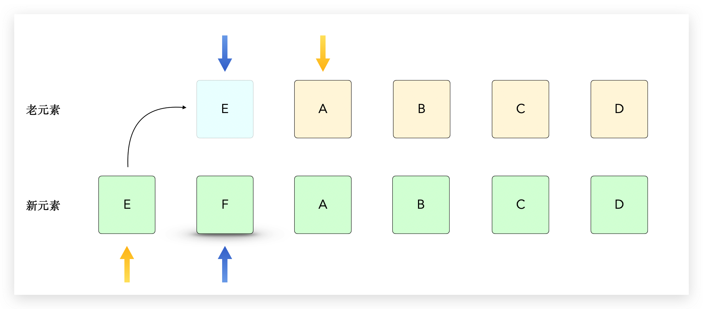

再处理`F`节点：将`F`节点插入到`A`节点与`E`节点之间的位置：

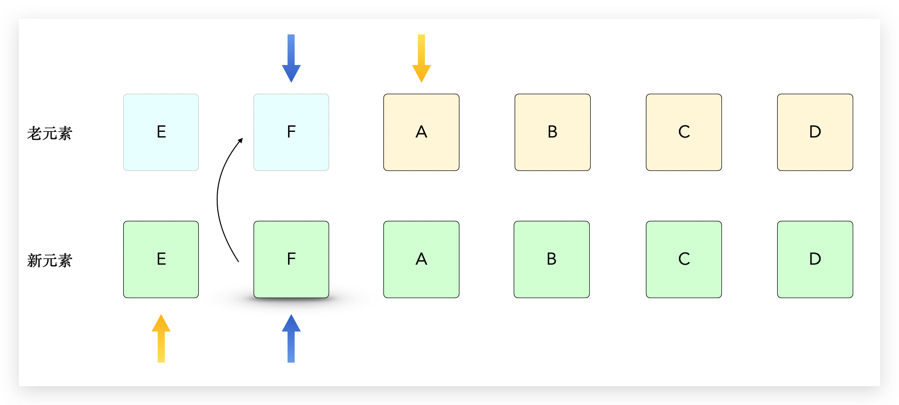

这样，当新增区域的头尾指针重合，即为最后一次比对；

方案设计：两种比对方式的合并处理
新增的节点的两种情况：有可能被追加到后面，也有可能被插入到前面：

头头比较时，将新增节点追加到老儿子集合的尾部；
尾尾比较时，将新增加点添加到老儿子集合的头部；
综合以上两种情况，如何确定向前 or 向后添加节点呢？
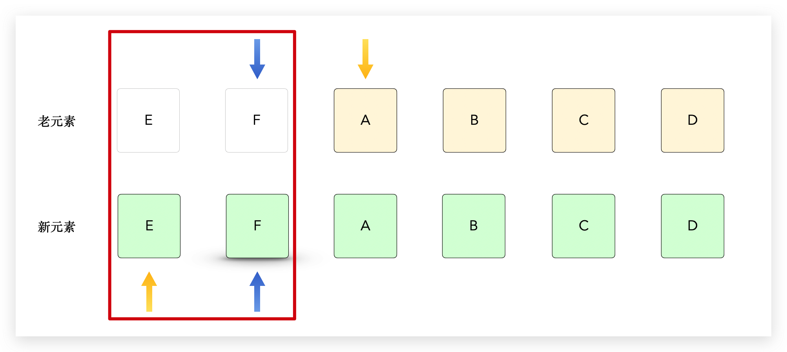

这取决于while循环结束时，新儿子集合的尾指针newChildren[newEndIndex + 1]上是否存在节点：

如果无节点：说明是从头向尾进行比对的，新增节点需要被追加到老儿子集合后面，使用appendChild直接追加即可；
如果有节点：说明是从尾向头进行比对的，新增节点需要被添加到老儿子集合前面，使用insertBefore插入指定到位置；
以上分析对应的代码实现，如下：

~~~~js
while(oldStartIndex <= oldEndIndex && newStartIndex <= newEndIndex){ 
		//     ......
  
    // 头头比对：
    else if (isSameVnode(oldEndVnode, newEndVnode)) {
      patch(oldEndVnode, newEndVnode);
      oldEndVnode = oldChildren[--oldEndIndex];
      newEndVnode = newChildren[--newEndIndex];
      // 头尾比较：老的头节点和新的尾节点做对比
    }
  
  	// ......
}

// ############# 改造之前的元素插入方式 ##############
// 1，新的多（以新指针为参照），插入新增节点
if (newStartIndex <= newEndIndex) {

  // ****** 先获取参照物 ******
  // 判断当前尾节点的下一个元素是否存在：
  //  1，如果存在：说明是尾尾比对，插入到当前尾节点下一个元素前面；
  //  2，如果不存在（下一个是 null）：说明是头头比对，追加即可
    
  // 取参考节点 anchor：决定新节点放置到前边还是后边
  //  逻辑：取 newChildren 的尾部 +1，判断是否为 null
  //  解释：若有值则说明是向前移动，取出当前虚拟元素的真实节点 el，并将新节点添加到此真实节点之前
  // （由于是向前移动比对，故此虚拟元素在前一次比对中，已经复用了老节点 el，所以直接取新的虚拟节点上的 el 即可）
  let anchor = newChildren[newEndIndex + 1] == null ? null : newChildren[newEndIndex + 1].el
  
  // ****** 再根据参照物进行处理 ******
  // 遍历多出的节点：新的开始指针和新的结束指针之间的节点
  for (let i = newStartIndex; i <= newEndIndex; i++) {
      
    // 获取对应的虚拟节点，并生成真实节点，添加到 dom 中
    // el.appendChild(createElm(newChildren[i]))
    
    // 逻辑合并：将 appendChild 更换为 insertBefore 处理
    //  效果：既有 appendChild 又有 insertBefore 功能，直接放入参考节点即可;
    //  解释：对于 insertBefore 方法，如果 anchor=null，就等同于appendChild；如果有值，则是 insertBefore；
    el.insertBefore(createElm(newChildren[i]), anchor)
  }
}
~~~~

这里非常重要的一个思想，就是找到参考节点`anchor`；之后，再将新的真实节点放置于参考节点之前即可；

注意此处`insertBefore`方法的妙用：

- 当第二个参数为`null`时，效果等同于`appendChild`追加；
- 当第二个参数不为`null`时，效果是`insertBefore`插入；

所以，同时具备了`appendChild`追加和`insertBefore`插入的效果；

以上，对新节点比老节点多的两种情况，分别进行了处理；

除此之外，还可能存在老节点比新节点多的情况，那么，该如何处理呢？

#### 情况 2：老儿子比新儿子多，删除多余

~~~~js
let render1 = compileToFunction(`<div>
    <li key="A">A</li>
    <li key="B">B</li>
    <li key="C">C</li>
    <li key="D">D</li>
</div>`);

let render2 = compileToFunction(`<div>
    <li key="A">A</li>
    <li key="B">B</li>
    <li key="C">C</li>
</div>`);
~~~~

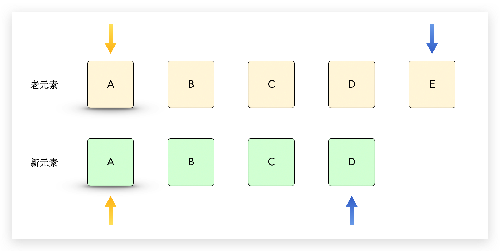

老的比新的多，在移动过程中就会出现：新的已经到头了，但老的还有；

所以，当移动结束时：老的头指针会和尾指针重合，新的头指针会越过新的尾指针；

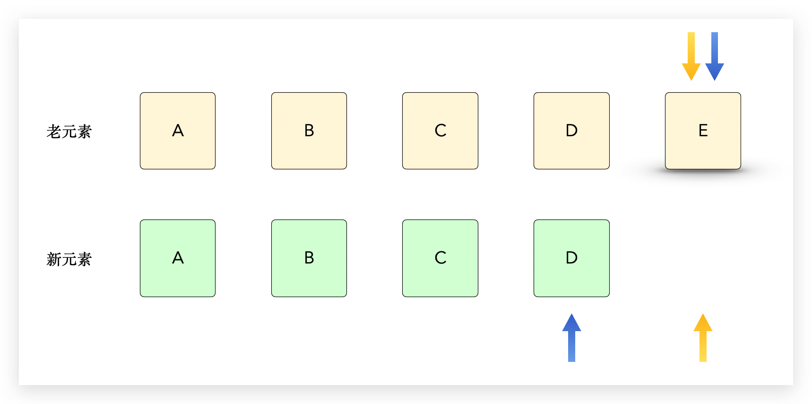

代码实现：

将老儿子集合“从头指针到尾指针”区域中，多余的真实节点删除：

```js
// 2，老儿子比新儿子多，（以旧指针为参照）删除多余的真实节点
if(oldStartIndex <= oldEndIndex){
  for(let i = oldStartIndex; i <= oldEndIndex; i++){
    let child = oldChildren[i];
    el.removeChild(child.el);
  }
}
```

#### 情况 3：反序情况（头尾、尾头）

反序情况：如图，新老儿子集合中的节点顺序是完全相反的；

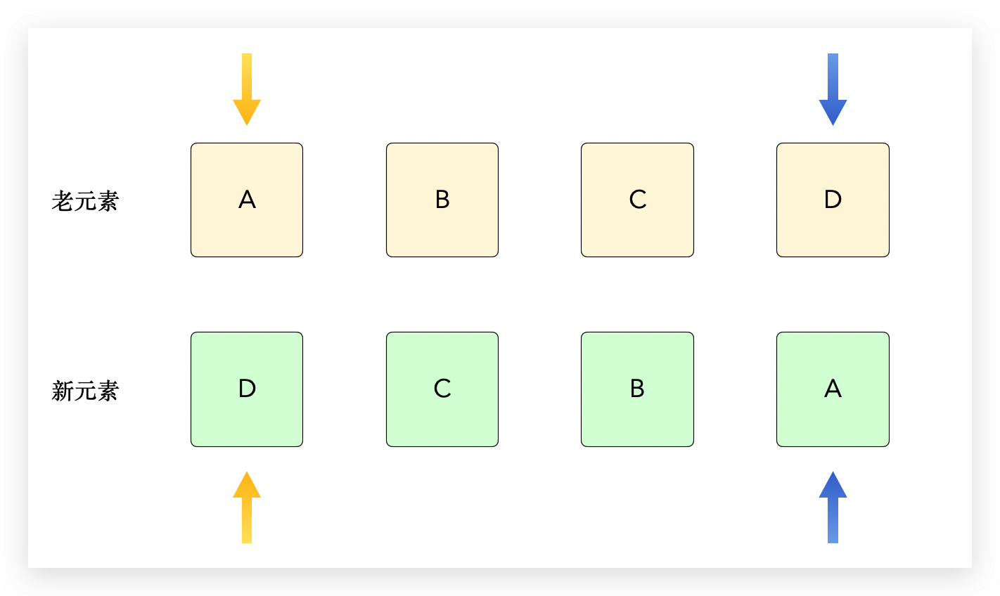

这种情况下，可以使用“老的头指针”和“新的尾指针”进行比较，即“头尾比对”

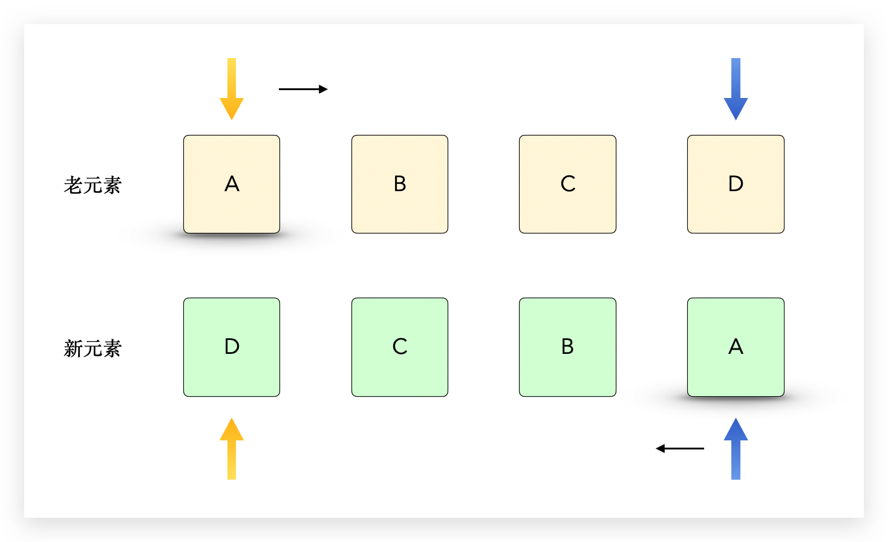

每次比较完成后，“老的头指针”向后移动，“新的尾指针”向前移动；并在比对完成后，直接将老节点`A`放置到老节点集合的最后：

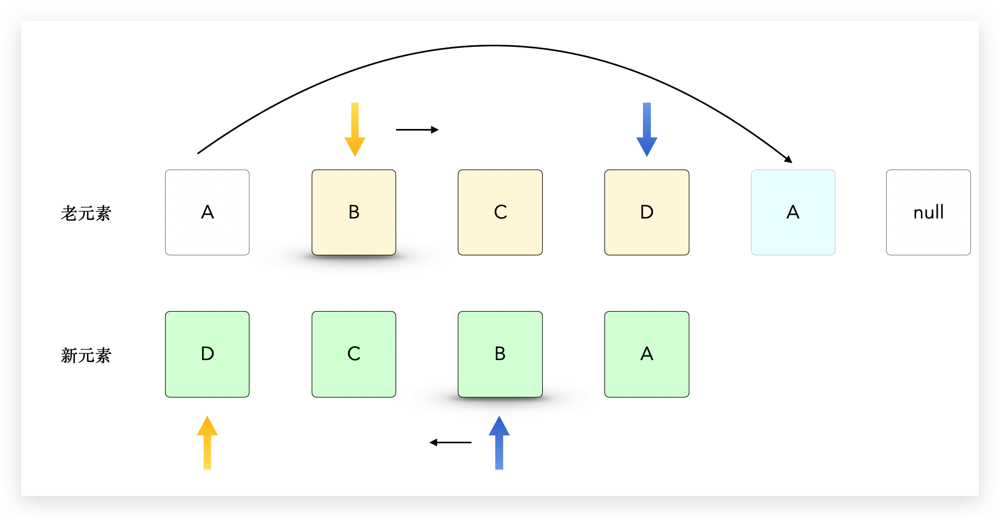

更确切的说，应该是插入到尾指针的下一个节点（`null`）之前；

（在移动前，想象尾指针指向的`D`节点后面，还存在着下一个节点为`null`）

`js`本身是无法做到“向一个元素之后添加一个元素”的；比如：`appendChild` 是向最后进行追加；

因此，在逻辑上，只能是先找到目标元素的下一个元素，再向下一个元素之前添加一个新的元素；

继续比对`B`，比对完成后继续移动指针，并移动`B`，插入到尾指针的下一个节点之前（这时尾指针`D`的下一个节点，边是上一次移动过来的`A`，所以`B`就插入到了`D`和`A`之间）

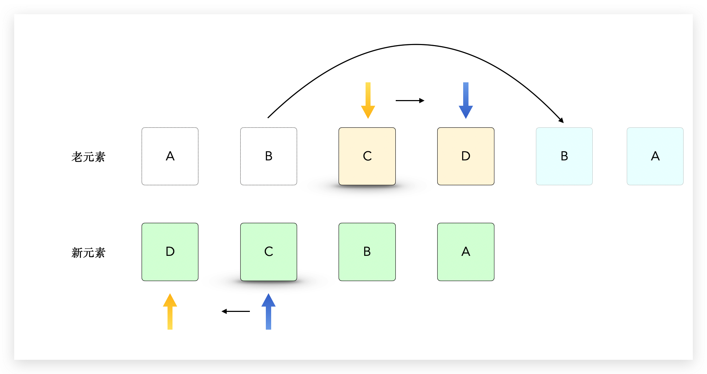

继续`C`和`C`比，比对完成后继续移动指针，并移动`C`，插入到尾指针的下一个节点之前（这时，尾指针`D`的下一个是上一次移动过来的`B`）

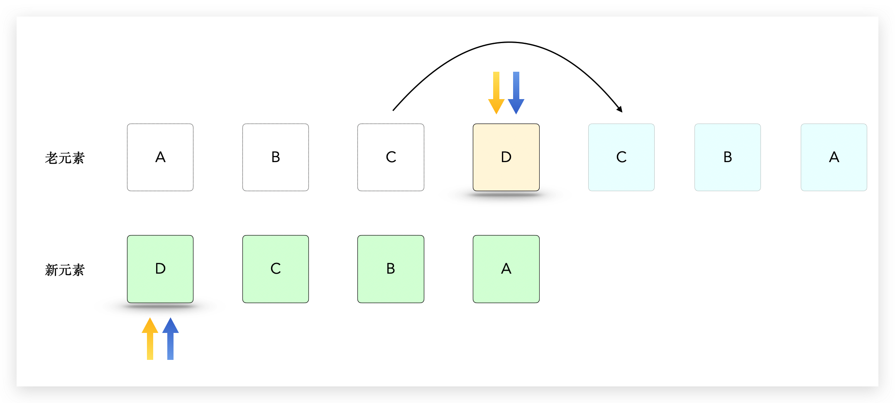

接下来继续比对D，此时，就会发现“旧的头指针”和“新的头指针”都指向了D;

这时，就比对完成了，D无需再移动，结果就是D C B A；

（整个反序过程，共移动了3 次，只对节点进行了移动操作，并没有创建新节点）

结论：对于反序操作来说，需要去比对头尾指针（老的头和新的尾），每次比对完成之后，头指针向右移动，尾指针向左移动；

代码实现，添加“头尾比较”逻辑：

~~~~js
while (oldStartIndex <= oldEndIndex && newStartIndex <= newEndIndex) {

  // if (isSameVnode(oldStartVnode, newStartVnode)) {
    // patch(oldStartVnode, newStartVnode);
    // oldStartVnode = oldChildren[++oldStartIndex];
    // newStartVnode = newChildren[++newStartIndex];
  // }else if(isSameVnode(oldEndVnode, newEndVnode)){
    // patch(oldEndVnode, newEndVnode);
    // oldEndVnode = oldChildren[--oldEndIndex];
    // newEndVnode = newChildren[--newEndIndex];
  // } 
  // 头尾比较：老的头节点和新的尾节点做对比
  else if(isSameVnode(oldStartVnode, newEndVnode)){
    // patch 方法只会 diff 比较并更新属性，但元素的位置不会变化
    patch(oldStartVnode, newEndVnode); // diff：会递归比对儿子
    
    // 移动节点：将当前的节点插入到最后一个节点的下一个节点的前面去
    el.insertBefore(oldStartVnode.el, oldEndVnode.el.nextSibling);
    
    // 指针置位--下一次循环继续处理
    oldStartVnode = oldChildren[++oldStartIndex];
    newEndVnode = newChildren[--newEndIndex];
  }
  // 尾头比较：老得尾节点和新的头节点比较
  else if (isSameVnode(oldEndVnode, newStartVnode)) {
    patch(oldEndVnode, newStartVnode);  // patch方法只会更新属性，元素的位置不会变化
    // 移动节点:将老的尾节点移动到老的头节点前面去
    el.insertBefore(oldEndVnode.el, oldStartVnode.el);// 将尾部插入到头部
    // 移动指针
    oldEndVnode = oldChildren[--oldEndIndex];
    newStartVnode = newChildren[++newStartIndex];
  } 
}
~~~~

#### 情况4：前面四种对比方式节点都不相同，此时采用乱序对比

- 一方有儿子，一方没有儿子；
  - 老的有儿子，新的没有儿子：直接将多余的老 dom 元素删除即可；
  - 老的没有儿子，新的有儿子：直接将新的儿子节点放入对应的老节点中即可；
- 新老节点都有儿子时，进行头头、尾尾、头尾、尾头对比；
- 头头、尾尾、头尾、尾头均没有命中时，进行乱序比对；

##### 1、乱序比对方案

下面这种情况，头头、尾尾、头尾、尾头都不相同：

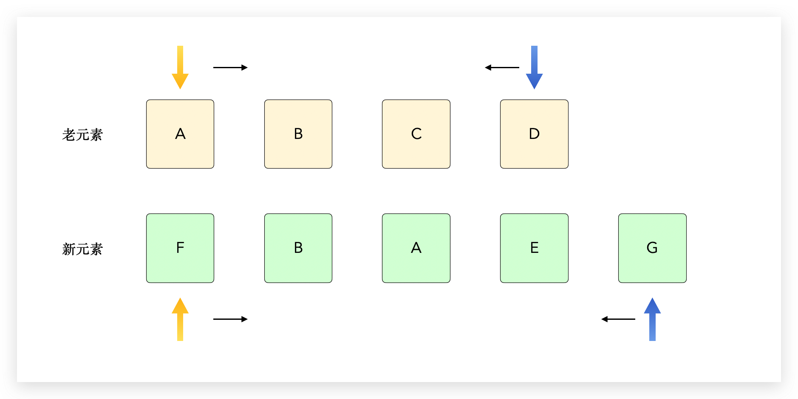

在理想情况下，`A`、`B` 节点是可以被复用的：

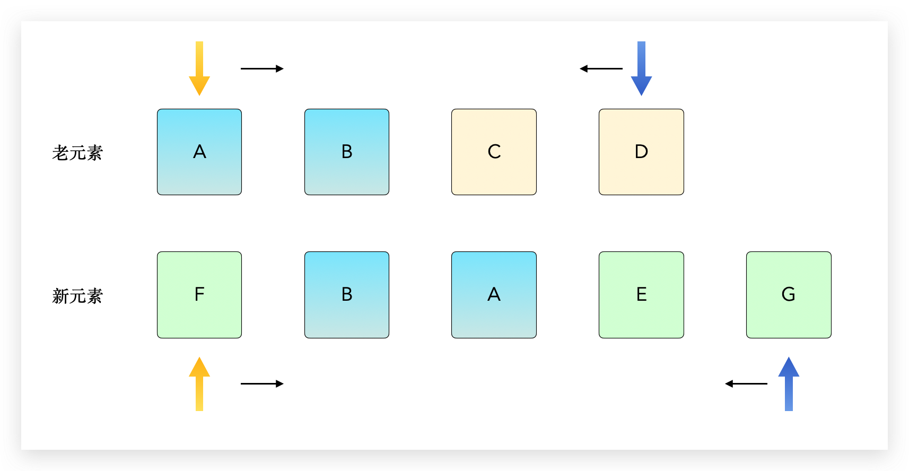

以新节点为主，以老节点做参照，先到老儿子集合中去找能复用的节点，再将不能复用老节点删掉；

根据老儿子集合，创建一个节点`key`和索引`index`的映射关系`mapping`，用于判定节点是否可被复用

取新节点，依次到老的索引列表`mapping`中查找是否存在，如果存在就复用，不存在则重新创建

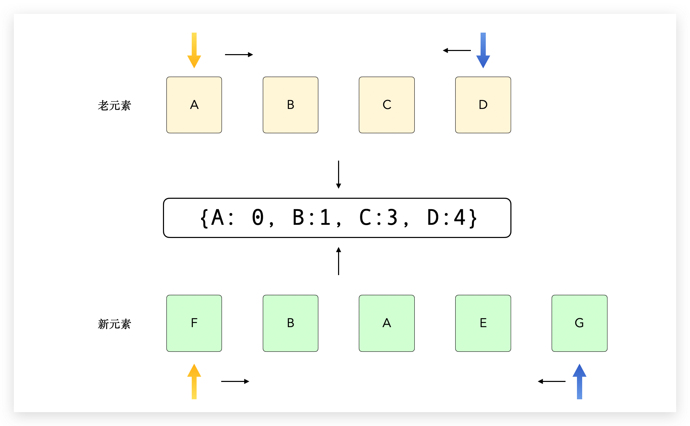


##### 2、乱序比对过程分析

1，先比对一下头头、尾尾、头尾、尾头，都没有命中：

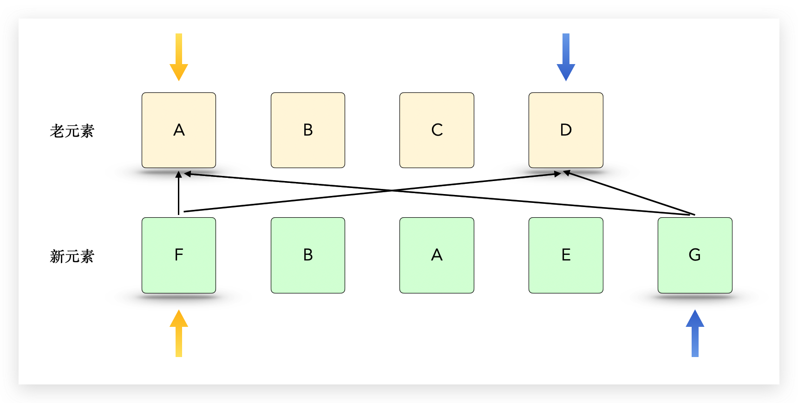

查找`F`是否在映射关系中，不在，直接做插入操作：插入到老的头指针前面的位置

即：将`F`节点插入到`A`节点的前面，并将新的头指针向后移动：

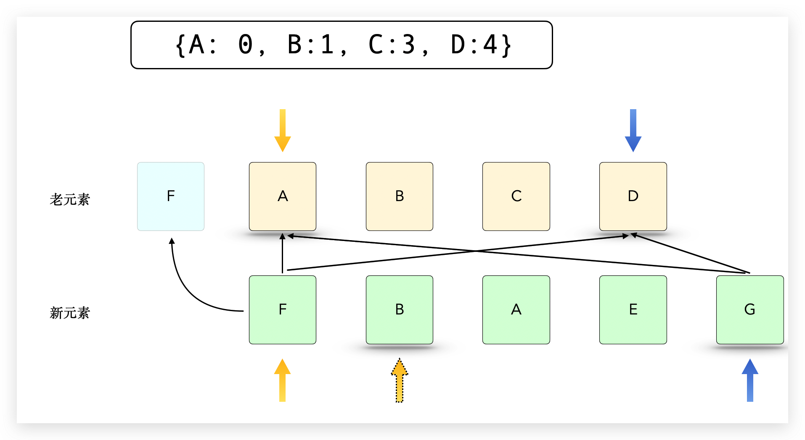

2，再对比一下头头、尾尾、头尾、尾头，还是没有命中：

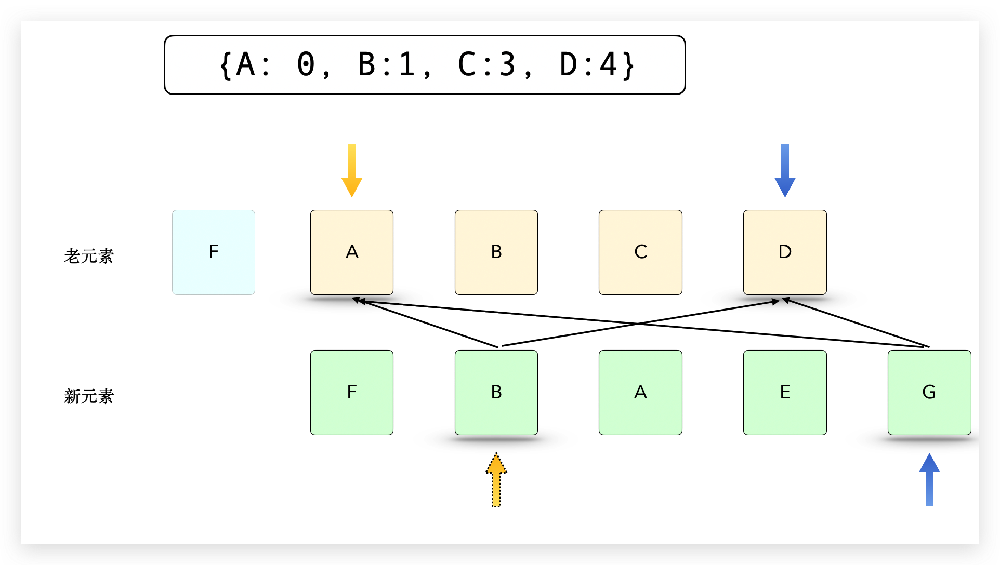

继续查找`B`是否在映射关系中，`B`在映射关系中，复用`B`节点并做移动操作：将复用节点移动到头指针指向节点的前面；

即：将老的`B`节点移动到`A`节点的前面，并将新的头指针向后移动：

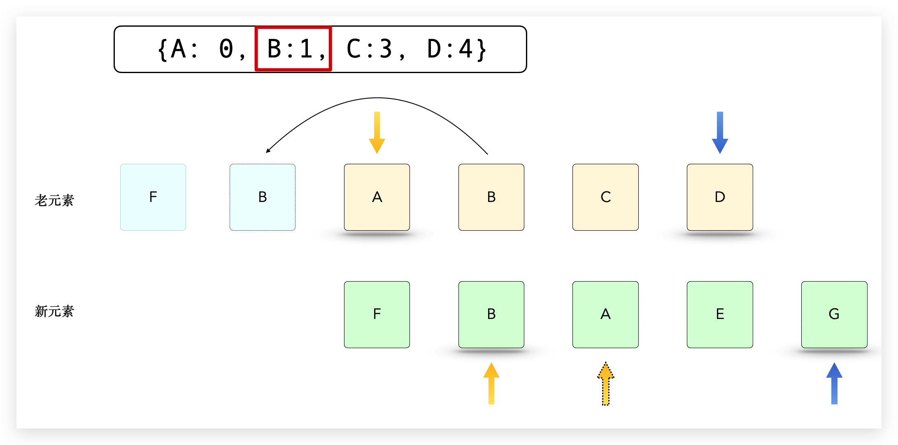

3，继续比对一次头头、尾尾、头尾、尾头，命中了头头比对：

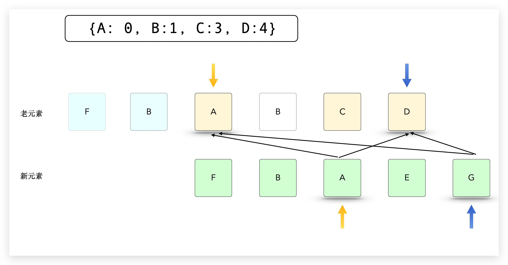

这时，按照头头比对的逻辑：老的头指针向后移动，新的头指针也向后移动；（同理，如果命中尾尾比对，将新老尾指针都向前进行移动）

由于之前`B`节点已经移动到`A`节点前面了，所以老的头指针需要跳过原始`B`节点的位置，直接移动到`C`节点所在的位置：

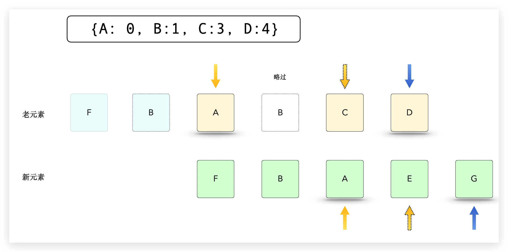

这里使用到了之前`B`节点移动走之后所做的空位置标记；

4，继续比对一次头头、尾尾、头尾、尾头，没有命中：

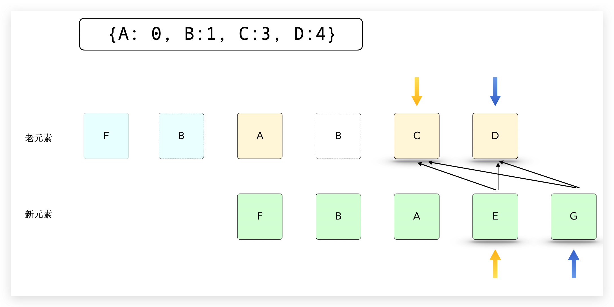

查找`E`是否在映射关系中，不在，直接做插入操作：插入到老的头指针前面的位置

即：将`E`节点插入到`C`节点的前面，并将新的头指针向后移动：

永远是插入到老的头指针前面的位置；

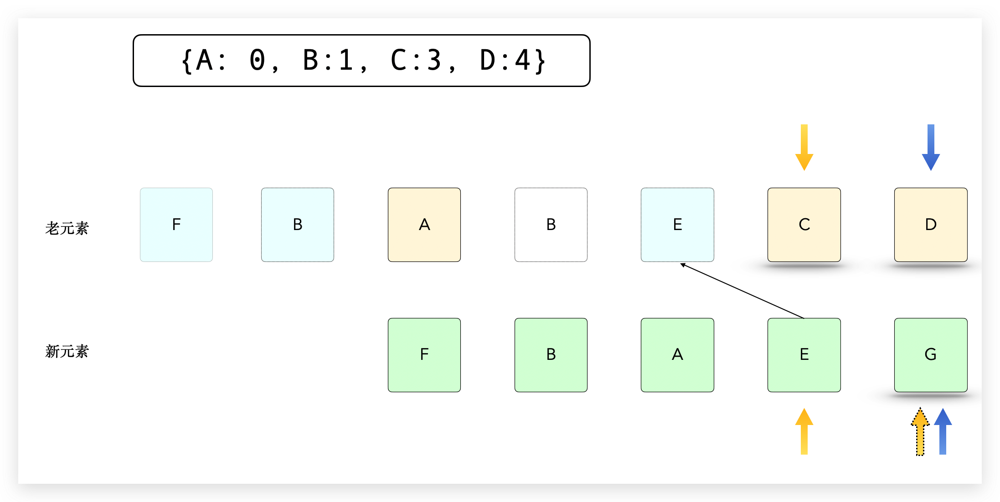

5，继续比对一次头头、尾尾、头尾、尾头，没有命中：

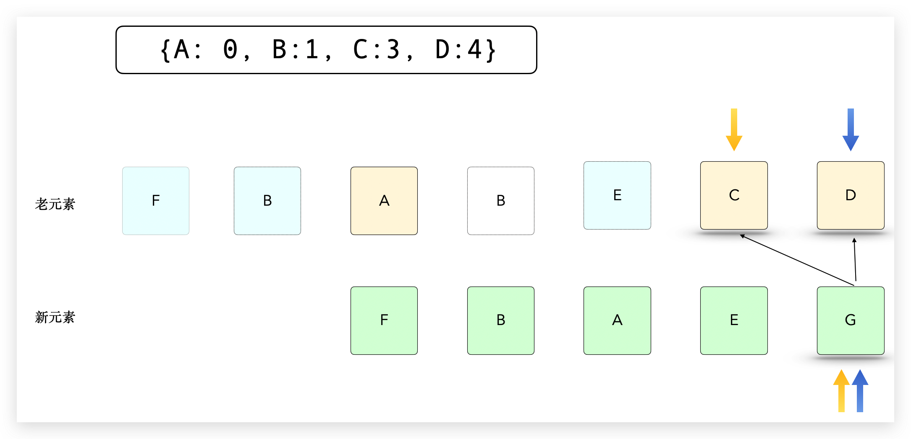

查找`G`是否在映射关系中，不在，直接做插入操作：插入到老的头指针前面的位置;

即：将`G`节点插入到`C`节点的前面，并将新的头指针向后移动：

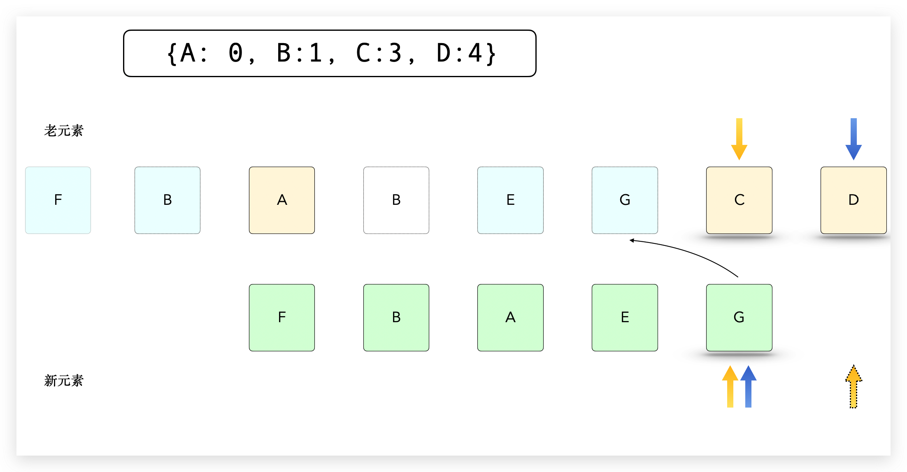

6，由于新儿子数组已全部比对完成，剩余的老节点直接删除即可

依次删除“从老的头节点到老的尾节点”区域的全部节点：

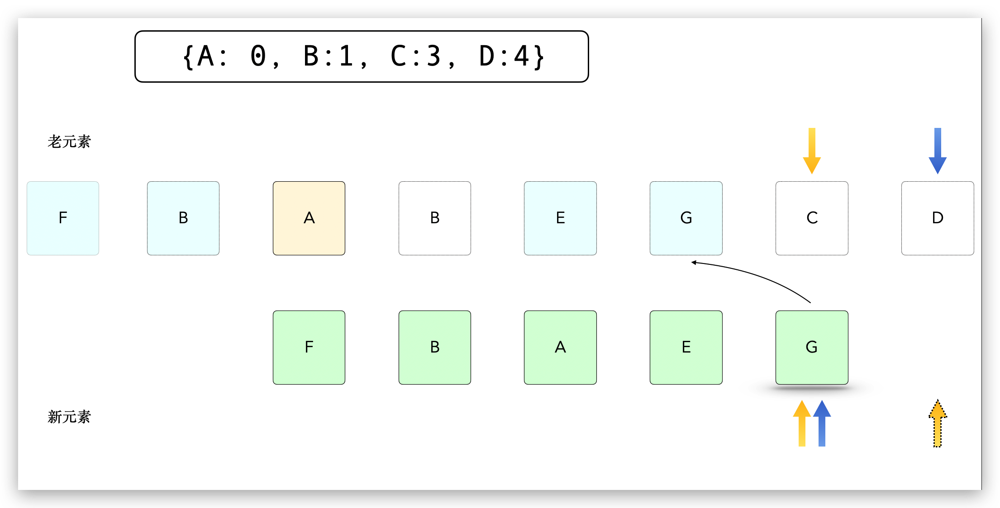

所以，最终结果为`F B A E G`；其中，对`A、B`节点实现了节点复用；


根据老儿子集合创建一个节点key和索引index的映射关系 mapping；用新儿子节点依次到mapping中查找是否存在可复用的节点；

存在复用节点，更新可复用节点属性并移动到对应位置；（移动走的老位置要做空标记）
不存在复用节点，创建节点并添加到对应位置；
最后，再将不可复用的老节点删除；

##### 3、乱序对比的代码实现

~~~~js
function updateChildren(el, oldChildren, newChildren) {
  /**
   * 根据children创建映射
   * 根据老儿子集合创建节点key与索引index的映射关系mapping：
   */
  function makeKeyByIndex(children) {
    let map = {}
    children.forEach((item, index) => {
      map[item.key] = index;
    })
    return map
  }

  let mapping = makeKeyByIndex(oldChildren);

  // while 循环处理，所以 diff 算法的复杂度为O(n)，只循环一遍
  // 循环结束条件：有一方遍历完了就结束；即"老的头指针和尾指针重合"或"新的头指针和尾指针重合"
  // 备注: 此while循环中主要对4种特殊情况进行优化处理,包括：头头、尾尾、头尾、尾头
  while (oldStartIndex <= oldEndIndex && newStartIndex <= newEndIndex) {
    
    // 定义空节点跳过指针的逻辑
    if (!oldStartVnode) {
      oldStartVnode = oldChildren[++oldStartIndex];
    } else if (!oldEndVnode) {
      oldEndVnode = oldChildren[--oldEndIndex];
    }
    ...
    ...
    ...
    
    else {
      // 前面4种逻辑（头头、尾尾、头尾、尾头）,主要是考虑到用户使用时的一些特殊场景，但也有非特殊情况，如：乱序排序
      // 筛查当前新的头指针对应的节点在mapping中是否存在
      let moveIndex = mapping[newStartVnode.key]
      // 没有，将当前比对的新节点插入到老的头指针对用的节点前面
      if (moveIndex == undefined) {
        // 将当前新的虚拟节点创建为真实节点，插入到老的开始节点前面
        el.insertBefore(createElm(newStartVnode), oldStartVnode.el);
        // 有,需要复用
      } else {  
        // 将当前比对的老节点移动到老的头指针前面
        // 从老的队列中找到可以被复用的这个节点
        let moveVnode = oldChildren[moveIndex];
        // 复用：更新复用节点的属性，插入对应位置
        patch(moveVnode, newStartVnode)
        el.insertBefore(moveVnode.el, oldStartVnode.el);
        // 由于复用的节点在oldChildren中被移走了,之前的位置要标记为空(指针移动时，跳过会使用)
        oldChildren[moveIndex] = undefined;
      }
      // 每次处理完成后，新节点的头指针都需要向后移动
      // 备注：
      // 		无论节点是否可复用，新指针都会向后移动，所以最后统一处理；
      //    节点可复用时，老节点的指针移动会在4种特殊情况中被处理完成；
      newStartVnode = newChildren[++newStartIndex];
    }
  }

  .....
  .....
}
~~~~

至此所有的diff对比就给大家介绍完了，下面我们看看patch的完整实现：

~~~~js
// src/vdom/patch.js

/**
 * 将虚拟节点转为真实节点后插入到元素中
 * @param {*} oldVnode  老的虚拟节点
 * @param {*} vnode     新的虚拟节点
 * @returns             新的真实元素
 */
export function patch(oldVnode, vnode) {

  // 是否真实节点：虚拟节点无此属性
  const isRealElement = oldVnode.nodeType;  
  
  if (isRealElement) {// 真实节点
  
    // 1，根据虚拟节点创建真实节点
    const elm = createElm(vnode);
    
    // 2，使用真实节点替换掉老节点
    // 找到元素的父亲节点
    const parentNode = oldVnode.parentNode;
    // 找到老节点的下一个兄弟节点（nextSibling 若不存在将返回 null）
    const nextSibling = oldVnode.nextSibling;
    
    // 将新节点 elm 插入到老节点 el 的下一个兄弟节点 nextSibling 的前面
    // 备注：若 nextSibling 为 null，insertBefore 等价于 appendChild
    parentNode.insertBefore(elm, nextSibling);
    
    // 删除老节点 el
    parentNode.removeChild(oldVnode);
    
    return elm;
  } else { // diff：新老虚拟节点比对
    
    // 1，同级比对，不是相同节点时，不考虑复用（放弃跨层复用），直接用新的替换旧的
    if (!isSameVnode(oldVnode, vnode)) {
      return oldVnode.el.parentNode.replaceChild(createElm(vnode), oldVnode.el);
    }

    // 2，相同节点时，复用老节点，更新差异点（比如：属性）
    // 文本没有标签名，需要进行单独处理：由于文本不存在儿子，直接更新即可（组件Vue.component（‘xxx’）即为组件 tag）
    let el = vnode.el = oldVnode.el;  // 节点复用：将老节点el，赋值给新节点el
    
    
    if (!oldVnode.tag) {  // 文本：没有标签名
      // 文本内容发生变化时，用新内容覆盖老内容
      if (oldVnode.text !== vnode.text) {
        return el.textContent = vnode.text;
      }
    }

    // 元素的处理：相同节点，且新老节点不都是文本时
    updateProperties(vnode, oldVnode.data);

    // 比较儿子节点
    let oldChildren = oldVnode.children || {};
    let newChildren = vnode.children || {};
    
    // 情况 1：老的有儿子，新的没有儿子；直接把老的 dom 元素干掉即
    if (oldChildren.length > 0 && newChildren.length == 0) {
      el.innerHTML = '';//暴力写法直接清空；更好的处理是封装removeChildNodes方法：将子节点全部删掉，因为子节点可能包含组件
      
    // 情况 2：老的没有儿子，新的有儿子；直接将新的插入即可
    } else if (oldChildren.length == 0 && newChildren.length > 0) {
      newChildren.forEach((child) => {// 注意：这里的child是虚拟节点，需要变为真实节点
        let childElm = createElm(child); // 根据新的虚拟节点，创建一个真实节点
        el.appendChild(childElm);// 将生成的真实节点，放入 dom
      })
      
    // 情况 3：新老都有儿子
    } else {  
      // 递归: updateChildren 内部会调用 patch方法，
      // patch 方法内部还会继续调用 updateChildren； (patch 方法是更新的入口)
      updateChildren(el, oldChildren, newChildren)
    }
    
    return el;// 返回新节点
  }
}

/**
 * 新老都有儿子时做比对，即 diff 算法核心逻辑
 * 备注：采用头尾双指针的方式；优化头头、尾尾、头尾、尾头的特殊情况；
 * @param {*} el 
 * @param {*} oldChildren  老的儿子节点
 * @param {*} newChildren  新的儿子节点
 */
function updateChildren(el, oldChildren, newChildren) {
  // vue2中的diff算法内部做了优化，尽量提升性能，实在不行再暴力比对
  // 常见情况：在列表中，新增或删除某一项（用户很少在列表的中间添加一项）

  // 声明头尾指针
  let oldStartIndex = 0;
  let oldStartVnode = oldChildren[0];
  let oldEndIndex = oldChildren.length - 1;
  let oldEndVnode = oldChildren[oldEndIndex];

  let newStartIndex = 0;
  let newStartVnode = newChildren[0];
  let newEndIndex = newChildren.length - 1;
  let newEndVnode = newChildren[newEndIndex];

  /**
   * 根据children创建映射
   * 根据老儿子集合创建节点key与索引index的映射关系mapping：
   */
  function makeKeyByIndex(children) {
    let map = {}
    children.forEach((item, index) => {
      map[item.key] = index;
    })
    return map
  }

  let mapping = makeKeyByIndex(oldChildren);

  // while 循环处理，所以 diff 算法的复杂度为O(n)，只循环一遍
  // 循环结束条件：有一方遍历完了就结束；即"老的头指针和尾指针重合"或"新的头指针和尾指针重合"
  // 备注: 此while循环中主要对4种特殊情况进行优化处理,包括：头头、尾尾、头尾、尾头
  while (oldStartIndex <= oldEndIndex && newStartIndex <= newEndIndex) {
    // 当前循环开始时，先处理当前的oldStartVnode和oldEndVnode为空的情况； 原因：节点之前被移走时置空，直接跳过
    if (!oldStartVnode) {
      oldStartVnode = oldChildren[++oldStartIndex];
    } else if (!oldEndVnode) {
      oldEndVnode = oldChildren[--oldEndIndex];
      // 头头比较：比较新老开始节点
    } else if (isSameVnode(oldStartVnode, newStartVnode)) {
      // isSameVnode只能判断标签和key是否一样，但还有可能属性不一样
      // 所以还需要使用patch方法比对新老虚拟节点的属性，
      // 而patch方法是递归比对的，同时还会递归比较子节点
      patch(oldStartVnode, newStartVnode);
      // 更新新老头指针和新老头节点
      oldStartVnode = oldChildren[++oldStartIndex];
      newStartVnode = newChildren[++newStartIndex];
      // 尾尾比较：比较新老末尾节点
    } else if (isSameVnode(oldEndVnode, newEndVnode)) {
      patch(oldEndVnode, newEndVnode);
      oldEndVnode = oldChildren[--oldEndIndex];
      newEndVnode = newChildren[--newEndIndex];
      // 头尾比较：老的头节点和新的尾节点做对比
    } else if (isSameVnode(oldStartVnode, newEndVnode)) {
      // patch方法只会duff比较并更新属性，但元素的位置不会变化
      // diff:包括递归比儿子
      patch(oldStartVnode, newEndVnode);
      // 移动节点：将当前的节点插入到最后一个节点的下一个节点的前面去
      el.insertBefore(oldStartVnode.el, oldEndVnode.el.nextSibling);
      // 移动指针
      oldStartVnode = oldChildren[++oldStartIndex];
      newEndVnode = newChildren[--newEndIndex];
      // 尾头比较
    } else if (isSameVnode(oldEndVnode, newStartVnode)) {
      // patch方法只会更新属性，元素的位置不会变化
      patch(oldEndVnode, newStartVnode);  
      // 移动节点:将老的尾节点移动到老的头节点前面去
      // 将尾部插入到头部
      el.insertBefore(oldEndVnode.el, oldStartVnode.el);
      // 移动指针
      oldEndVnode = oldChildren[--oldEndIndex];
      newStartVnode = newChildren[++newStartIndex];
    } else {
      // 前面4种逻辑（头头、尾尾、头尾、尾头）,主要是考虑到用户使用时的一些特殊场景，但也有非特殊情况，如：乱序排序
      // 筛查当前新的头指针对应的节点在mapping中是否存在
      let moveIndex = mapping[newStartVnode.key]
      // 没有，将当前比对的新节点插入到老的头指针对用的节点前面
      if (moveIndex == undefined) {
        // 将当前新的虚拟节点创建为真实节点，插入到老的开始节点前面
        el.insertBefore(createElm(newStartVnode), oldStartVnode.el);
        // 有,需要复用
      } else {  
        // 将当前比对的老节点移动到老的头指针前面
        // 从老的队列中找到可以被复用的这个节点
        let moveVnode = oldChildren[moveIndex];
        // 复用：更新复用节点的属性，插入对应位置
        patch(moveVnode, newStartVnode)
        el.insertBefore(moveVnode.el, oldStartVnode.el);
        // 由于复用的节点在oldChildren中被移走了,之前的位置要标记为空(指针移动时，跳过会使用)
        oldChildren[moveIndex] = undefined;
      }
      // 每次处理完成后，新节点的头指针都需要向后移动
      // 备注：
      // 		无论节点是否可复用，新指针都会向后移动，所以最后统一处理；
      //    节点可复用时，老节点的指针移动会在4种特殊情况中被处理完成；
      newStartVnode = newChildren[++newStartIndex];
    }
  }

  // 至此，完成了相同节点的比较，下面开始处理不同的节点

  // 1，新的多（以新指针为参照）插入新增的
  if (newStartIndex <= newEndIndex) {
    // 新的开始指针和新的结束指针之间的节点
    for (let i = newStartIndex; i <= newEndIndex; i++) {
      // 判断当前尾节点的下一个元素是否存在：
      //  1，如果存在：则插入到下一个元素的前面
      //  2，如果不存在（下一个是 null） ：就是 appendChild
      // 取参考节点anchor:决定新节点放到前边还是后边
      //  逻辑：取去newChildren的尾部+1,判断是否为 null
      //  解释：如果有值说明是向前移动的，取出此虚拟元素的真实节点el，将新节点添加到此真实节点前即可
      let anchor = newChildren[newEndIndex + 1] == null ? null : newChildren[newEndIndex + 1].el
      // // 获取对应的虚拟节点，并生成真实节点，添加到 dom 中
      // el.appendChild(createElm(newChildren[i]))
      // 逻辑合并:将 appendChild 改为 insertBefore
      //  效果：既有appendChild又有insertBefore的功能，直接将参考节点放进来即可;
      //  解释：对于insertBefore方法,如果anchor为null，等同于appendChild;如果有值，则是insertBefore;
      el.insertBefore(createElm(newChildren[i]), anchor)
    }
  }
  // 2，旧的多，（以旧指针为参照）删除多余的真实节点
  if (oldStartIndex <= oldEndIndex) {
    for (let i = oldStartIndex; i <= oldEndIndex; i++) {
      let child = oldChildren[i];
      // child有值时才删除；原因：节点有可能在移走时被置为undefined
      child && el.removeChild(child.el);
    }
  }
}
~~~~

这里有一个在线对比网站https://wanglin2.github.io/VNode_visualization_demo/ 可以帮助大家更好的理解对比过程


至此我们的vue框架就实现完了，这个框架中比较完整的实现了数据响应式，订阅发布模式，dom更新机制，除此之外还有的生命周期，指令系统，组件系统，以及插件系统，因为实现相对比较简单，我们没有继续深入实现。

