## 一、拓展章节

这一部分的内容以拓展为主大家适量斟酌


## 二、vue3中的响应式原理

在前面的内容中我们学了vue2的响应式原理，主要通过object.defineProperty，但是在vue3中响应式的方案变成了proxy，也就是代理，改成proxy主要为了解决defineProperty开销大的问题。

| **实现原理** | **defineProperty**   | **Proxy**               | **value setter**    |
| ------------ | -------------------- | ----------------------- | ------------------- |
| 实际场景     | Vue 2 响应式         | Vue 3 reactive          | Vue 3 ref           |
| 优势         | 兼容性               | 基于proxy实现真正的拦截 | 实现简单            |
| 劣势         | 数组和属性删除开销大 | 兼容不了 IE11           | 只拦截了 value 属性 |
| 实际应用     | Vue 2                | Vue 3 复杂数据结构      | Vue 3 简单数据结构  |


### Proxy

Proxy 对象用于创建一个对象的代理，从而实现基本操作的拦截和自定义（如属性查找、赋值、枚举、函数调用等）。

被 Proxy 代理虚拟化的对象。它常被作为代理的存储后端。根据目标验证关于对象不可扩展性或不可配置属性的不变量（保持不变的语义）。

~~~~js
const p = new Proxy(target, handler)
~~~~

**参数：**
**target：**
要使用 Proxy 包装的目标对象（可以是任何类型的对象，包括原生数组，函数，甚至另一个代理）。

**handler：**
一个通常以函数作为属性的对象，各属性中的函数分别定义了在执行各种操作时代理 p 的行为。

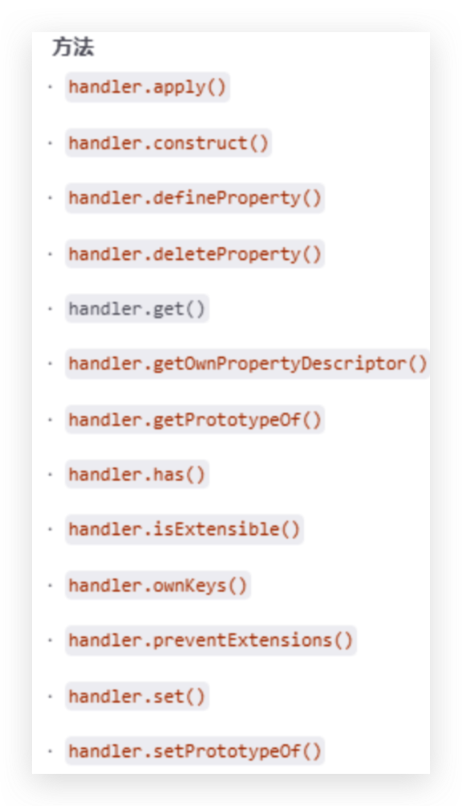

我们看下面的代码，在其中我们通过 new Proxy 代理了 obj 这个对象，然后通过 get、set 和 deleteProperty 函数代理了对象的读取、修改和删除操作，从而实现了响应式的功能,

~~~~js
let person = {
  name: "浩男",
  age: 18
}
const p = new Proxy (person, {
  // 当p对象中的某个属性被读取时触发
  get (target, p, receiver) {
    console.log(`p对象上的${p}属性被读取了`);
  },
  // 当p对象中某个属性被修改的时候触发 （修改，新增）
  set (target, p, value, receiver) {
    console.log(`p对象上的${p}被修改了`);
  },
  // 当p对象中某个属性不被删除的时候触发
  deleteProperty (target, p) {
    console.log(`p对象上的${p}被删除了`);
  }
})
~~~~

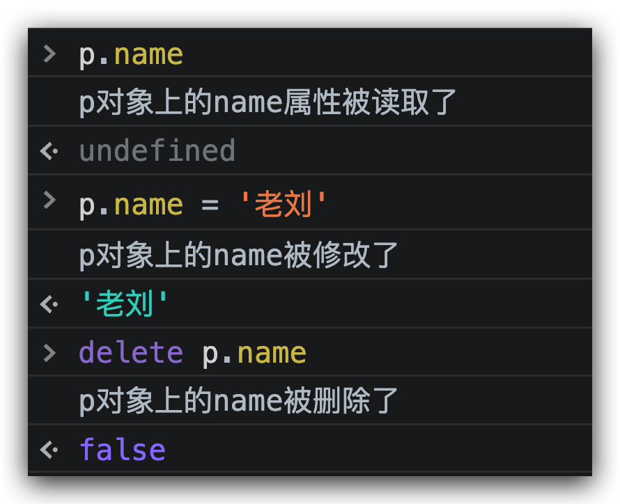

我们从这里可以看出 Proxy 实现的功能和 Vue 2 的 definePropery 类似，它们都能够在用户修改数据的时候触发 set 函数，从而实现自动更新 double 的功能。而且 Proxy 还完善了几个 definePropery 的缺陷，比如说可以监听到属性的删除。

但是我们发现当属性被修改之后，在此输出数据，数据并没有修改。

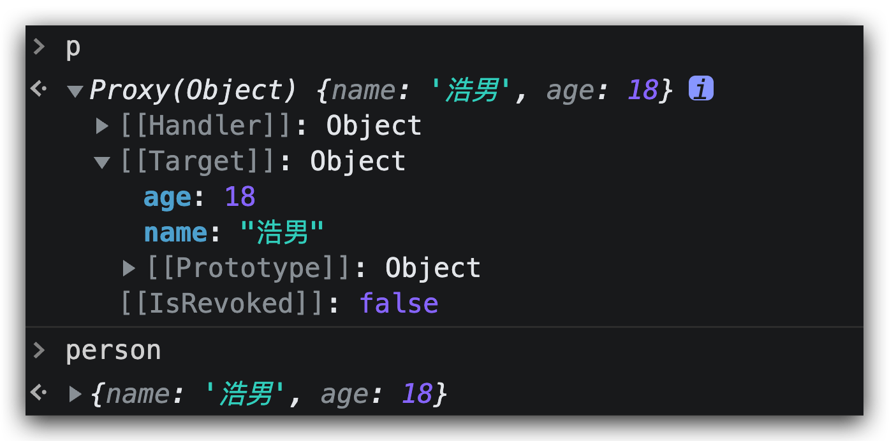

在object.defineProperty中我们可以通过一个中间变量或者闭包结构实现数据的修改，但是在proxy中，为我们提供了一个新的内置对象 **Reflect**（反射）实现对原对象的操作

Reflect是什么呢？

**Reflect** 是一个内置的对象，它提供拦截 JavaScript 操作的方法。这些方法与 [proxy handler (en-US)](https://developer.mozilla.org/en-US/docs/Web/JavaScript/Reference/Global_Objects/Proxy/Proxy) 的方法相同。`Reflect` 不是一个函数对象，因此它是不可构造的。与大多数全局对象不同 `Reflect` 并非一个构造函数，所以不能通过 [new 运算符](https://developer.mozilla.org/zh-CN/docs/Web/JavaScript/Reference/Operators/new)对其进行调用，或者将 `Reflect` 对象作为一个函数来调用。`Reflect` 的所有属性和方法都是静态的（就像 [`Math`](https://developer.mozilla.org/zh-CN/docs/Web/JavaScript/Reference/Global_Objects/Math) 对象）。`Reflect` 对象提供了以下静态方法，这些方法与 [proxy handler 方法](https://developer.mozilla.org/zh-CN/docs/Web/JavaScript/Reference/Global_Objects/Proxy/Proxy)的命名相同。

[`Reflect.defineProperty(target, propertyKey, attributes)`](https://developer.mozilla.org/zh-CN/docs/Web/JavaScript/Reference/Global_Objects/Reflect/defineProperty)和 [`Object.defineProperty()`](https://developer.mozilla.org/zh-CN/docs/Web/JavaScript/Reference/Global_Objects/Object/defineProperty) 类似。如果设置成功就会返回 `true`

[`Reflect.deleteProperty(target, propertyKey)`](https://developer.mozilla.org/zh-CN/docs/Web/JavaScript/Reference/Global_Objects/Reflect/deleteProperty)作为函数的[`delete`](https://developer.mozilla.org/zh-CN/docs/Web/JavaScript/Reference/Operators/delete)操作符，相当于执行 `delete target[name]`。

[`Reflect.get(target, propertyKey[, receiver\])`](https://developer.mozilla.org/zh-CN/docs/Web/JavaScript/Reference/Global_Objects/Reflect/get)获取对象身上某个属性的值，类似于 `target[name]`。

[`Reflect.set(target, propertyKey, value[, receiver\])`](https://developer.mozilla.org/zh-CN/docs/Web/JavaScript/Reference/Global_Objects/Reflect/set)将值分配给属性的函数。返回一个[`Boolean`](https://developer.mozilla.org/zh-CN/docs/Web/JavaScript/Reference/Global_Objects/Boolean)，如果更新成功，则返回`true`。

除了这四个比较常用的意外还有其他的方法，大家可以到<a href="https://developer.mozilla.org/zh-CN/docs/Web/JavaScript/Reference/Global_Objects/Reflect">文档</a>中查看

~~~~js
let person = {
  name: "浩男",
  age: 18
}
const p = new Proxy (person, {
  // 当p对象中的某个属性被读取时触发
  get (target, p, receiver) {
    console.log(`p对象上的${p}属性被读取了`);
    return Reflect.get(target,p)
  },
  // 当p对象中某个属性被修改的时候触发 （修改，新增）
  set (target, p, value, receiver) {
    console.log(`p对象上的${p}被修改了`);
    Reflect.set(target,p,value)
  },
  // 当p对象中某个属性不被删除的时候触发
  deleteProperty (target, p) {
    console.log(`p对象上的${p}被删除了`);
    return Reflect.deleteProperty(target,p)
  }
})
~~~~

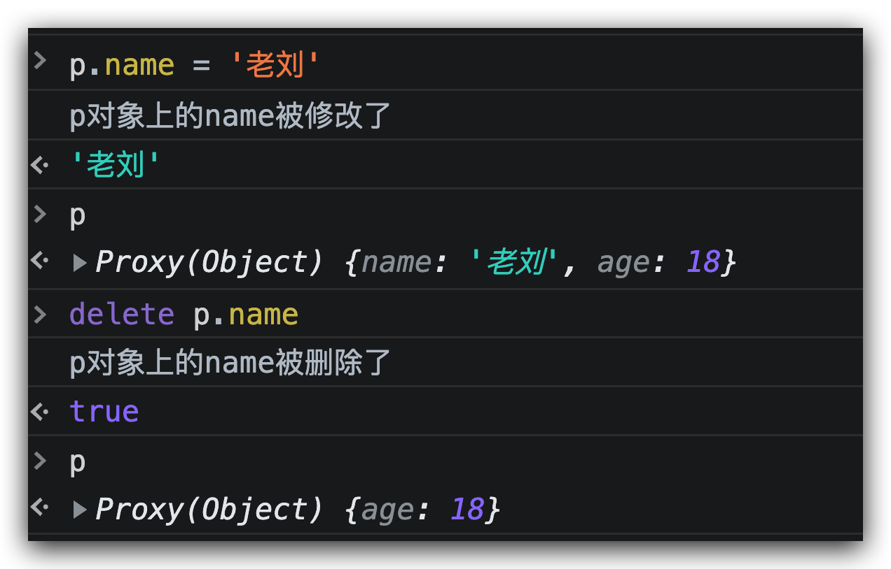

结合使用reflect之后，此时数据就被修改了。

Proxy 是针对对象来监听，而不是针对某个具体属性，所以不仅可以代理那些定义时不存在的属性，还可以代理更丰富的数据结构，比如 Map、Set 等，并且我们也能通过 deleteProperty 实现对删除操作的代理

不管是通过p对象对person对象进行增删改查任意一种操作，都能监测到，同时数据也能得到更新，对比起Vue2来说，确实真正意义上实现了数据的完全式响应。

### value setter

但是proxy只适用于对象的代理，对于简单的数据类型我们使用value setter来实现，类似于object.defineProperty

~~~~js
let count = {
    get value() {
        console.log(`变量获取${this.value}`);
        return this.value;
    },
    set value(val) {
        console.log(`变量修改${val}`);
    }
}
count.value = 1; //打印1
count.value = 2; //打印2
~~~~

如果相对对象中的某个属性实现响应式也是可以实现的。

~~~~js
let p = {
    _age: 18,
    set age(value){
      console.log('数据修改')
      this._age = value
    },
    get age(){
      console.log('数据获取')
      return this._age
    }
}
p.age = 3
console.log(p.age);
~~~~

在vue3中ref实现响应式使用的就是value setter实现的。


## 三、vue2源码阅读

我们在`new vue()`发生的一些列的过程就是 `vue` 初始化的过程

### 1、vue源码目录结构

vue源码地址 https://github.com/vuejs/vue/tree/2.6

本小节需要掌握vue的源码目录和目录文件的作用，了解主目录下的文件功能

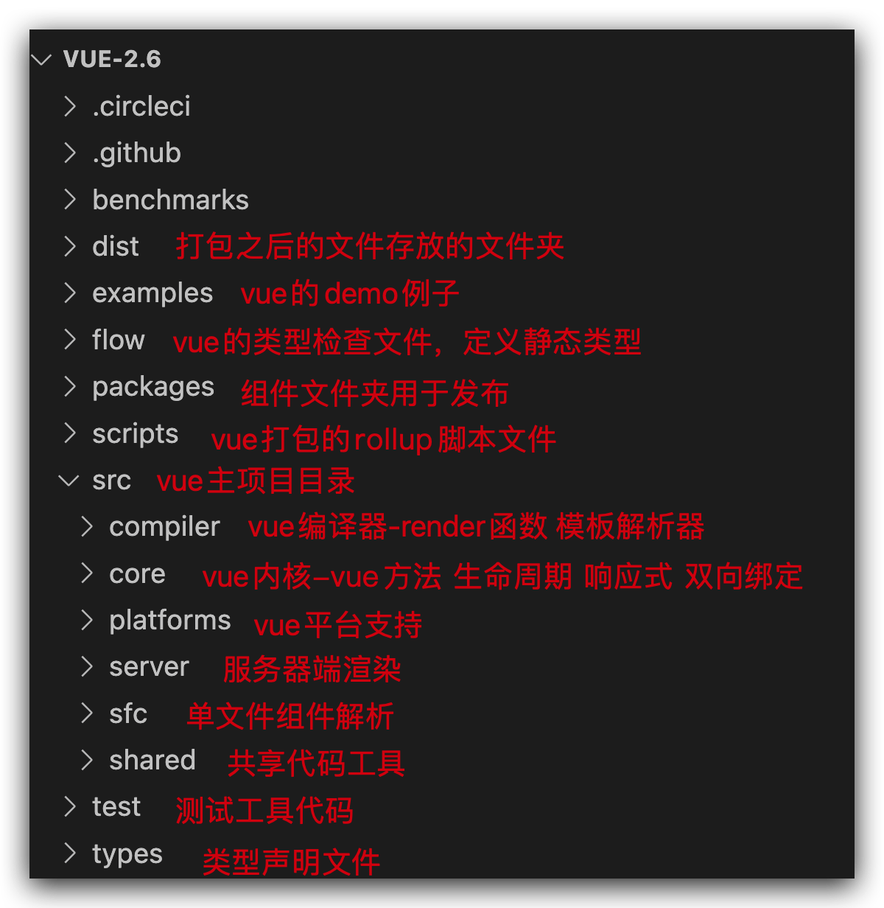

从上面的目录结构可以看出，`Vue`的整个项目包含了类型检测相关、单元测试相关、与平台无关的核心代码以及跨平台运行的相关代码。

由于我们只是学习`Vue.js`的设计思想以及代码实现的相关逻辑，所以我们暂不去关心类型检测、单元测试以及特定平台运行等相关逻辑实现，仅关注它的核心代码，即`src/core`和`src/complier`这两个目录下的代码，并且接下来后续的学习也都是只在这两个目录的范围之内。


【思考】`vue`源代码和`vue`项目代码目录结构一样么？

【回答】不一样vue源代码是`npm`目录编译打包结果需要上传到npm官网，`vue`项目是项目目录，编译打包结果需要上传到服务器

【思考】`vue`源码目录中重点需要了解的是哪一个目录？

【回答】项目主目录 `src`目录


### 2、`vue`初始化过程

#### 1、vue初始化过程回顾

在初始化`vue`项目的时候都需要在项目的打包入口文件中通过`new`构造一个Vue实例，才能呢使用`vue`框架中的规则，那么`new Vue`的过程中发生了哪些事情呢？

我们首先缕清`vue`框架初始化的各个步骤，然后按照初始化流程的顺序依次学习 `vue` 各个部分的原理

~~~~js
// 引入vue实例
import Vue from 'vue';
import App from './App.vue'
// vue配置
Vue.config.productionTip = false;

// 初始化vue实例，传入options配置
new Vue({  
	  el:'#app',
	  // 向render函数中传入根组件
    render: h => h(App)
    // 调用mount方法传入$el，将App根组件在index.html中id为app的dom元素上渲染
})
~~~~

这段代码大家都很熟悉，这就是 `Vue` 实例化的过程，从 new 操作符可以看出 Vue 其实就是一个构造函数，传入的参数是一个对象，这里给参数起一个名字，叫做 `options`（选项）


【思考】在`vue`项目中的入口文件`main.js`中我们做了哪些配置呢？ 

【回答】

 	1. 将`vue`的实例引入
 	2. 将`App`根组件引入
 	3. 创建一个`vue`实例
 	4. 给`render`函数传入根组件实例
 	5. 调用`Vue`实例上的`$mount`方法并传入`dom`节点，将`App`根组件在`index.html`中`id`为`app`的`dom`元素上渲染


#### 2、使用生命周期理解初始化过程

在开始看`vue`源码之前我们先复习一下[vue的生命周期](https://v2.cn.vuejs.org/v2/guide/instance.html#%E5%AE%9E%E4%BE%8B%E7%94%9F%E5%91%BD%E5%91%A8%E6%9C%9F%E9%92%A9%E5%AD%90)，这有助于我们更好的理解vue初始化的整个流程，这次我们重点关注的流程图中的**各个节点**


#### 3、代码阅读

【注意】我们在阅读源码的时候 为了方便理解，所有的`process.env.NODE_ENV`相关代码我们都可以暂时不看，这样可以降低理解难度。

在`new Vue()`的过程中大致分为三步： 

1. 在`vue`构造函数上挂载属性、事件、选项、生命周期钩子、渲染函数
2. 在初始化数据的时候将递归数据将每一个属性都变成可观测的（**Observable**：可观测到变量的读写）收集依赖驱动视图更新
3. 将`template`进行编译成`render`函数，通过`diff`算法`patch`页面元素更新

##### **【初始化事件和生命周期】**

`vue`源码的主目录是`src`，初始化Vue实例时，使用`new`关键字创建一个实例，所以首先需要找到一个名为vue的构造函数 打开 **/src/core/index.js** 找到导出Vue构造函数的文件 **./instance/index**

```js
// 从instance实例中引入vue实例 
// vue实例就是在/instance/index文件中实现的初始化
import Vue from './instance/index'
```

下面看一下`instance`中的`init`函数的作用，来到 **./instance/index**

~~~~js
// 导入方法
// _init函数在initMixin中
import { initMixin } from './init'
import { stateMixin } from './state'
import { renderMixin } from './render'
import { eventsMixin } from './events'
import { lifecycleMixin } from './lifecycle'
import { warn } from '../util/index'

function Vue (options) {
  if (process.env.NODE_ENV !== 'production' &&
    !(this instanceof Vue)
  ) {
    warn('Vue is a constructor and should be called with the `new` keyword')
  }
  // 方法中的this指向方法所有者的对象 Vue
  // new Vue的时候执行_init方法并传入options
  this._init(options)
}

// 初始化相关配置
initMixin(Vue)
// 初始化 data props 相关配置
stateMixin(Vue)
// 初始化 $on $emit $once $off 事件(事件总线)
eventsMixin(Vue)
// 初始化生命周期函数
lifecycleMixin(Vue)
// 初始化渲染函数
renderMixin(Vue)

export default Vue
~~~~

~~~~js
//【拓展】
//通过阅读这一部分的代码我们可以发现一个特点，
// Vue在初始化属性和方法的时候主要是用两种方式 例如：
// Object.defineProperty(Vue.prototype, '$data', dataDef)
// Vue.prototype.$watch

//【思考】
//两种方法都可以将属性挂载到对象上但是到底为什么有的使用的是Object.defineProperty有的使用的是Vue.prototype呢？
//【回答】
//在vue中，vue实例的内置属性一般不相让用户操作，枚举，修改，所以添加属性 例如data prop 等都使用的是Object.defineProperty，对对象上的属性实现更加细致的控制
//对于方法则不需要，考虑到用户可能对Vue中的方法进行调用，重定义等操作，所以方法使用Object.property挂载到原型上即可。
~~~~

在 instance 文件中完成了方法属性的添加，将`Vue`构造函数作为参数 传入到各个子模块中完成`vue`实例上属性和方法的拓展

【补充】这里使用了设计模式中的**装饰器模式**， 装饰者模式是一种包装模式，装饰器模式的作用是为了给对象增加功能。装饰器模式常常形成一条长的装饰链

接下来进入到 initMixin 方法中在 initMixin 中完成了生命周期的初始阶段

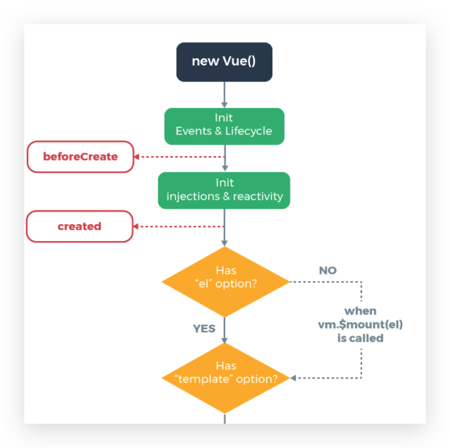

~~~~js
/* @flow */
import config from '../config'
import { initProxy } from './proxy'
import { initState } from './state'
import { initRender } from './render'
import { initEvents } from './events'
import { mark, measure } from '../util/perf'
import { initLifecycle, callHook } from './lifecycle'
import { initProvide, initInjections } from './inject'
import { extend, mergeOptions, formatComponentName } from '../util/index'

let uid = 0

// 导出 initMixin 混入对象
export function initMixin (Vue: Class<Component>) {
	// 在vue的实例上挂载_init方法
  Vue.prototype._init = function (options?: Object) {
    // vm：在对象方法中，this指的是此方法的实例Vue
    const vm: Component = this
    // 每个vue都会有一个uid 用于重复创建vue实例的时候不互相影响
    vm._uid = uid++
		
    let startTag, endTag
    /* istanbul ignore if */
    if (process.env.NODE_ENV !== 'production' && config.performance && mark) {
      startTag = `vue-perf-start:${vm._uid}`
      endTag = `vue-perf-end:${vm._uid}`
      mark(startTag)
    }

    // a flag to avoid this being observed
    vm._isVue = true
    // merge options
    if (options && options._isComponent) {
      // optimize internal component instantiation
      // since dynamic options merging is pretty slow, and none of the
      // internal component options needs special treatment.
      initInternalComponent(vm, options)
    } else {
      // 把一些全局的api方法混入到当前实例的$options上面
      vm.$options = mergeOptions(
        resolveConstructorOptions(vm.constructor),
        options || {},
        vm
      )
    }
    /* istanbul ignore else */
    if (process.env.NODE_ENV !== 'production') {
      initProxy(vm)
    } else {
      vm._renderProxy = vm
    }
    // expose real self
    vm._self = vm
    // 初始化生命周期钩子
    initLifecycle(vm)
    // 初始化事件
    initEvents(vm)
    // 初始化render
    initRender(vm)
    /* 调用beforeCreate生命周期钩子 此时写在beforeCreate钩子中的方法会执行*/
    callHook(vm, 'beforeCreate')
    // 初始化vue实例的inject 
    // 父组件可以使用provide选项给自己的下游子孙组件内注入一些数据
    // 在下游子孙组件中可以使用inject选项来接收这些数据以便为自己所用。
		// 另外，这里有一点需要注意：provide 和 inject 选项绑定的数据不是响应式的
    initInjections(vm) // resolve injections before data/props
    // 初始化options，props，methods，data，computed，watch
    // 考虑到inject引入的内容可能需要在options中使用所以先对inject进行初始化
    initState(vm)
    // 初始化vue实例的Provide
    initProvide(vm) // resolve provide after data/props
    /* 调用created生命周期钩子 此时写在created钩子中的方法会执行*/
    callHook(vm, 'created')

    /* istanbul ignore if */
    if (process.env.NODE_ENV !== 'production' && config.performance && mark) {
      vm._name = formatComponentName(vm, false)
      mark(endTag)
      measure(`vue ${vm._name} init`, startTag, endTag)
    }
		// 判断 options 上是否有el属性
    if (vm.$options.el) {
      // 如果有开始挂载
      vm.$mount(vm.$options.el)
    }
  }
}
~~~~


这一阶段也是vue初始化过程中生命周期、事件、响应式系统初始化的过程，现阶段先关注流程，各个模块的内部实现流程会在后面章节中详细展开。**下一步进入到dom挂载渲染阶段**，我们看一下$mount的实现


## 四、vue-router的实现原理

路由是我们在使用vue框架进行开发时必须要使用的一个组件，他的作用就是在补充锌请求页面的情况下能实现页面的更新，在浏览器中实现这一功能的方式有两种一个是hash一个是histort，对应vue-router的两种模式。

### hash模式

【前置知识】

hashchange事件

在url中#后面额度部分是hash值，当这一部分的值发生改变的时候通过hashchange可以监听到值的改变，下面我们来试试这段代码，在浏览器中通过window.location.href修改地址为old hash: https://www.baidu.com/#/123

~~~~js
window.onhashchange = function(e){
  console.log('old hash:', e.oldURL)
  console.log('new hash', e.newURL)
}
~~~~

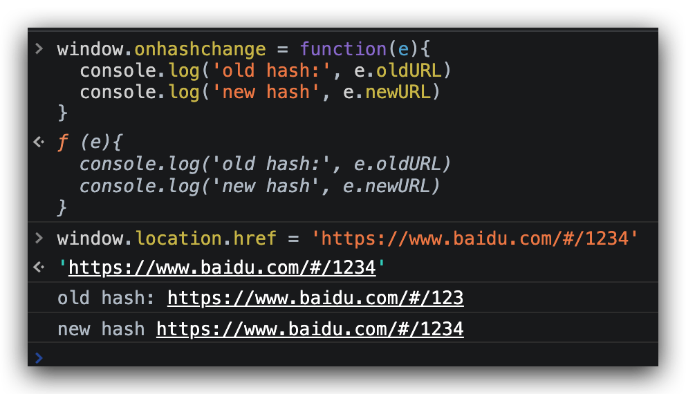

- old hash 先前会话历史记录的URL
- new hash 当前会话历史记录的URL

我们发现 hash模式不会发起请求素有改变hash的值也不会重新加载页面，但是我们可以给hash添加一个改变的监听事件hashchange事件 window.addEventListener("hashchange", func)，有了这个方法就可以实现一个最简单的路由了

首先准备dom

~~~~html
<body>
  <div>
    <p>顶部导航区域</p>
    <a class="nav" href="#/page1">page1</a>
    <a class="nav" href="#/page2">page2</a>
    <a class="nav" href="#/page3">page3</a>
    <a class="nav" href="#/page4">page4</a>
  </div>
  <div>
    <p>
      页面显示区域
    </p>
    <div id="content"></div>
  </div>
</body>
~~~~

当点击a标签的时候，url会同步修改，此时使用刚刚的hashchange事件就可以监听到路径的改变，然后我们将dom渲染到id为content的div中即可

~~~~js
let content = document.querySelector('#content');
window.addEventListener('hashchange', e => {
  let path = e.newURL.split('#')[1];
  let item = routes.find(function (item) {
    return item.path == path;
  });
  content.innerHTML = item.template;
})
~~~~

最后我们定义一下路由规则

~~~~js
const routes = [{
    path: '/page1',
    template: '<div>page1 content</div>'
  }, {
    path: '/page2',
    template: '<div>page2 content</div>'
  }, {
    path: '/page3',
    template: '<div>page3 content</div>'
  }, {
    path: '/page4',
    template: '<div>page4 content</div>'
  }]
~~~~

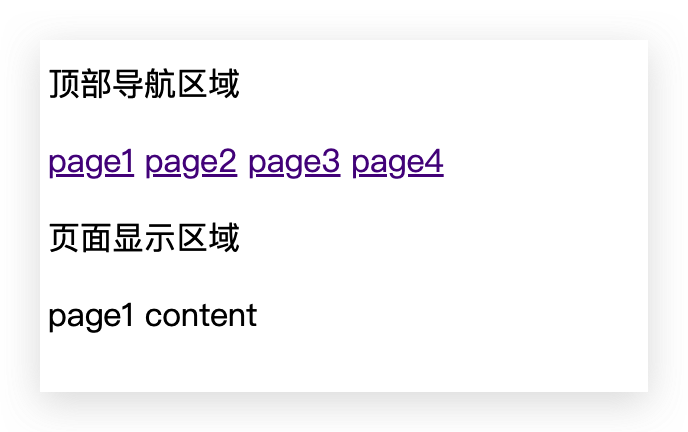


至此我们实现了hash路由的最基本的导航功能

### history模式

history导航实际上调用的是html5中的history对象中的方法实现的路由功能，他使用起来相对美观，但是由于使用了html5新增的api对于浏览器的兼容性有一定要求

history实现导航主要使用了三个比较重要的api，分别是pushState， replaceState，onpopstate

我们先来看pushState和replaceState，这两个方法都可以跳转到指定的url页面，主要区别在于replaceState() 是修改了当前的历史记录项而不是新建一个。history.pushState()之后，history.length会加一，但是replaceState()却不会。

【前置知识】

pushState接受三个参数

- state object -- state object 是将要关联到使用 pushState创建的一个新历史(history)记录的javascrpt 对象。 当用户导航到该页面的时候，popstate 事件将被触发， 那么这个state对象就会通过 event.state 传给事件处理函数。    

  1、state 对象可以是任意可以被序列化的js对象

  2、浏览器会把这个信息存储到用户的物理存储上

  3、最大size 640K

- title --  目前浏览器是忽略这个参数的，但是可能会在将来用到，所以建议传递一个空字符串

- URL -- 新历史记录的url。

  1、需要注意的是 浏览器并不会尝试加载这个url，

  2、url可以是绝对的也可以是相对的。

  3、url必须个当前页面同源，不然会报异常

下面我们在浏览器中实验一下

~~~~js
history.pushState({page: 1}, "title", "?page=1");
~~~~

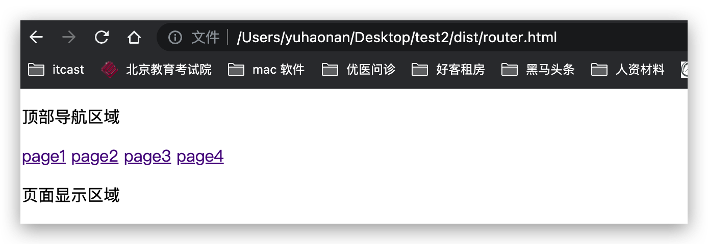

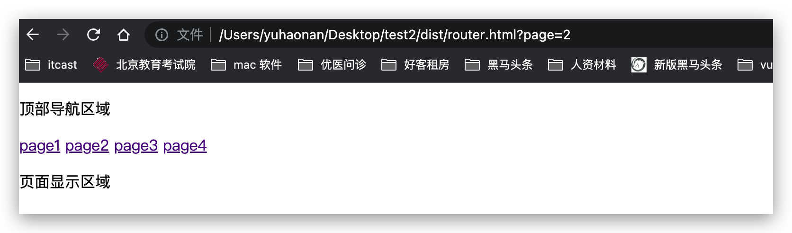

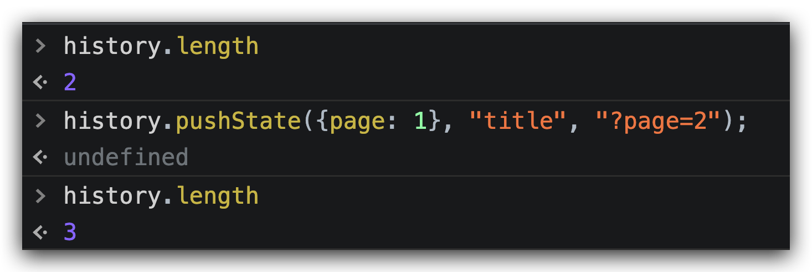

此时url上的地址发生了改变，同时history.length的长度也增加了一个

然后我们来看看replaceState：

```javascript
history.replaceState({page: 2}, "title", "?page=2");
```

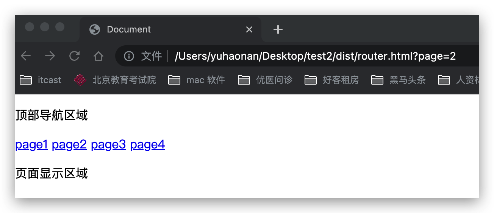

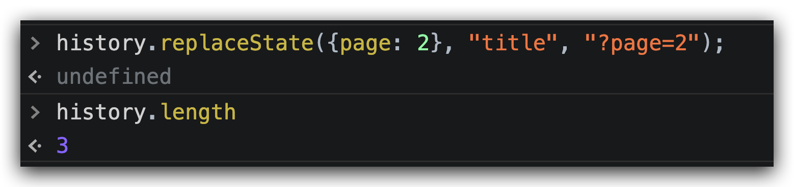

此时页面的地址发生了改变，但是我们发现history的长度并没有增加

popstate事件https://developer.mozilla.org/zh-CN/docs/Web/API/Window/popstate_event

每当活动的历史记录项发生变化时， popstate 事件都会被传递给window对象。如果当前活动的历史记录项是被 pushState 创建的，或者是由 replaceState 改变的，那么 popstate 事件的状态属性 state 会包含一个当前历史记录状态对象的拷贝

假如当前网页地址为 `http://example.com/example.html`，则运行下述代码将触发警告对话框：下面我们可以来试一试

```javascript
window.onpopstate = function(event) {
  alert("location: " + document.location + ", state: " + JSON.stringify(event.state));
};

history.pushState({page: 1}, "title 1", "?page=1");
history.pushState({page: 2}, "title 2", "?page=2");
history.replaceState({page: 3}, "title 3", "?page=3");
history.back(); // 弹出 "location: http://example.com/example.html?page=1, state: {"page":1}"
history.back(); // 弹出 "location: http://example.com/example.html, state: null
history.go(2);  // 弹出 "location: http://example.com/example.html?page=3, state: {"page":3}

```

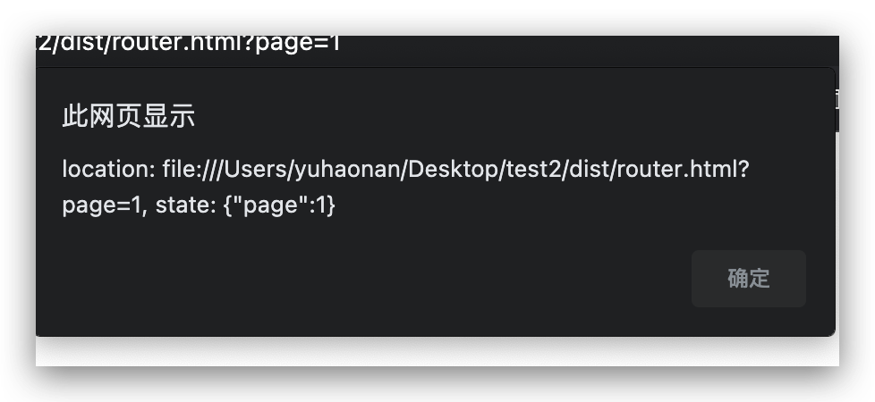

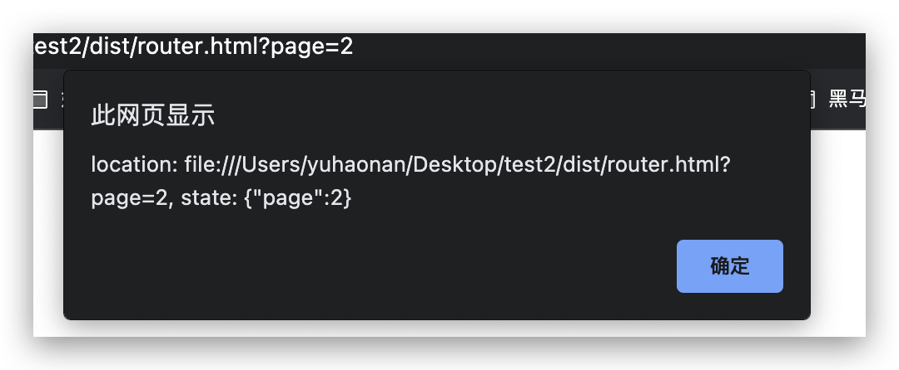

我们发现popstate事件实际上是无法监听到pushState和replaceState事件，也就意味着我们使用pushState修改url后浏览器并不能监听到地址的改变，也就无法实现页面跳转，那么这个问题我们怎么实现呢？有两种方式：一种是通过setInterval轮询的方式来判断history.state是否变化来判断url是否变化，另一种是重写一下pushState方法，在history添加一个onpushState属性，在pushState时进行调用即可。

~~~~js
(function(history){
    var pushState = history.pushState;
    history.pushState = function(state) {
        if (typeof history.onpushstate == "function") {
            history.onpushstate({state: state});
        }
        return pushState.apply(history, arguments);
    };
})(window.history);
//设置其方法和popstate相同即可
window.onpopstate =history.onpushstate= function(event) {
      alert("location: " + document.location + ", state: " + JSON.stringify(event.state));
};
~~~~

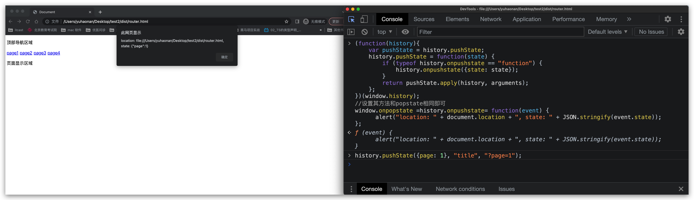

此时提示框出现，监听到了url的修改，接下来就可以使用这些方法实现一个history路由了

~~~~html
<!DOCTYPE html>
<html lang="en">

<head>
  <meta charset="UTF-8">
  <meta http-equiv="X-UA-Compatible" content="IE=edge">
  <meta name="viewport" content="width=device-width, initial-scale=1.0">
  <title>Document</title>
</head>

<body>
  <button id="btn1">home</button>
  <button id="btn2">mine</button>
  <div id="app"></div>
</body>
<script>
  const routes = [
    {
      path: '/home',
      name: 'home',
      component: '<div>主页</div>'
    },
    {
      path: '/mine',
      name: 'home',
      component: '<div>我的</div>'
    }
  ]

  const home = document.querySelector('#btn1')
  const mine = document.querySelector('#btn2')
  home.addEventListener('click', () => {
    history.pushState({ path: '/home' }, null, '#/home')
  })
  mine.addEventListener('click', () => {
    history.pushState({ path: '/mine' }, null, '#/mine')
  })

  let onpopstate = function (history) {
    var pushState = history.pushState;
    history.pushState = function (state) {
      if (typeof history.onpushstate == "function") {
        history.onpushstate({ state: state });
      }
      return pushState.apply(history, arguments);
    };
  }
  onpopstate(window.history);

  //设置其方法和popstate相同即可
  window.onpopstate = history.onpushstate = (event) => {
    console.log(event)
    let curRoute = routes.find(route => {
        if(route.path == event.state.path){
            return route
        }
    })
    document.querySelector('#app').innerHTML = curRoute.component
  };

</script>

</html>
~~~~

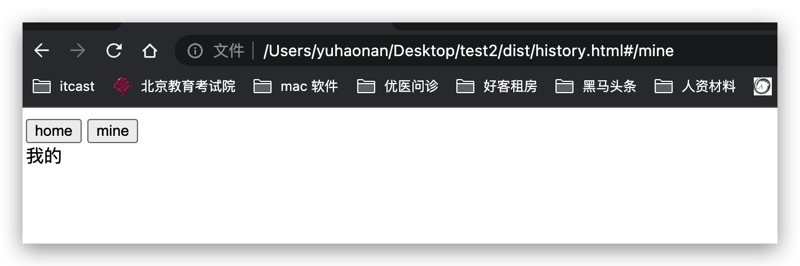

至此我们实现了两种方式的路由，任何框架中的路由插件也是基于这个原理进行的比较复杂的封装。

